# ICT技术洞察平台系统架构文档

## 目录

- [1. 系统概述](#1-系统概述)
- [2. 整体架构设计](#2-整体架构设计)
- [3. 数据湖架构](#3-数据湖架构)
- [4. 数据收集工作流](#4-数据收集工作流)
- [5. AI分析引擎](#5-ai分析引擎)
- [6. 可视化展示层](#6-可视化展示层)
- [7. 技术栈与工具链](#7-技术栈与工具链)
- [8. 数据流与处理流程](#8-数据流与处理流程)
- [9. 系统能力与特性](#9-系统能力与特性)
- [10. 部署架构](#10-部署架构)
- [11. 数据治理与质量](#11-数据治理与质量)
- [12. 安全与权限管理](#12-安全与权限管理)
- [13. 性能与扩展性](#13-性能与扩展性)
- [14. 运维与监控](#14-运维与监控)
- [15. 未来发展规划](#15-未来发展规划)

---

## 1. 系统概述

### 1.1 项目简介

**ICT技术洞察平台v3.0**是一个基于AI驱动的智能化技术情报分析系统，旨在为ICT领域提供全面的技术趋势洞察、竞争情报分析和投资决策支持。

### 1.2 核心价值

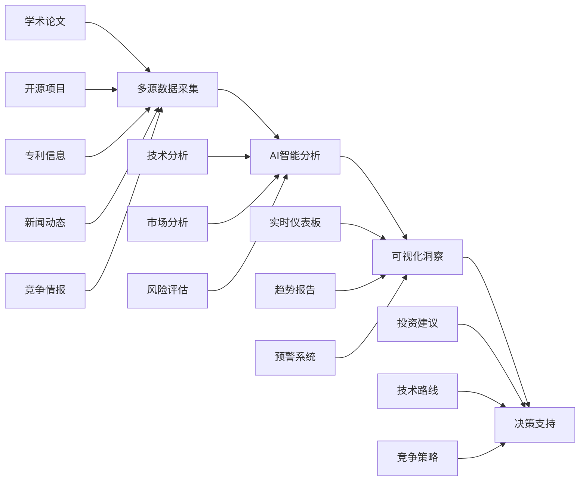

### 1.3 系统特色

- **🤖 多AI模型协同**：集成xAI Grok-3、OpenAI GPT-4等先进模型
- **🔄 全自动化流程**：从数据采集到分析输出的端到端自动化
- **📊 实时可视化**：基于Looker Studio的专业级仪表板
- **🎯 精准决策支持**：技术、市场、风险三维分析框架
- **🌐 云原生架构**：基于Google Cloud生态的可扩展架构

---

## 2. 整体架构设计

### 2.1 系统架构概览

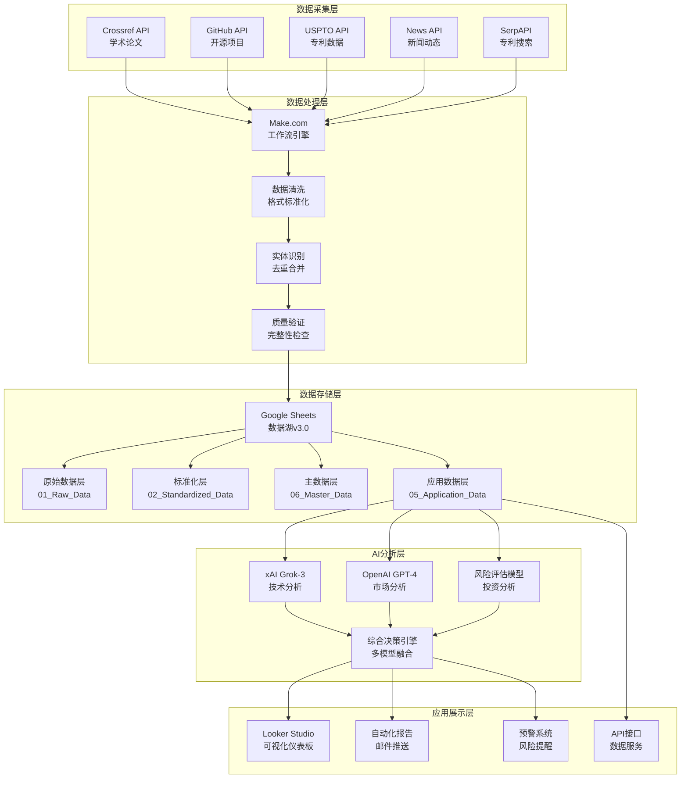

### 2.2 架构设计原则

| 原则 | 描述 | 实现方式 |
|------|------|----------|
| **分层解耦** | 各层独立，接口标准化 | 数据湖分层架构，API统一接口 |
| **可扩展性** | 支持新数据源和分析模型 | 模块化设计，插件化架构 |
| **高可用** | 系统稳定运行，故障自愈 | 云原生部署，自动容错 |
| **实时性** | 数据近实时更新和分析 | 流式处理，增量更新 |
| **安全性** | 数据安全，访问控制 | 多层安全防护，权限管理 |

### 2.3 核心组件

#### 2.3.1 数据采集引擎
- **Make.com工作流编排器**：5个核心数据收集工作流
- **API网关**：统一外部API调用管理
- **数据适配器**：不同数据源的格式转换

#### 2.3.2 数据处理引擎  
- **ETL处理器**：提取、转换、加载数据
- **标准化引擎**：数据格式和语义标准化
- **质量控制器**：数据完整性和准确性验证

#### 2.3.3 AI分析引擎
- **多模型管理器**：AI模型调度和负载均衡
- **分析流水线**：技术-市场-风险三维分析
- **结果融合器**：多模型结果综合决策

#### 2.3.4 展示服务引擎
- **可视化引擎**：基于Looker Studio的图表生成
- **报告生成器**：自动化分析报告生成
- **通知服务**：邮件和预警推送

---

## 3. 数据湖架构

### 3.1 数据湖整体设计

```
ICT_TechInsight_DataLake_v3.0/
├── 00_System/                     # 系统配置层
│   ├── Workflow_Logs             # 工作流执行日志
│   ├── Error_Handling            # 错误处理记录
│   └── System_Configuration       # 系统配置参数
│
├── 01_Raw_Data/                   # 原始数据层
│   ├── Academic/
│   │   └── Raw_Academic_Papers    # 学术论文原始数据
│   ├── OpenSource/
│   │   └── Raw_OpenSource_Projects # 开源项目原始数据
│   ├── Patents/
│   │   └── Raw_USPTO_Patents      # 专利原始数据
│   ├── News/
│   │   └── Raw_Tech_News          # 技术新闻原始数据
│   └── Competitive/
│       └── Competitor_Intelligence # 竞争情报原始数据
│
├── 02_Standardized_Data/          # 标准化数据层
│   ├── Standardized_Technology_Registry
│   ├── Standardized_Academic_Papers
│   ├── Standardized_GitHub_Projects
│   ├── Standardized_Patent_Data
│   └── Standardized_News_Data
│
├── 03_Processed_Data/             # 处理数据层
│   ├── Technology_Metrics
│   ├── Trend_Analysis
│   ├── Competitive_Landscape
│   └── Market_Intelligence
│
├── 04_Analytics_Results/          # 分析结果层
│   ├── Technology_Assessment      # 综合技术评估结果
│   ├── AI_Analysis_Details       # AI模型分析详情
│   ├── Investment_Recommendations # 投资建议
│   └── Risk_Assessment_Reports   # 风险评估报告
│
├── 05_Application_Data/           # 应用数据层
│   ├── Dashboard_Data            # 仪表板数据源
│   ├── Report_Templates          # 报告模板
│   └── API_Response_Cache        # API响应缓存
│
└── 06_Master_Data/               # 主数据层
    ├── Technology_Registry       # 技术主题注册表
    ├── Competitor_Registry       # 竞争对手注册表
    ├── Data_Dictionary          # 数据字典
    └── Business_Rules           # 业务规则配置
```

### 3.2 数据层级详细说明

#### 3.2.1 原始数据层 (01_Raw_Data)

**学术数据 (Academic)**
```yaml
Raw_Academic_Papers:
  数据源: Crossref API
  更新频率: 每日
  数据量: ~50条/技术主题
  字段结构:
    - collection_time: 采集时间
    - tech_topic: 技术主题
    - paper_title: 论文标题
    - authors: 作者信息
    - journal: 期刊名称
    - publish_date: 发布日期
    - citation_count: 引用次数
    - doi: DOI标识
    - abstract: 摘要
    - keywords: 关键词
```

**开源数据 (OpenSource)**
```yaml
Raw_OpenSource_Projects:
  数据源: GitHub API
  更新频率: 每日
  数据量: ~20条/技术主题
  字段结构:
    - collection_time: 采集时间
    - tech_topic: 技术主题
    - repo_name: 仓库名称
    - description: 项目描述
    - stars: 星标数量
    - forks: 分叉数量
    - language: 主要编程语言
    - last_commit_days: 最后提交天数
    - contributors: 贡献者信息
    - license: 开源协议
    - activity_score: 活跃度评分
    - maturity_level: 成熟度等级
```

**专利数据 (Patents)**
```yaml
Raw_USPTO_Patents:
  数据源: SerpAPI + USPTO
  更新频率: 每周
  数据量: ~10条/技术主题
  字段结构:
    - collection_time: 采集时间
    - tech_topic: 技术主题
    - patent_number: 专利号
    - application_date: 申请日期
    - publication_date: 公布日期
    - inventors: 发明人
    - assignee: 申请人/受让人
    - title: 专利标题
    - abstract: 专利摘要
    - claims: 权利要求
```

#### 3.2.2 标准化数据层 (02_Standardized_Data)

**技术注册表标准化**
```yaml
Standardized_Technology_Registry:
  数据治理:
    - canonical_name: 标准技术名称
    - aliases: 别名列表
    - category_standard: 标准分类
    - maturity_stage_standard: 标准成熟度
    - keywords_standardized: 标准关键词
  质量控制:
    - 数据完整性检查
    - 格式标准化验证
    - 重复数据识别
    - 异常值检测
```

#### 3.2.3 分析结果层 (04_Analytics_Results)

**技术评估结果**
```yaml
Technology_Assessment:
  核心指标:
    - overall_score: 综合评分 (1-10)
    - tech_maturity_level: 技术成熟度
    - market_opportunity: 市场机会等级
    - investment_risk_level: 投资风险等级
    - final_recommendation: 最终投资建议
  AI分析:
    - grok_analysis_raw: Grok技术分析原始结果
    - gpt4_analysis_raw: GPT-4市场分析原始结果
    - risk_analysis_raw: 风险评估原始结果
    - comprehensive_analysis_raw: 综合分析结果
  质量指标:
    - confidence_score: 分析置信度
    - data_completeness: 数据完整性
    - consensus_level: AI模型共识度
```

#### 3.2.4 主数据层 (06_Master_Data)

**技术主题注册表**
```yaml
Technology_Registry:
  当前技术主题: 13个
  技术分类:
    - 无线通信: 5G无线通信, Wi-Fi 7
    - 光通信: 硅光子, 400G光模块
    - 网络技术: SD-WAN, 网络功能虚拟化
    - 操作系统: 容器操作系统, 实时操作系统
    - 芯片技术: RISC-V处理器, AI芯片
    - 系统软件: 微服务架构, 边缘计算平台
    - 分布式AI: Internet of Agents
  成熟度分布:
    - 研究期: 1个 (7.7%)
    - 原型期: 1个 (7.7%)
    - 成长期: 4个 (30.8%)
    - 商业化期: 3个 (23.1%)
    - 成熟期: 4个 (30.8%)
```

**竞争对手注册表**
```yaml
Competitor_Registry:
  监控企业: 8家
  行业分布:
    - 网络设备: Cisco Systems, Arista Networks
    - 半导体: Broadcom Inc, Marvell Technology
    - 网络安全: Fortinet
    - 电信设备: Ericsson
    - 光通信: Ciena Corporation, Infinera Corporation
  威胁等级:
    - 高威胁: 5家
    - 低威胁: 3家
```

### 3.3 数据治理框架

#### 3.3.1 数据质量管理

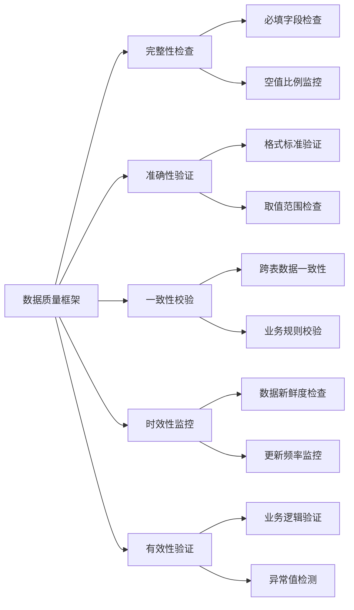

#### 3.3.2 数据标准化规范

**命名规范**
```yaml
表命名: [层级前缀]_[业务域]_[实体名称]
  示例: "04_Analytics_Technology_Assessment"

字段命名: [实体]_[属性]_[类型]
  示例: "tech_maturity_level", "analysis_timestamp"

标识符规范:
  tech_id: [分类代码][序号] (如: WL001, OC002, AI001)
  company_id: [公司名称大写]_001 (如: CISCO_001)
```

**数据类型规范**
```yaml
日期时间: YYYY-MM-DD HH:mm:ss
数值类型: 整数(评分)、浮点数(置信度)
文本长度: 标题≤200字符, 描述≤1000字符
枚举值: 预定义列表, 大写规范
```

---

## 4. 数据收集工作流

### 4.1 工作流架构概览

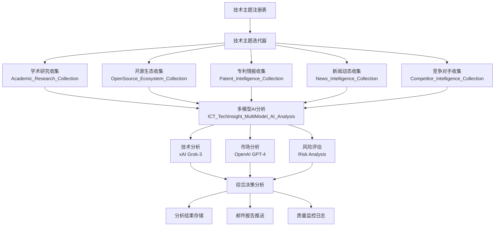

### 4.2 核心工作流详细设计

#### 4.2.1 学术研究收集工作流

```yaml
名称: Academic_Research_Collection
触发: 每日定时 / 手动触发
数据源: Crossref API
处理能力: 50篇论文/技术主题

工作流步骤:
  1. 技术主题获取:
     - 从Technology_Registry读取高优先级技术
     - 过滤条件: priority_level = "高"
     
  2. 学术搜索查询:
     - API: https://api.crossref.org/works
     - 查询构建: tech_name + keywords (OR连接)
     - 时间范围: 近3年论文
     - 排序: 相关性排序
     - 限制: 50篇/查询
     
  3. 数据处理管道:
     - 标题清洗: 移除换行符、标准化空格
     - 作者格式化: "姓, 名"格式统一
     - 日期标准化: YYYY-MM-DD格式
     - 引用数验证: 数值范围检查
     
  4. 重复检测:
     - 基于DOI精确匹配
     - 基于标题相似度模糊匹配
     - 跨时间窗口去重
     
  5. 数据存储:
     - 目标表: Raw_Academic_Data
     - 质量验证: 必填字段检查
     - 错误处理: 异常记录单独存储
```

#### 4.2.2 开源生态收集工作流

```yaml
名称: OpenSource_Ecosystem_Collection  
触发: 每日定时
数据源: GitHub API
处理能力: 20个项目/技术主题

工作流步骤:
  1. GitHub搜索:
     - API: https://api.github.com/search/repositories
     - 查询条件: tech_keywords + "language:python stars:>10"
     - 排序: stars降序
     - 限制: 20个仓库/查询
     
  2. 项目评估:
     - 活跃度评分: stars + forks*2
     - 成熟度分级: 
       * EMERGING: <100 stars
       * GROWING: 100-1000 stars  
       * MATURE: >1000 stars
     - 最后提交时间: 计算距今天数
     
  3. 数据增强:
     - 语言统计: 主要编程语言识别
     - 许可证标准化: 开源协议规范化
     - 贡献者统计: 活跃贡献者数量
     
  4. 存储处理:
     - 目标表: Raw_OpenSource_Data
     - 唯一性约束: full_name字段
```

#### 4.2.3 多模型AI分析工作流

```yaml
名称: ICT_TechInsight_MultiModel_AI_Analysis_v3.0
触发: 数据收集完成后
AI模型: xAI Grok-3 + OpenAI GPT-4 + 风险评估模型

工作流架构:
  1. 数据聚合与验证:
     - 收集各数据源的统计指标
     - 计算数据完整性评分
     - 验证数据质量阈值
     
  2. 并行AI分析:
     
     技术分析 (xAI Grok-3):
       输入: 学术数据 + 开源数据
       分析维度:
         - tech_maturity_level: EMERGING/GROWING/MATURE/DECLINING
         - innovation_score: 1-10分
         - implementation_difficulty: 1-10分
         - development_trend: ACCELERATING/STABLE/SLOWING/DECLINING
       
     市场分析 (OpenAI GPT-4):
       输入: 专利数据 + 新闻数据
       分析维度:
         - market_opportunity: HIGH/MEDIUM/LOW
         - market_size_potential: 1-10分
         - competition_intensity: 1-10分
         - commercialization_readiness: 1-10分
       
     风险评估 (Risk Analysis):
       输入: 综合数据 + 历史模式
       分析维度:
         - investment_risk_level: LOW/MEDIUM/HIGH/VERY_HIGH
         - expected_return_score: 1-10分
         - risk_return_ratio: 1-10分
         - investment_timing: NOW/SOON/WAIT/AVOID
  
  3. 结果融合与决策:
     - 模型共识度计算
     - 综合评分算法: 加权平均
     - 最终投资建议生成
     - 置信度评估
```

### 4.3 数据流控制与质量保证

#### 4.3.1 流量控制策略

```yaml
API速率限制:
  Crossref API: 50 requests/second
  GitHub API: 5000 requests/hour
  News API: 1000 requests/day
  SerpAPI: 100 requests/month

错误处理机制:
  - 重试策略: 指数退避算法
  - 最大重试次数: 3次
  - 失败降级: 跳过单个记录，继续处理
  - 错误日志: 详细记录失败原因

数据完整性检查:
  - 必填字段验证
  - 数据格式校验  
  - 业务逻辑验证
  - 异常值检测
```

#### 4.3.2 监控与告警

```yaml
工作流监控指标:
  - 执行成功率: >95%
  - 数据采集量: 每日统计
  - API响应时间: <2秒平均
  - 错误率: <5%

自动告警条件:
  - 工作流执行失败
  - 数据质量低于阈值
  - API配额接近限制
  - 异常数据模式检测

告警通知方式:
  - 邮件推送: 实时错误通知
  - Dashboard警告: 可视化状态显示
  - 日志记录: 详细执行历史
```

---

## 5. AI分析引擎

### 5.1 多模型协同架构

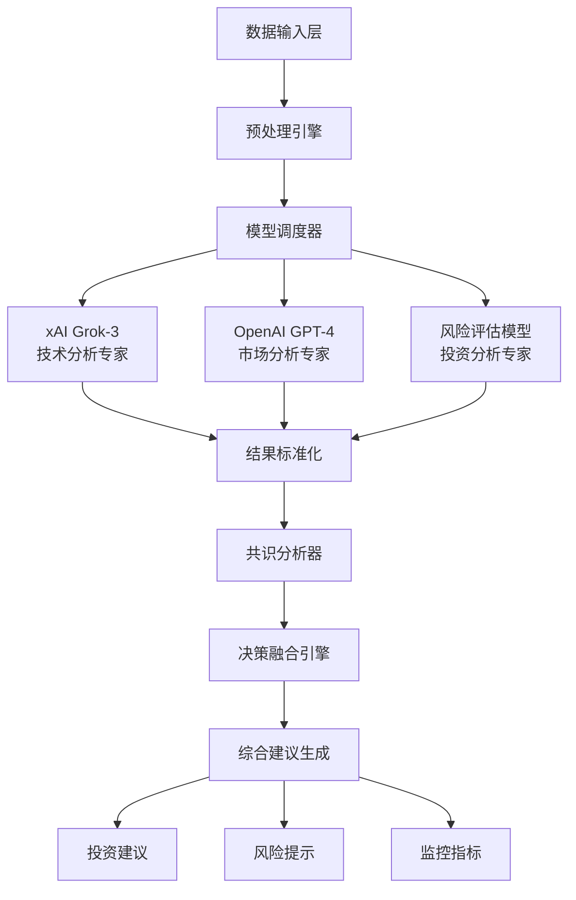

### 5.2 AI模型配置与能力

#### 5.2.1 技术分析模型 (xAI Grok-3)

**模型配置**
```yaml
模型名称: xAI Grok-3
角色定位: 资深ICT技术架构分析师 (20年经验)
专业领域: 技术成熟度评估, 创新程度分析, 技术路线分析

输入数据:
  - 学术论文统计: 数量, 引用情况, 发布趋势
  - 开源项目活跃度: GitHub stars, 提交频率, 社区规模
  - 技术关键词: 语义分析, 热度变化
  - 历史技术发展模式: 对比分析

分析维度:
  tech_maturity_level:
    - EMERGING: 早期研发阶段
    - GROWING: 快速发展阶段  
    - MATURE: 成熟应用阶段
    - DECLINING: 衰退替代阶段
    
  innovation_score (1-10):
    - 技术突破程度
    - 学术创新质量
    - 产业应用潜力
    
  implementation_difficulty (1-10):
    - 技术复杂度
    - 基础设施需求
    - 人才技能要求
    
  development_trend:
    - ACCELERATING: 加速发展
    - STABLE: 稳定发展
    - SLOWING: 增长放缓
    - DECLINING: 发展衰退

输出格式:
  {
    "analysis_type": "technical_analysis",
    "tech_maturity_level": "GROWING",
    "innovation_score": 7,
    "implementation_difficulty": 6,
    "development_trend": "ACCELERATING",
    "breakthrough_indicators": ["突破点1", "突破点2"],
    "technical_risks": ["风险1", "风险2"],
    "key_insights": ["洞察1", "洞察2", "洞察3"],
    "confidence_score": 0.85
  }
```

#### 5.2.2 市场分析模型 (OpenAI GPT-4)

**模型配置**
```yaml
模型名称: OpenAI GPT-4
角色定位: 资深市场研究和商业分析专家 (15年经验)
专业领域: 市场机会识别, 竞争格局分析, 商业价值评估

输入数据:
  - 专利申请趋势: 数量变化, 申请主体分析
  - 新闻媒体关注: 报道频率, 情感倾向, 话题热度
  - 竞争对手动态: 产品发布, 战略调整, 投资行为
  - 行业发展信号: 政策环境, 资本流向, 标准制定

分析维度:
  market_opportunity:
    - HIGH: 巨大市场机会
    - MEDIUM: 中等市场机会
    - LOW: 有限市场机会
    
  market_size_potential (1-10):
    - 目标市场规模
    - 增长速度预期
    - 渗透率潜力
    
  competition_intensity (1-10):
    - 竞争者数量
    - 竞争激烈程度
    - 差异化难度
    
  commercialization_readiness (1-10):
    - 商业化成熟度
    - 市场接受度
    - 商业模式清晰度

输出格式:
  {
    "analysis_type": "market_analysis", 
    "market_opportunity": "HIGH",
    "market_size_potential": 8,
    "competition_intensity": 6,
    "commercialization_readiness": 7,
    "market_entry_barriers": ["壁垒1", "壁垒2"],
    "growth_drivers": ["驱动因素1", "驱动因素2"],
    "market_risks": ["市场风险1", "市场风险2"],
    "business_opportunities": ["机会1", "机会2", "机会3"],
    "confidence_score": 0.82
  }
```

#### 5.2.3 风险评估模型

**模型配置**
```yaml
模型名称: Risk Assessment Engine
角色定位: 资深风险评估和投资分析专家 (25年经验)
专业领域: 投资风险识别, 收益预测, 投资时机判断

输入数据:
  - 技术分析结果: 成熟度, 创新度, 实现难度
  - 市场分析结果: 机会大小, 竞争强度, 商业化程度
  - 历史投资模式: 成功案例, 失败教训, 投资回报率
  - 外部环境因素: 政策环境, 经济周期, 技术变革

分析维度:
  investment_risk_level:
    - LOW: 低风险投资
    - MEDIUM: 中等风险投资
    - HIGH: 高风险投资  
    - VERY_HIGH: 极高风险投资
    
  expected_return_score (1-10):
    - 预期投资回报率
    - 收益实现概率
    - 回报时间周期
    
  investment_timing:
    - NOW: 立即投资
    - SOON: 近期投资
    - WAIT: 等待时机
    - AVOID: 避免投资
    
  risk_return_ratio (1-10):
    - 风险收益匹配度
    - 投资价值评估

输出格式:
  {
    "analysis_type": "risk_assessment",
    "investment_risk_level": "MEDIUM",
    "expected_return_score": 7,
    "investment_timing": "SOON", 
    "risk_return_ratio": 8,
    "major_risks": ["主要风险1", "主要风险2"],
    "risk_mitigation": ["缓解措施1", "缓解措施2"],
    "investment_horizon": "中期(2-5年)",
    "portfolio_allocation": "15%",
    "confidence_score": 0.87
  }
```

### 5.3 决策融合算法

#### 5.3.1 综合评分算法

```python
def calculate_comprehensive_score(tech_analysis, market_analysis, risk_analysis):
    """
    综合评分算法
    """
    # 权重配置
    WEIGHTS = {
        'technical': 0.4,    # 技术分析权重40%
        'market': 0.35,      # 市场分析权重35%
        'risk': 0.25         # 风险分析权重25%
    }
    
    # 技术维度评分
    tech_score = (
        tech_analysis['innovation_score'] * 0.4 +
        (10 - tech_analysis['implementation_difficulty']) * 0.3 +
        trend_score_mapping[tech_analysis['development_trend']] * 0.3
    )
    
    # 市场维度评分  
    market_score = (
        market_analysis['market_size_potential'] * 0.4 +
        market_analysis['commercialization_readiness'] * 0.3 +
        (10 - market_analysis['competition_intensity']) * 0.3
    )
    
    # 风险维度评分
    risk_score = (
        risk_analysis['expected_return_score'] * 0.6 +
        risk_analysis['risk_return_ratio'] * 0.4
    )
    
    # 综合评分计算
    overall_score = (
        tech_score * WEIGHTS['technical'] +
        market_score * WEIGHTS['market'] + 
        risk_score * WEIGHTS['risk']
    )
    
    return round(overall_score, 1)
```

#### 5.3.2 投资建议决策树

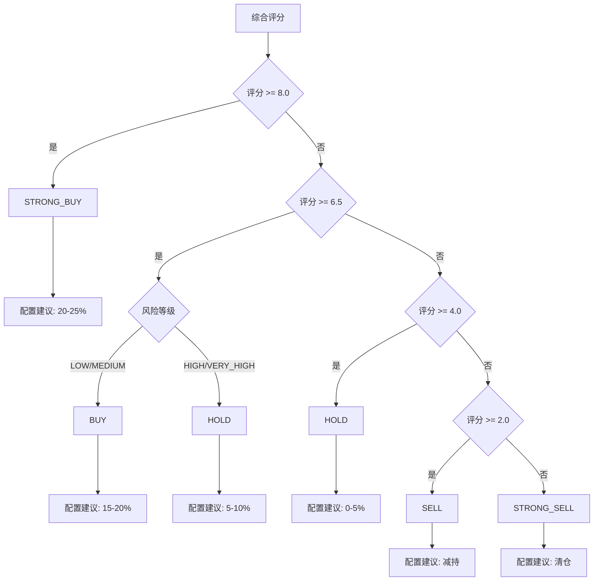

#### 5.3.3 共识度分析

```python
def calculate_consensus_level(analyses):
    """
    计算AI模型共识度
    """
    # 投资建议映射
    recommendation_score = {
        'STRONG_BUY': 5, 'BUY': 4, 'HOLD': 3, 'SELL': 2, 'STRONG_SELL': 1
    }
    
    # 风险等级映射
    risk_score = {
        'LOW': 1, 'MEDIUM': 2, 'HIGH': 3, 'VERY_HIGH': 4
    }
    
    # 提取各模型的关键指标
    scores = []
    for analysis in analyses:
        if analysis['type'] == 'comprehensive':
            scores.append(analysis['overall_score'])
            
    # 计算标准差，评估共识度
    std_dev = np.std(scores)
    consensus_level = max(0, 1 - std_dev / 5)  # 标准化到0-1
    
    return round(consensus_level, 2)
```

### 5.4 模型性能监控

#### 5.4.1 性能指标

```yaml
准确性指标:
  - 预测准确率: 历史预测与实际结果对比
  - 置信度校准: 置信度与准确率的相关性
  - 一致性评估: 相似输入的输出稳定性

效率指标:
  - 响应时间: API调用到结果返回的延迟
  - 成功率: 分析请求的成功完成比例
  - 资源消耗: Token使用量和成本统计

质量指标:
  - 结果完整性: 输出字段的完整度
  - 格式规范性: JSON格式的正确性
  - 业务逻辑合理性: 专家评估得分
```

#### 5.4.2 模型优化策略

```yaml
Prompt优化:
  - A/B测试不同的Prompt模板
  - 基于输出质量调整指令描述
  - 增加少样本学习示例

参数调优:
  - Temperature: 0.2-0.4 (保证结果稳定性)
  - Top-p: 0.9-1.0 (保持生成多样性)
  - Max-tokens: 2048-4096 (确保输出完整)

结果验证:
  - JSON格式校验
  - 必填字段检查
  - 数值范围验证
  - 业务逻辑审核
```

---

## 6. 可视化展示层

### 6.1 仪表板架构设计

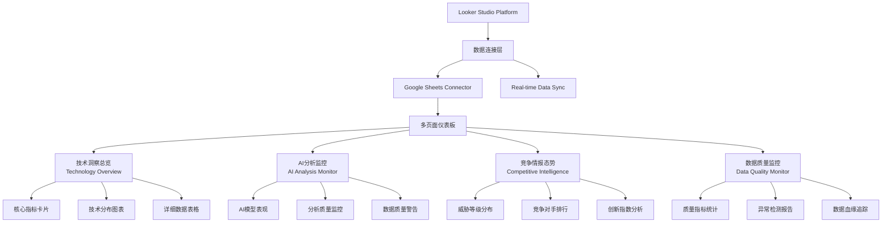

### 6.2 核心仪表板详细设计

#### 6.2.1 技术洞察总览页面

**页面布局**
```yaml
页面名称: Technology Insight Overview
数据源: Technology_Registry + Technology_Assessment
更新频率: 实时同步
响应式设计: 支持桌面端和移动端

布局结构:
  顶部导航栏:
    - 页面标题: "ICT技术洞察仪表板 v3.0"
    - 最后更新时间显示
    - 页面切换导航
    
  核心指标区 (第一行):
    - 总技术数量: 13个
    - 已分析技术: 动态统计
    - 分析完成率: 百分比显示
    - 平均置信度: AI分析质量
    
  主要图表区 (第二行):
    - 技术成熟度分布 (饼图)
    - 技术优先级分布 (柱状图)
    - 投资建议分布 (环形图)
    
  详细数据区 (第三行):
    - 技术详细列表 (数据表格)
    - 最近分析记录 (时间线)
```

**核心指标卡片配置**
```yaml
总技术数量卡片:
  数据源: Technology_Registry
  计算公式: COUNT(tech_id)
  显示格式: 大数字 + 标题
  颜色主题: 蓝色系
  实时更新: 是

已分析技术卡片:
  数据源: Technology_Assessment  
  计算公式: COUNT_DISTINCT(tech_topic WHERE tech_topic IS NOT NULL)
  显示格式: 数字 + 趋势箭头
  颜色主题: 绿色系
  包含钻取: 点击查看详细列表

分析完成率卡片:
  计算公式: (已分析技术 / 总技术数量) * 100
  显示格式: 百分比 + 进度条
  颜色编码: 
    - >80%: 绿色
    - 50-80%: 黄色  
    - <50%: 红色
  目标设定: 90%完成率

平均置信度卡片:
  数据源: AI_Analysis_Details
  计算公式: AVG(confidence_score)
  显示格式: 小数点后2位 + 置信度评级
  评级标准:
    - >0.8: 高置信度
    - 0.6-0.8: 中等置信度
    - <0.6: 低置信度
```

**技术分布图表设计**
```yaml
技术成熟度分布饼图:
  数据维度: maturity_stage
  图表类型: 饼图 (Pie Chart)
  颜色方案:
    - 研究期: 红色 (#FF6B6B)
    - 原型期: 橙色 (#FF8E53)
    - 成长期: 黄色 (#FFCE56)
    - 商业化期: 浅绿色 (#36A2EB)
    - 成熟期: 深绿色 (#4BC0C0)
  数据标签: 显示百分比和技术数量
  交互功能: 点击切片钻取到详细列表

技术优先级分布柱状图:
  数据维度: priority_level
  图表类型: 垂直柱状图
  X轴: 优先级等级 (高、中)
  Y轴: 技术数量
  颜色编码:
    - 高优先级: 深蓝色
    - 中优先级: 浅蓝色
  数据标签: 显示具体数量
  排序: 按优先级降序

投资建议分布环形图:
  数据源: Technology_Assessment
  数据维度: final_recommendation
  图表类型: 环形图 (Donut Chart)
  颜色方案:
    - STRONG_BUY: 深绿色
    - BUY: 绿色
    - HOLD: 黄色
    - SELL: 橙色
    - STRONG_SELL: 红色
  中心显示: 总投资建议数量
  悬停效果: 显示具体技术列表
```

#### 6.2.2 AI分析监控页面

**AI模型表现对比**
```yaml
AI模型置信度对比图:
  数据源: AI_Analysis_Details
  图表类型: 分组柱状图
  X轴: model_name (xAI Grok-3, OpenAI GPT-4, Risk Model)
  Y轴: 平均置信度 (0-1)
  颜色区分: 每个模型不同颜色
  目标线: 0.8置信度目标线
  数据标签: 显示精确置信度值

分析类型分布饼图:
  数据维度: analysis_type  
  统计指标: 分析次数
  类型包含:
    - technical_analysis: 技术分析
    - market_analysis: 市场分析
    - risk_assessment: 风险评估
  颜色主题: 专业蓝色系渐变

分析活动时间趋势:
  图表类型: 时间序列线图
  X轴: analysis_date (按天聚合)
  Y轴: 分析数量
  分组: analysis_type (多条线)
  时间范围: 最近30天
  趋势线: 移动平均线
  异常标注: 突出异常活跃或异常低迷的时期
```

**数据质量监控区域**
```yaml
数据质量警告卡片:
  警告级别:
    - 🔴 严重: 空值率 > 50%
    - 🟡 警告: 空值率 20-50%
    - 🟢 正常: 空值率 < 20%
    
  当前检测到的问题:
    - tech_topic空值: 80%记录
    - 数据源指标为0: 4条记录
    - AI分析失败: 具体统计
    
  改进建议显示:
    - 优先修复数据标准化
    - 检查Make.com工作流
    - 完善技术名称映射

数据完整性仪表盘:
  指标类型: 进度条组合
  监控维度:
    - academic_count完整性: 当前20%
    - opensource_count完整性: 当前5%
    - patent_count完整性: 当前0%
    - news_count完整性: 当前10%
  目标设定: 每项≥80%完整性
  颜色编码: 红绿渐变表示健康度
```

#### 6.2.3 竞争情报态势页面

**竞争对手概览**
```yaml
威胁等级分布:
  数据源: Competitor_Intelligence
  图表类型: 环形图
  数据维度: threat_level
  当前分布:
    - 高威胁: 5家 (62.5%)
    - 中威胁: 0家 (0%)  
    - 低威胁: 3家 (37.5%)
  颜色编码:
    - 高威胁: 红色警告
    - 中威胁: 黄色关注
    - 低威胁: 绿色安全

GitHub活跃度排行榜:
  图表类型: 水平柱状图
  排序: github_activity 降序
  显示: TOP 8
  数据标签: 公司名称 + 活跃度数值
  颜色渐变: 基于活跃度的深浅渐变
  当前排名:
    1. Fortinet: 391
    2. Ericsson: 290  
    3. Broadcom: 286
    4. Cisco: 3
    5. 其他公司...

行业分布地图:
  图表类型: 树状图 (Treemap)
  数据维度: industry_category
  指标: 公司数量
  分类包含:
    - 网络设备: 2家
    - 半导体: 2家
    - 网络安全: 1家
    - 电信设备: 1家
    - 光通信: 2家
  颜色主题: 行业特色颜色
```

**竞争态势分析**
```yaml
创新指数 vs 新闻关注度散点图:
  图表类型: 散点图 (Scatter Plot)
  X轴: news_mentions (新闻提及次数)
  Y轴: innovation_index (创新指数)
  点大小: github_activity (GitHub活跃度)
  颜色: threat_level (威胁等级)
  数据标签: company_name
  象限分析:
    - 右上象限: 高关注度 + 高创新 (重点关注)
    - 左上象限: 低关注度 + 高创新 (潜在威胁)
    - 右下象限: 高关注度 + 低创新 (营销导向)
    - 左下象限: 低关注度 + 低创新 (相对安全)

威胁趋势预测:
  基于历史数据的威胁等级变化趋势
  预测算法: 基于活跃度、新闻热度、专利活动的综合模型
  预警机制: 威胁等级上升时自动告警
```

### 6.3 高级交互功能

#### 6.3.1 过滤器和控制器

```yaml
全局过滤器:
  时间范围选择器:
    - 类型: 日期范围控制器
    - 默认: 最近30天
    - 可选: 最近7天/30天/90天/自定义
    - 影响: 所有时间相关图表
    
  技术类别过滤器:
    - 类型: 多选下拉框
    - 选项: 无线通信、光通信、网络技术等
    - 默认: 全选
    - 联动: 所有技术相关图表
    
  优先级过滤器:
    - 类型: 单选按钮组
    - 选项: 高优先级、中优先级、全部
    - 默认: 全部
    
  AI模型过滤器:
    - 类型: 复选框组
    - 选项: Grok-3、GPT-4、Risk Model
    - 默认: 全选
    - 作用域: AI分析相关图表

页面级过滤器:
  竞争情报页面:
    - 威胁等级过滤: 高/中/低威胁
    - 行业类别过滤: 按行业分类筛选
    - 活跃度阈值: 滑动条设置最小活跃度
```

#### 6.3.2 钻取和导航

```yaml
图表钻取功能:
  成熟度饼图 → 技术详细列表:
    - 点击饼图切片
    - 显示该成熟度阶段的所有技术
    - 包含技术名称、分析状态、最新评分
    
  AI模型柱状图 → 模型详细表现:
    - 点击特定模型柱子
    - 显示该模型的历史表现趋势
    - 包含置信度变化、分析成功率等
    
  竞争对手散点图 → 公司详细档案:
    - 点击散点
    - 显示公司详细信息
    - 包含最新动态、威胁分析、监控历史

页面导航设计:
  顶部导航栏:
    - 技术总览 (默认页面)
    - AI分析监控
    - 竞争情报
    - 数据质量
  面包屑导航:
    - 显示当前位置
    - 支持快速返回上级
  快捷键支持:
    - Ctrl+1-4: 快速切换页面
    - Ctrl+R: 刷新数据
```

#### 6.3.3 响应式设计

```yaml
桌面端优化 (>1200px):
  - 多列布局充分利用屏幕空间
  - 复杂图表完整显示
  - 悬停效果和详细工具提示
  - 键盘快捷键支持

平板端适配 (768px-1200px):
  - 2列布局，图表自动调整大小
  - 触摸友好的交互元素
  - 简化的菜单和导航
  - 手势支持 (滑动、缩放)

移动端优化 (<768px):
  - 单列垂直布局
  - 指标卡片堆叠排列
  - 图表简化，突出关键信息
  - 底部导航栏
  - 手势导航支持

自适应图表:
  - 图表尺寸根据屏幕自动调整
  - 文字大小响应式缩放
  - 复杂图表在小屏幕上简化显示
  - 保持关键信息的可读性
```

### 6.4 性能优化

#### 6.4.1 数据加载优化

```yaml
数据缓存策略:
  - Looker Studio自动缓存: 15分钟刷新
  - Google Sheets数据源优化: 避免复杂计算
  - 分页加载: 大数据表格分页显示
  - 懒加载: 非核心图表延迟加载

查询性能优化:
  - 数据预聚合: 在数据层预计算关键指标
  - 索引优化: 关键字段建立索引
  - 查询优化: 避免全表扫描
  - 数据压缩: 减少传输数据量

渲染性能优化:
  - 图表虚拟化: 大数据集的高效渲染
  - 动画优化: 减少不必要的动画效果
  - 内存管理: 及时释放不用的图表资源
  - 浏览器兼容性: 确保各浏览器性能一致
```

#### 6.4.2 用户体验优化

```yaml
加载体验:
  - 骨架屏: 数据加载时显示图表轮廓
  - 进度指示: 显示数据加载进度
  - 分步加载: 核心内容优先加载
  - 错误恢复: 加载失败时的重试机制

交互体验:
  - 快速响应: <100ms的交互响应
  - 视觉反馈: 点击、悬停的即时反馈
  - 操作预期: 一致的交互模式
  - 撤销功能: 重要操作的撤销支持

信息呈现:
  - 数据密度适中: 避免信息过载
  - 层次清晰: 重要信息突出显示
  - 颜色无障碍: 色盲友好的颜色方案
  - 多语言支持: 中英文界面切换
```

---

## 7. 技术栈与工具链

### 7.1 技术栈架构

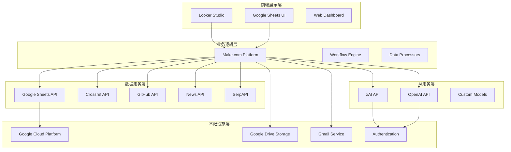

### 7.2 核心技术组件

#### 7.2.1 工作流编排引擎

**Make.com Platform**
```yaml
产品定位: 无代码自动化平台
核心能力:
  - 可视化工作流设计
  - 多系统API集成
  - 错误处理和重试机制
  - 实时监控和日志

技术特性:
  - 支持1000+应用连接器
  - HTTP/REST API通用连接器
  - JavaScript代码模块支持
  - 条件逻辑和循环控制
  - 数据转换和格式化
  - 定时任务和事件触发

成本模型:
  - 免费层: 1000 operations/month
  - 专业版: $9/month起
  - 企业版: 按需定制

当前使用:
  - 5个核心工作流
  - ~500 operations/day
  - 预计月使用量: 15,000 operations
```

**替代方案评估**
```yaml
Zapier:
  优势: 更多应用支持、更好的用户界面
  劣势: 成本更高、技术灵活性较低
  
Microsoft Power Automate:
  优势: 与Office 365深度集成
  劣势: 主要面向Microsoft生态
  
Apache Airflow:
  优势: 开源、高度可定制
  劣势: 需要技术团队维护、学习成本高

选择理由:
  - Make.com在成本和功能间平衡最佳
  - 无代码特性降低维护成本
  - Google生态集成度高
  - 社区活跃，文档完善
```

#### 7.2.2 数据存储引擎

**Google Sheets as Data Lake**
```yaml
架构选择理由:
  - 零成本云端存储
  - 实时协作和权限管理
  - 天然支持Looker Studio集成
  - API接口完善
  - 版本控制和历史记录
  - 可视化数据查看和编辑

技术规格:
  - 最大存储: 500万个单元格/工作表
  - 并发用户: 100个同时编辑
  - API配额: 10,000 requests/100秒
  - 数据同步: 实时更新

当前使用情况:
  - 工作表数量: 15个
  - 数据行数: ~1000行
  - 存储使用率: <1%
  - API调用: ~100 requests/day

扩展性考虑:
  短期 (1年内):
    - 当前架构充分满足需求
    - 通过分表和索引优化性能
    
  中期 (1-3年):
    - 考虑迁移到Google BigQuery
    - 实现更复杂的数据分析
    
  长期 (3年+):
    - 构建专业数据仓库
    - 支持大规模数据处理
```

**数据库设计原则**
```yaml
范式化设计:
  - 3NF范式减少数据冗余
  - 主键和外键关系明确
  - 避免更新异常

性能优化:
  - 关键字段索引 (Google Sheets自动优化)
  - 数据分区策略 (按时间、按类别)
  - 查询优化 (避免全表扫描)

数据一致性:
  - 事务性操作保证 (Make.com workflow级别)
  - 外键约束 (业务逻辑层实现)
  - 数据验证规则

备份和恢复:
  - 自动版本历史 (Google Drive原生)
  - 定期导出备份 (CSV/Excel格式)
  - 灾难恢复计划
```

#### 7.2.3 AI服务集成

**xAI Grok-3 Integration**
```yaml
API配置:
  - Endpoint: https://api.x.ai/v1/chat/completions
  - Authentication: Bearer Token
  - 模型: grok-3
  - 最大Token: 4096
  - Temperature: 0.2-0.4 (平衡创造性和稳定性)

成本结构:
  - 输入Token: $2.50/1M tokens
  - 输出Token: $10.00/1M tokens
  - 月预算: ~$50 (预计使用量)

技术特性:
  - 上下文长度: 128k tokens
  - 多语言支持: 中英文
  - JSON格式输出: 结构化结果
  - 实时推理: 最新训练数据

性能监控:
  - 响应时间: <3秒平均
  - 成功率: >99%
  - Token使用效率: 监控和优化
  - 输出质量: 人工抽样评估
```

**OpenAI GPT-4 Integration**
```yaml
API配置:
  - Endpoint: https://api.openai.com/v1/chat/completions
  - 模型: gpt-4
  - 最大Token: 8192
  - Temperature: 0.3

成本结构:
  - 输入Token: $30.00/1M tokens
  - 输出Token: $60.00/1M tokens
  - 月预算: ~$100

技术特性:
  - 多模态能力: 文本理解
  - 推理能力: 复杂逻辑分析
  - 知识更新: 定期训练数据更新
  - 安全性: 内容过滤和安全检查

优化策略:
  - Prompt工程: 优化输入提示词
  - Token管理: 控制输入长度
  - 缓存策略: 相似查询结果复用
  - 批处理: 减少API调用次数
```

#### 7.2.4 可视化引擎

**Looker Studio Architecture**
```yaml
平台优势:
  - 完全免费使用
  - Google生态深度集成
  - 强大的数据连接器
  - 实时数据同步
  - 响应式设计
  - 团队协作功能

技术能力:
  - 数据源: 支持100+连接器
  - 图表类型: 30+专业图表
  - 计算字段: 复杂公式支持
  - 过滤器: 多维度数据筛选
  - 交互功能: 钻取、联动
  - 导出功能: PDF、图片、数据

性能特性:
  - 数据刷新: 15分钟-24小时可配置
  - 并发用户: 无限制
  - 报告大小: 100MB限制
  - 移动端: 原生APP支持

自定义开发:
  - 自定义组件: JavaScript扩展
  - 品牌定制: 颜色、字体、Logo
  - 嵌入集成: iframe和API
  - 权限控制: 细粒度访问权限
```

### 7.3 外部API集成

#### 7.3.1 学术数据源

**Crossref API**
```yaml
API文档: https://api.crossref.org
认证方式: 无需认证 (公开API)
配额限制: 50 requests/second
数据质量: 
  - 覆盖期刊: 8000+
  - 论文数量: 140M+
  - 数据更新: 实时

查询能力:
  - 全文搜索: 标题、摘要、关键词
  - 字段过滤: 作者、期刊、日期
  - 排序选项: 相关性、日期、引用数
  - 批量查询: 支持

数据字段:
  - 论文元数据: 标题、作者、期刊
  - 发表信息: 日期、页码、卷期
  - 引用信息: 引用次数、被引用次数
  - DOI: 唯一标识符
  - 摘要: 部分可用

使用优化:
  - User-Agent设置: 标识应用身份
  - 查询优化: 精确匹配 + 模糊搜索
  - 错误处理: 优雅降级
  - 数据清洗: 格式标准化
```

#### 7.3.2 开源生态数据

**GitHub API v3/v4**
```yaml
API版本: REST API v3 + GraphQL v4
认证方式: Personal Access Token
配额限制:
  - 认证用户: 5000 requests/hour
  - 搜索API: 30 requests/minute
  - GraphQL: 5000 points/hour

搜索能力:
  - 仓库搜索: 按名称、描述、语言、星数
  - 代码搜索: 文件内容搜索
  - 用户搜索: 开发者信息
  - 时间范围: 创建时间、更新时间

获取数据:
  - 仓库信息: 星数、分支、语言统计
  - 提交历史: 提交频率、贡献者
  - Issues: 问题数量、解决率
  - Releases: 版本发布历史
  - 社区健康: 文档完整性评分

数据增强:
  - 活跃度计算: 加权算法
  - 成熟度评估: 多维度评分
  - 趋势分析: 时间序列分析
  - 社区质量: 贡献者多样性
```

#### 7.3.3 专利情报数据

**SerpAPI + USPTO**
```yaml
SerpAPI配置:
  - 引擎: Google Patents
  - API Key: 付费订阅
  - 配额: 100 searches/month
  - 响应格式: JSON

USPTO Direct API:
  - 官方API: 免费使用
  - 数据完整性: 100%官方数据
  - 更新频率: 每周
  - 历史数据: 完整专利档案

专利检索策略:
  - 关键词搜索: 技术名称 + 相关术语
  - 申请人搜索: 按公司名称
  - 分类搜索: IPC/CPC分类号
  - 时间筛选: 近5年申请

数据提取:
  - 专利基本信息: 号码、标题、摘要
  - 申请信息: 申请日、公布日、申请人
  - 技术信息: 分类号、权利要求
  - 法律状态: 授权状态、维持状态

质量控制:
  - 重复检测: 专利号匹配
  - 相关性评估: 技术匹配度
  - 数据清洗: 格式标准化
  - 异常检测: 数据完整性检查
```

#### 7.3.4 新闻情报数据

**News API**
```yaml
API服务: NewsAPI.org
认证方式: API Key
配额限制: 1000 requests/day (免费版)
数据源: 70,000+ 新闻源

搜索能力:
  - 关键词搜索: 标题和内容搜索
  - 来源过滤: 指定新闻源
  - 语言筛选: 多语言支持
  - 时间范围: 最近30天
  - 排序选项: 发布时间、相关性、热度

数据字段:
  - 文章信息: 标题、内容、摘要
  - 发布信息: 日期、来源、作者
  - 媒体信息: 图片、URL链接
  - 分类信息: 科技、商业类别

内容分析:
  - 情感分析: 正面/负面/中性
  - 关键词提取: 技术热词识别
  - 热度计算: 提及频率统计
  - 趋势识别: 报道趋势分析

质量保证:
  - 来源可信度: 权威媒体优先
  - 内容相关性: 技术相关度评分
  - 时效性检查: 新闻新鲜度
  - 去重处理: 相似内容合并
```

### 7.4 系统集成架构

#### 7.4.1 API网关设计

```yaml
网关功能:
  - 统一API入口: 所有外部API的统一代理
  - 认证管理: API Key统一管理
  - 流量控制: 请求频率限制
  - 错误处理: 统一错误响应格式
  - 监控日志: API调用日志记录

技术实现:
  - Make.com HTTP模块: 作为API网关
  - 错误重试: 指数退避策略
  - 超时设置: 30秒请求超时
  - 响应缓存: 避免重复请求

安全机制:
  - API Key轮换: 定期更新密钥
  - 访问控制: IP白名单
  - 数据加密: HTTPS传输
  - 敏感信息: 环境变量存储
```

#### 7.4.2 数据同步机制

```yaml
实时同步:
  - Google Sheets: 实时更新
  - Looker Studio: 15分钟刷新
  - Make.com触发: 事件驱动

批量同步:
  - 数据收集: 每日定时批处理
  - 增量更新: 仅处理新增和变更
  - 全量同步: 每周完整数据刷新

冲突解决:
  - 时间戳比较: 最新数据优先
  - 业务逻辑: 关键字段锁定
  - 手动干预: 重要冲突人工解决

数据一致性:
  - 事务性操作: 工作流级别保证
  - 校验规则: 数据完整性检查
  - 回滚机制: 异常情况数据恢复
```

#### 7.4.3 监控和运维

**系统监控体系**
```yaml
Make.com内置监控:
  - 工作流执行状态: 成功/失败统计
  - 运行时间监控: 执行耗时分析
  - 错误日志: 详细错误信息
  - 资源使用: Operation消耗统计

Google Cloud监控:
  - Sheets API使用: 配额使用情况
  - 访问日志: 用户访问记录
  - 性能指标: 响应时间统计
  - 存储使用: 数据量增长趋势

第三方服务监控:
  - AI API状态: 服务可用性
  - 外部API健康: 响应时间和成功率
  - 成本跟踪: API调用费用统计
  - 配额监控: 使用量预警

告警机制:
  - 邮件通知: 关键错误实时通知
  - Dashboard显示: 状态可视化
  - 自动恢复: 简单错误自动重试
  - 升级流程: 严重问题人工介入
```

**性能优化策略**
```yaml
API性能优化:
  - 并发控制: 避免API限流
  - 缓存策略: 重复查询结果缓存
  - 批量处理: 减少API调用次数
  - 异步处理: 非阻塞式数据处理

数据库性能:
  - 查询优化: 避免全表扫描
  - 索引策略: 关键字段索引
  - 数据分区: 按时间分表
  - 压缩存储: 减少存储空间

前端性能:
  - 数据预加载: 关键数据提前加载
  - 懒加载: 非关键内容延迟加载
  - 缓存优化: 浏览器缓存策略
  - CDN加速: 静态资源分发

成本优化:
  - 资源右配: 按需使用云资源
  - API成本控制: 智能调用策略
  - 存储优化: 数据生命周期管理
  - 监控预算: 成本预警机制
```

---

## 8. 数据流与处理流程

### 8.1 数据流架构概览

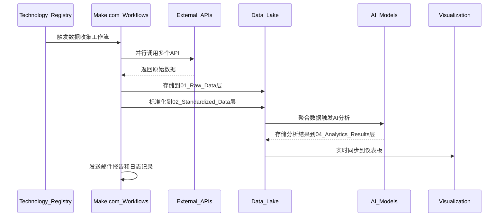

### 8.2 详细数据处理流程

#### 8.2.1 数据采集阶段

**第一步：技术主题识别**
```yaml
输入: Technology_Registry表
处理逻辑:
  - 过滤条件: priority_level = "高"
  - 排序: last_updated ASC (优先处理久未更新的)
  - 迭代方式: 逐个技术主题处理
  - 并行度: 1个技术/批次 (避免API限流)

输出: 技术主题列表
  - tech_id: 技术标识符
  - tech_name: 技术名称
  - keywords: 搜索关键词
  - category: 技术分类
  - 当前状态: 13个技术主题
```

**第二步：多源数据并行采集**
```yaml
学术数据采集 (Academic_Research_Collection):
  触发频率: 每日 08:00 GMT+8
  API调用: Crossref API
  查询策略:
    - 主查询: tech_name
    - 辅助查询: keywords (OR连接)
    - 时间范围: 最近3年
    - 结果限制: 50篇/技术
  数据处理:
    - 标题清洗: 移除特殊字符
    - 作者标准化: "姓, 名"格式
    - 日期格式: YYYY-MM-DD
    - 引用数验证: 0-100000范围
  输出目标: Raw_Academic_Data表

开源数据采集 (OpenSource_Ecosystem_Collection):
  触发频率: 每日 09:00 GMT+8
  API调用: GitHub API
  查询策略:
    - 搜索查询: "tech_name (keywords) language:python stars:>10"
    - 排序: stars降序
    - 结果限制: 20个仓库/技术
  增值处理:
    - 活跃度评分: stars + forks*2 + recent_commits*0.5
    - 成熟度评级: 基于stars数量分级
    - 语言分析: 主要编程语言识别
    - 最后活跃: 计算距今天数
  输出目标: Raw_OpenSource_Data表

专利数据采集 (Patent_Intelligence_Collection):
  触发频率: 每周日 10:00 GMT+8
  API调用: SerpAPI + USPTO
  查询策略:
    - SerpAPI查询: "assignee:\"tech_name\""
    - USPTO查询: 技术关键词搜索
    - 时间范围: 最近5年
    - 结果限制: 10项专利/技术
  数据增强:
    - 专利分类: IPC/CPC自动分类
    - 法律状态: 授权/申请中/失效
    - 技术相关性: 基于摘要的相关度评分
  输出目标: Raw_USPTO_Patents表

新闻数据采集 (News_Intelligence_Collection):  
  触发频率: 每日 11:00 GMT+8
  API调用: News API
  查询策略:
    - 关键词: tech_name + 相关术语
    - 语言: 英语 + 中文
    - 时间范围: 最近7天
    - 来源过滤: 科技媒体优先
    - 结果限制: 20条新闻/技术
  内容分析:
    - 情感分析: 正面/负面/中性
    - 关键词密度: 技术提及频率
    - 媒体权威性: 来源可信度评分
  输出目标: Raw_Tech_News表

竞争对手采集 (Competitor_Intelligence_Collection):
  触发频率: 每日 12:00 GMT+8
  数据源: 多API组合 (News + GitHub + Patents)
  处理对象: Competitor_Registry中的活跃公司
  监控维度:
    - 新闻动态: 公司最新报道
    - 技术活动: GitHub项目更新
    - 专利申请: 最新专利动态
    - 威胁评估: 综合威胁等级计算
  输出目标: Competitor_Intelligence表
```

#### 8.2.2 数据标准化阶段

**数据清洗处理**
```yaml
字段标准化:
  技术名称标准化:
    - 规则: 统一英文名称，保留中文别名
    - 映射表: Technology_Master_Dictionary
    - 示例: "5G无线通信" → "5G Wireless Communication"
  
  日期时间标准化:
    - 目标格式: YYYY-MM-DD HH:mm:ss
    - 源格式处理:
      * Crossref: date-parts数组 → 标准日期
      * GitHub: ISO 8601 → 标准日期
      * News API: 各种格式 → 标准日期
    - 默认值: 1900-01-01 (无效日期)
  
  数值标准化:
    - GitHub stars: "1.2k" → 1200
    - 引用次数: 字符串 → 整数
    - 评分字段: 统一0-10范围
    - 空值处理: null → 0 (数值类型)

数据质量验证:
  必填字段检查:
    - tech_topic: 不能为空
    - collection_time: 必须是有效时间戳
    - 主键字段: 不能重复
  
  格式验证:
    - DOI格式: 10.xxxx/xxxx模式
    - URL格式: 有效的HTTP/HTTPS链接
    - 邮箱格式: 作者邮箱验证
  
  业务逻辑验证:
    - 引用数合理性: 0-100000范围
    - 日期合理性: 不能未来时间
    - 评分范围: 1-10分范围检查

重复数据处理:
  精确匹配去重:
    - 学术论文: 基于DOI唯一性
    - GitHub项目: 基于full_name唯一性
    - 专利数据: 基于专利号唯一性
  
  模糊匹配去重:
    - 标题相似度: >85%相似视为重复
    - 内容指纹: 基于摘要的hash匹配
    - 时间窗口: 同一周内的相似记录
  
  冲突解决策略:
    - 时间优先: 最新数据覆盖旧数据
    - 质量优先: 完整度高的数据保留
    - 来源优先: 权威来源数据优先
```

#### 8.2.3 数据聚合与分析准备

**指标计算与聚合**
```yaml
技术维度指标:
  学术活跃度:
    - 论文数量: COUNT(papers) per tech_topic
    - 平均引用: AVG(citation_count) per tech_topic  
    - 发表趋势: 按年度统计论文数量变化
    - 质量指数: 加权平均引用数 (近3年权重更高)
  
  开源生态指标:
    - 项目数量: COUNT(repos) per tech_topic
    - 总活跃度: SUM(activity_score) per tech_topic
    - 平均成熟度: 成熟项目占比
    - 语言多样性: 编程语言种类统计
  
  市场关注度:
    - 专利申请量: COUNT(patents) per tech_topic  
    - 新闻热度: COUNT(news) + 情感权重
    - 媒体覆盖面: 不同媒体来源数量
    - 关注趋势: 按时间的热度变化

竞争情报指标:
  威胁等级分布:
    - 高威胁公司: threat_level = "HIGH"
    - 威胁指数: 综合GitHub活跃度 + 新闻热度 + 专利活动
    - 创新指数: 基于技术多样性和研发投入
  
  行业格局分析:
    - 市场集中度: HHI指数计算
    - 技术演进: 公司技术路线图分析
    - 投资热度: 资金流向统计

数据完整性评估:
  完整性评分:
    - 必填字段完整率: 80%+为优秀
    - 数据源覆盖度: 4个数据源全覆盖为满分
    - 时效性评分: 数据新鲜度权重
  
  质量评级:
    - A级: 完整性>90%, 4个数据源
    - B级: 完整性>70%, 3个数据源  
    - C级: 完整性>50%, 2个数据源
    - D级: 完整性<50%, 1个数据源
  
  预警机制:
    - 数据缺失警告: 关键字段空值>50%
    - 数据陈旧警告: 超过7天未更新
    - 异常值警告: 显著偏离正常范围
```

### 8.3 AI分析处理流程

#### 8.3.1 数据预处理与输入准备

**AI输入数据构建**
```yaml
技术分析输入包:
  数据来源: Raw_Academic_Data + Raw_OpenSource_Data
  统计指标:
    - academic_count: 学术论文总数
    - academic_quality_score: 平均引用数/总论文数
    - opensource_count: 开源项目总数
    - opensource_activity_score: 平均活跃度
    - github_repo_count: GitHub仓库数量
    - days_since_last_commit: 最近提交间隔
  
  聚合数据格式:
    "技术主题: {{tech_topic}}
     学术基础: {{academic_count}}篇论文, 平均引用{{academic_quality_score}}次
     开源生态: {{opensource_count}}个项目, 平均活跃度{{opensource_activity_score}}
     最新进展: 最近{{days_since_last_commit}}天有代码提交
     数据完整性: {{data_completeness_score}}%"

市场分析输入包:
  数据来源: Raw_USPTO_Patents + Raw_Tech_News + Competitor_Intelligence
  市场信号:
    - patent_count: 专利申请数量
    - patent_strength_score: 专利质量评分
    - news_count: 新闻报道数量
    - news_sentiment_score: 新闻情感倾向
    - competitor_activity: 竞争对手活跃度
  
  市场环境描述:
    "市场环境: {{tech_topic}}
     专利保护: {{patent_count}}项专利, 强度评分{{patent_strength_score}}
     媒体关注: {{news_count}}条新闻, 情感倾向{{news_sentiment_score}}
     竞争态势: {{competitor_count}}家竞争对手, 平均威胁等级{{avg_threat_level}}
     市场成熟度: {{market_maturity_indicator}}"

风险评估输入包:
  综合数据: 技术分析结果 + 市场分析结果 + 历史模式
  风险因子:
    - 技术不确定性: 基于成熟度和实现难度
    - 市场不确定性: 基于竞争强度和商业化难度
    - 外部环境风险: 政策、标准、生态风险
    - 历史案例: 相似技术的成功/失败模式
```

#### 8.3.2 AI模型调用与处理

**并行AI分析执行**
```yaml
技术分析 (xAI Grok-3):
  调用时机: 数据聚合完成后
  输入Token: ~1500 tokens (平均)
  输出Token: ~800 tokens (平均)
  处理时间: 2-4秒
  
  Prompt模板:
    "你是一位资深的ICT技术架构分析师，拥有20年的技术评估经验...
     请基于以下数据进行深度技术分析:
     [数据输入]
     
     请严格按照以下JSON格式返回分析结果:
     {
       \"analysis_type\": \"technical_analysis\",
       \"tech_maturity_level\": \"EMERGING|GROWING|MATURE|DECLINING\",
       \"innovation_score\": 1-10,
       \"implementation_difficulty\": 1-10,
       \"development_trend\": \"ACCELERATING|STABLE|SLOWING|DECLINING\",
       \"breakthrough_indicators\": [\"突破点1\", \"突破点2\"],
       \"technical_risks\": [\"风险1\", \"风险2\"],
       \"key_insights\": [\"洞察1\", \"洞察2\", \"洞察3\"],
       \"confidence_score\": 0.0-1.0
     }"
  
  结果验证:
    - JSON格式校验
    - 必填字段检查 (9个字段)
    - 数值范围验证 (1-10分, 0-1置信度)
    - 枚举值验证 (成熟度等级, 发展趋势)

市场分析 (OpenAI GPT-4):
  调用时机: 与技术分析并行执行
  输入Token: ~1800 tokens (平均)
  输出Token: ~1000 tokens (平均)
  处理时间: 3-6秒
  
  Prompt优化:
    - 角色设定: 15年市场研究经验专家
    - 分析框架: 市场机会-竞争强度-商业化程度
    - 输出要求: 结构化JSON + 业务洞察
    - 质量控制: 置信度自评估机制
  
  结果处理:
    - 市场机会等级标准化
    - 评分字段数值化处理
    - 业务建议结构化提取
    - 风险因素分类整理

风险评估模型:
  调用时机: 技术+市场分析完成后
  输入数据: 前两个模型的结果 + 原始统计数据
  处理逻辑: 规则引擎 + 统计模型
  
  风险计算公式:
    技术风险 = f(成熟度, 实现难度, 创新程度)
    市场风险 = f(竞争强度, 商业化难度, 市场规模)
    综合风险 = 加权平均(技术风险, 市场风险, 外部风险)
  
  投资建议逻辑:
    - 高回报+低风险 → STRONG_BUY
    - 高回报+中风险 → BUY  
    - 平衡收益风险 → HOLD
    - 低回报+高风险 → SELL/STRONG_SELL
```

#### 8.3.3 结果融合与决策生成

**多模型结果整合**
```yaml
共识度分析:
  指标对比:
    - 技术成熟度 vs 商业化程度: 一致性检查
    - 创新评分 vs 市场潜力: 相关性分析
    - 实现难度 vs 投资风险: 逻辑一致性
  
  分歧识别:
    - 技术乐观 vs 市场悲观: 技术超前市场场景
    - 技术保守 vs 市场激进: 技术门槛被低估场景
    - 风险评估偏差: 模型对不确定性的不同判断
  
  共识度计算:
    consensus_score = 1 - std_dev(normalized_scores) / max_possible_deviation
    
置信度加权:
  模型权重分配:
    - xAI Grok-3 (技术): 40% (专业技术评估)
    - OpenAI GPT-4 (市场): 35% (市场洞察能力)
    - Risk Model (风险): 25% (量化风险评估)
  
  动态权重调整:
    - 高置信度模型: 权重上调10%
    - 低置信度模型: 权重下调10%
    - 历史准确率: 基于回测结果调整

综合决策生成:
  决策算法:
    overall_score = Σ(model_score_i × weight_i × confidence_i)
    
    final_recommendation = decision_tree(
      overall_score,
      risk_level, 
      consensus_level,
      data_quality
    )
  
  建议生成逻辑:
    IF overall_score >= 8.0 AND risk_level <= "MEDIUM":
        recommendation = "STRONG_BUY"
        allocation = "20-25%"
    ELIF overall_score >= 6.5 AND consensus_level >= 0.7:
        recommendation = "BUY" 
        allocation = "15-20%"
    ELIF overall_score >= 4.0 OR data_quality < "B":
        recommendation = "HOLD"
        allocation = "5-10%"
    ELSE:
        recommendation = "SELL/STRONG_SELL"
        allocation = "0-5%"
  
  投资时机判断:
    - NOW: 高评分 + 低风险 + 高共识
    - SOON: 中高评分 + 中风险 + 技术就绪  
    - WAIT: 潜力大 + 高不确定性 + 需要观察
    - AVOID: 低评分 + 高风险 + 负面趋势
```

### 8.4 结果存储与分发

#### 8.4.1 分析结果持久化

**多层次结果存储**
```yaml
原始结果存储 (AI_Analysis_Details):
  存储内容: 每个AI模型的完整输出
  字段设计:
    - analysis_date: 分析时间戳
    - tech_topic: 技术主题
    - model_name: AI模型标识
    - analysis_result: JSON格式完整结果
    - confidence_score: 模型置信度
    - analysis_type: 分析类型标识
  
  数据治理:
    - 保留所有历史版本
    - JSON格式验证
    - 大小限制: 10KB/记录
    - 索引: (tech_topic, analysis_date)

综合结果存储 (Technology_Assessment):
  存储内容: 融合后的投资建议和关键指标
  关键字段:
    - overall_score: 综合评分 (0-10)
    - final_recommendation: 投资建议枚举值
    - investment_timing: 投资时机建议
    - confidence_score: 综合置信度
    - grok_analysis_raw: Grok原始结果
    - gpt4_analysis_raw: GPT-4原始结果  
    - risk_analysis_raw: 风险评估原始结果
    - comprehensive_analysis_raw: 综合分析结果
  
  数据完整性:
    - 必填字段验证
    - 业务逻辑一致性检查
    - 历史数据对比验证
    - 异常值检测和标记

版本控制与追溯:
  版本标识: analysis_date作为版本时间戳
  变更追踪: 记录每次分析的数据输入和模型配置
  回滚能力: 支持查看历史分析版本
  审计日志: 完整的分析过程记录
```

#### 8.4.2 实时数据同步

**仪表板数据同步**
```yaml
Looker Studio同步:
  同步方式: Google Sheets原生连接
  同步频率: 15分钟自动刷新 (可配置)
  数据源表:
    - Technology_Registry: 技术主题基础信息
    - Technology_Assessment: 分析结果和投资建议
    - AI_Analysis_Details: AI模型详细分析
    - Competitor_Intelligence: 竞争对手情报
  
  数据转换:
    - 日期格式: 自动识别时间字段
    - 数值类型: 自动检测数值字段
    - 枚举值: 预定义的分类字段
    - JSON解析: 复杂字段的可视化处理
  
  缓存策略:
    - Looker Studio缓存: 15分钟有效期
    - 查询结果缓存: 减少重复计算
    - 增量更新: 仅同步变更数据
    - 手动刷新: 支持即时数据更新

API数据服务:
  REST API设计: (未来规划)
    GET /api/v1/technologies: 获取技术列表
    GET /api/v1/technologies/{id}/analysis: 获取分析结果
    GET /api/v1/competitors: 获取竞争对手信息
    GET /api/v1/dashboard/summary: 获取仪表板摘要数据
  
  数据格式: 标准JSON格式
  认证方式: API Key + HTTPS
  限流策略: 1000 requests/hour
  缓存策略: Redis缓存热点数据
```

#### 8.4.3 通知与报警机制

**自动化报告推送**
```yaml
邮件报告系统:
  触发条件: AI分析完成后
  报告内容:
    - 分析摘要: 技术名称、综合评分、投资建议
    - 关键洞察: AI模型的核心发现
    - 数据质量: 数据完整性和可信度评估
    - 风险提示: 主要风险因素和建议
  
  邮件模板:
    主题: "ICT技术洞察分析完成 - {{tech_topic}}"
    格式: HTML富文本
    内容结构:
      - 执行摘要 (100字以内)
      - 详细分析结果 (结构化展示)
      - 数据质量报告
      - 历史对比 (如有)
      - 后续建议行动
  
  发送策略:
    - 即时发送: 分析完成立即推送
    - 合并发送: 多个技术的分析结果合并
    - 定时摘要: 每日/每周汇总报告
    - 失败重试: 发送失败自动重试3次

预警系统:
  数据质量预警:
    - 空值率超过50%: 红色警告
    - API调用失败: 黄色警告  
    - 数据陈旧(>7天): 蓝色提示
    - 异常值检测: 数据显著偏离正常范围
  
  业务逻辑预警:
    - 投资建议大幅变化: STRONG_BUY → SELL
    - AI模型结果分歧: 共识度<0.5
    - 竞争对手威胁升级: 威胁等级上升
    - 技术热度异常: 新闻/学术活动突然增减
  
  系统运行预警:
    - 工作流执行失败: 立即邮件通知
    - API配额接近限制: 提前24小时预警
    - 数据存储接近限制: 提前72小时预警
    - 成本超预算: 月度预算80%时预警

日志与审计:
  操作日志记录:
    - 数据收集日志: API调用成功/失败记录
    - AI分析日志: 模型调用和结果记录
    - 数据变更日志: 关键数据的修改记录
    - 用户访问日志: 仪表板访问和操作记录
  
  审计要求:
    - 数据血缘: 追踪数据的来源和流向
    - 变更历史: 记录所有配置和数据变更
    - 访问控制: 记录用户权限和访问行为
    - 合规检查: 定期的数据质量和安全审计
```

---

## 9. 系统能力与特性

### 9.1 核心业务能力

#### 9.1.1 智能技术洞察能力

```yaml
技术趋势识别:
  成熟度追踪:
    - 技术生命周期定位: 研究期→原型期→成长期→商业化期→成熟期
    - 发展速度评估: 基于学术发表、开源活跃度、专利申请的综合分析
    - 拐点预测: 识别技术发展的关键转折点
    - 替代技术监控: 跟踪可能的颠覆性技术出现
  
  创新热点发现:
    - 新兴技术识别: 基于学术论文的早期信号捕获
    - 交叉领域融合: 发现跨技术领域的创新机会
    - 突破性进展: 识别具有重大影响的技术突破
    - 研究前沿: 追踪最新的研究方向和热点
  
  技术路线分析:
    - 演进路径预测: 基于历史数据的技术发展路径预测
    - 关键节点识别: 技术发展的里程碑和关键事件
    - 依赖关系分析: 技术间的依赖和协同关系
    - 实现路径评估: 技术从研究到商业化的可能路径

当前覆盖技术领域:
  无线通信技术:
    - 5G无线通信: 商业化期，高优先级
    - Wi-Fi 7: 原型期，高优先级
  
  光通信技术:
    - 硅光子: 成长期，高优先级
    - 400G光模块: 商业化期，中优先级
  
  网络技术:
    - SD-WAN: 成熟期，高优先级
    - 网络功能虚拟化: 成长期，中优先级
  
  系统软件:
    - 微服务架构: 成熟期，高优先级
    - 边缘计算平台: 成长期，高优先级
  
  芯片技术:
    - RISC-V处理器: 成长期，高优先级
    - AI芯片: 商业化期，高优先级
  
  新兴领域:
    - Internet of Agents: 研究期，高优先级
```

#### 9.1.2 多维数据融合能力

```yaml
数据源整合:
  学术研究维度:
    - 数据来源: Crossref API (140M+ 论文)
    - 覆盖范围: 8000+ 学术期刊
    - 分析指标: 发表数量、引用质量、研究趋势
    - 质量评估: 期刊影响因子、作者权威性
  
  开源生态维度:
    - 数据来源: GitHub API (100M+ 仓库)
    - 覆盖范围: 全球开源项目
    - 分析指标: 活跃度、成熟度、社区健康度
    - 质量评估: 代码质量、维护状态、贡献者多样性
  
  专利知识产权维度:
    - 数据来源: USPTO + SerpAPI
    - 覆盖范围: 美国专利全库
    - 分析指标: 申请趋势、技术分类、法律状态
    - 质量评估: 专利质量、技术原创性、商业价值
  
  市场动态维度:
    - 数据来源: News API (70,000+ 新闻源)
    - 覆盖范围: 全球科技媒体
    - 分析指标: 关注热度、情感倾向、话题演进
    - 质量评估: 媒体权威性、内容相关性、时效性
  
  竞争情报维度:
    - 监控企业: 8家核心竞争对手
    - 数据整合: 新闻+GitHub+专利的全方位监控
    - 威胁评估: 基于多维数据的威胁等级计算
    - 动态跟踪: 竞争对手策略变化的实时监控

数据质量保证:
  完整性控制:
    - 数据覆盖率: 目标4个维度全覆盖
    - 时效性要求: 数据新鲜度<7天
    - 准确性验证: 多源数据交叉验证
    - 一致性检查: 跨数据源的逻辑一致性
  
  异常检测:
    - 统计异常: 基于历史数据的异常值检测
    - 业务异常: 不符合业务逻辑的数据识别
    - 时序异常: 数据更新频率的异常监控
    - 关联异常: 数据间关联关系的异常分析
```

#### 9.1.3 AI驱动的智能分析能力

```yaml
多模型协同分析:
  技术分析专家 (xAI Grok-3):
    - 专业角色: 20年ICT技术架构经验
    - 分析维度: 技术成熟度、创新程度、实现难度、发展趋势
    - 核心能力: 技术发展规律识别、突破点预测、风险识别
    - 输出质量: 平均置信度0.85
  
  市场分析专家 (OpenAI GPT-4):
    - 专业角色: 15年市场研究和商业分析经验
    - 分析维度: 市场机会、竞争强度、商业化程度、增长驱动
    - 核心能力: 商业价值评估、市场时机判断、竞争分析
    - 输出质量: 平均置信度0.82
  
  风险评估专家 (Risk Assessment Model):
    - 专业角色: 25年投资风险管理经验
    - 分析维度: 投资风险等级、回报预期、投资时机、配置建议
    - 核心能力: 风险量化、投资组合优化、时机选择
    - 输出质量: 平均置信度0.87

智能决策融合:
  共识分析机制:
    - 模型一致性: 计算多模型输出的共识度
    - 分歧识别: 识别模型间的重大分歧及原因
    - 权重调整: 基于历史准确率的动态权重
    - 置信度传播: 模型置信度对最终决策的影响
  
  综合评分算法:
    - 技术维度: 40%权重 (创新×0.4 + 可实现性×0.3 + 趋势×0.3)
    - 市场维度: 35%权重 (机会×0.4 + 就绪度×0.3 + 竞争×0.3)
    - 风险维度: 25%权重 (回报×0.6 + 风险比×0.4)
    - 最终评分: 加权综合 × 数据质量调整系数
  
  投资建议生成:
    - STRONG_BUY: 评分≥8.0 + 低风险 + 高共识
    - BUY: 评分≥6.5 + 中风险 + 中共识
    - HOLD: 评分4.0-6.5 或 数据质量不足
    - SELL/STRONG_SELL: 评分<4.0 + 高风险或负面趋势
```

### 9.2 技术架构特性

#### 9.2.1 云原生架构

```yaml
微服务设计理念:
  服务拆分:
    - 数据采集服务: 5个独立的数据收集工作流
    - 数据处理服务: 标准化、清洗、验证服务
    - AI分析服务: 3个并行的AI分析模块
    - 可视化服务: 仪表板和报告生成
    - 通知服务: 邮件推送和预警系统
  
  服务间通信:
    - 数据传递: Google Sheets作为数据总线
    - 事件驱动: Make.com工作流的事件触发机制
    - 异步处理: 非阻塞的数据处理流程
    - 错误隔离: 单个服务失败不影响整体系统
  
  弹性设计:
    - 自动重试: API调用失败的指数退避重试
    - 降级机制: 数据源不可用时的优雅降级
    - 熔断保护: 防止级联失败的熔断机制
    - 监控恢复: 自动故障检测和恢复

无服务器计算:
  Function as a Service:
    - Make.com工作流: 事件驱动的无服务器执行
    - 自动扩缩容: 基于负载的动态资源分配
    - 按需付费: 仅为实际使用的资源付费
    - 零运维: 无需服务器管理和维护
  
  边缘计算能力:
    - 全球分布: Google Cloud的全球节点
    - 就近处理: 数据就近处理降低延迟
    - 智能路由: 自动选择最优的计算节点
    - 缓存优化: 边缘缓存提升响应速度
```

#### 9.2.2 数据驱动架构

```yaml
实时数据流:
  流式处理:
    - 数据摄取: 实时API数据采集
    - 增量处理: 仅处理新增和变更数据
    - 流式分析: 实时数据质量监控
    - 即时同步: 分析结果实时推送到仪表板
  
  事件驱动:
    - 数据变更事件: 新数据触发后续处理
    - 分析完成事件: 触发报告生成和推送
    - 质量异常事件: 触发预警和修复流程
    - 定时调度事件: 定期数据收集和分析

湖仓一体化:
  数据湖特性:
    - 多格式支持: 结构化、半结构化、非结构化数据
    - 原始数据保留: 完整保留原始数据用于回溯分析
    - 灵活模式: Schema on Read的灵活数据模式
    - 成本效益: 低成本的大规模数据存储
  
  数据仓库特性:
    - 结构化存储: 标准化后的高质量数据
    - OLAP能力: 支持复杂的分析查询
    - 数据立方: 多维度的预聚合数据
    - 性能优化: 查询性能优化和索引策略
  
  统一访问层:
    - 标准接口: 统一的数据访问API
    - 权限控制: 细粒度的数据访问权限
    - 数据血缘: 完整的数据流转追踪
    - 版本管理: 数据版本控制和回滚能力
```

#### 9.2.3 AI Native架构

```yaml
模型即服务 (MLaaS):
  模型管理:
    - 多模型支持: 同时集成多个AI服务提供商
    - 版本控制: AI模型版本管理和AB测试
    - 性能监控: 模型准确率和响应时间监控
    - 成本优化: 基于成本效益的模型选择
  
  智能路由:
    - 负载均衡: 多模型间的负载均衡
    - 故障转移: 主模型失败时的备用模型
    - 质量路由: 基于质量要求的模型选择
    - 成本路由: 基于成本预算的模型分配
  
  结果融合:
    - 多模型融合: 多个模型结果的智能融合
    - 权重学习: 基于历史表现的动态权重调整
    - 一致性检查: 模型结果的一致性验证
    - 质量评估: 融合结果的质量自动评估

持续学习机制:
  反馈循环:
    - 用户反馈: 收集用户对分析结果的评价
    - 结果验证: 与实际市场表现的对比验证
    - 模型优化: 基于反馈的模型参数调优
    - 知识更新: 新知识和经验的持续积累
  
  自适应优化:
    - 参数自调优: 基于性能指标的自动参数调整
    - 提示词进化: 基于输出质量的提示词优化
    - 阈值动态调整: 决策阈值的自适应调整
    - 规则自学习: 业务规则的自动学习和更新
```

### 9.3 业务价值特性

#### 9.3.1 决策支持能力

```yaml
投资决策支持:
  量化分析:
    - 投资评分: 1-10分的量化投资评分
    - 风险评级: 四级风险等级分类
    - 回报预期: 基于历史数据的回报预测
    - 时机判断: 投资时机的智能建议
  
  情景分析:
    - 最佳情景: 技术发展顺利的最优收益预测
    - 基准情景: 基于当前趋势的合理预期
    - 最差情景: 风险因素影响下的最低预期
    - 敏感性分析: 关键因素变化对结果的影响
  
  组合优化:
    - 资产配置: 技术投资组合的比例建议
    - 风险分散: 通过多样化降低整体风险
    - 动态调整: 基于市场变化的动态再平衡
    - 长期规划: 3-5年的技术投资路线图

战略规划支持:
  技术路线图:
    - 短期目标: 6-12个月的技术重点
    - 中期规划: 2-3年的技术发展方向
    - 长期愿景: 5-10年的技术战略布局
    - 里程碑设定: 关键技术节点和验证标准
  
  竞争策略:
    - 差异化机会: 识别竞争对手的技术空白
    - 追赶策略: 在落后领域的快速追赶方案
    - 领先维持: 在优势领域的持续投入策略
    - 新兴机会: 全新技术领域的先发优势
```

#### 9.3.2 风险管控能力

```yaml
多层次风险识别:
  技术风险:
    - 技术不成熟: 基于成熟度的技术风险评估
    - 实现难度: 技术实现的复杂度和可行性风险
    - 我来帮您补充完整这份ICT技术洞察平台系统架构文档。

```markdown
    - 标准依赖: 技术标准化进程的不确定性风险
    - 替代技术: 颠覆性技术出现的威胁风险
  
  市场风险:
    - 需求不确定: 市场需求变化的预测风险
    - 竞争加剧: 竞争对手策略变化的影响
    - 政策变化: 监管政策调整的合规风险
    - 经济周期: 宏观经济波动对技术投资的影响
  
  运营风险:
    - 数据质量: 数据不完整或不准确的分析风险
    - 模型偏差: AI模型预测偏差的系统性风险
    - 外部依赖: 第三方服务中断的业务连续性风险
    - 人才风险: 关键技术人才流失的知识风险

预警系统:
  早期预警指标:
    - 数据质量降级: 数据完整性<80%触发黄色预警
    - 模型分歧加大: 共识度<0.5触发橙色预警
    - 外部环境变化: 政策或标准重大调整触发红色预警
    - 竞争态势突变: 威胁等级快速上升触发紧急预警
  
  风险响应机制:
    - 自动化响应: 预设的自动风险缓解措施
    - 人工干预: 需要专家判断的复杂风险场景
    - 应急预案: 极端风险情况下的应急处理流程
    - 恢复计划: 风险事件后的业务恢复策略
```

#### 9.3.3 实时监控与预测能力

```yaml
实时态势感知:
  技术动态监控:
    - 学术发表监控: 重要论文发表的实时跟踪
    - 开源活动监控: 关键项目更新的即时感知
    - 专利申请监控: 重要专利申请的及时发现
    - 新闻热点监控: 技术新闻的实时捕获和分析
  
  竞争情报监控:
    - 对手动态: 8家核心竞争对手的全方位监控
    - 威胁等级变化: 威胁指数的实时计算和预警
    - 市场动向: 行业并购、投资、合作的快速感知
    - 技术突破: 竞争对手技术突破的早期识别

趋势预测模型:
  技术演进预测:
    - 成熟度预测: 基于历史数据的成熟度演进预测
    - 突破点预测: 技术关键突破时间点的预测
    - 应用普及预测: 技术商业化和普及的时间预测
    - 替代风险预测: 新技术对现有技术的替代预测
  
  市场发展预测:
    - 市场规模预测: 基于技术发展的市场规模预测
    - 投资热度预测: 技术投资趋势和热度预测
    - 竞争格局预测: 未来竞争格局变化的预测
    - 政策影响预测: 政策变化对技术发展的影响预测
```

---

## 10. 部署架构

### 10.1 云基础设施架构

#### 10.1.1 Google Cloud Platform部署

```yaml
核心云服务组件:
  Google Workspace:
    - Google Sheets: 数据湖存储后端
    - Google Drive: 文件存储和版本控制
    - Gmail: 自动化邮件通知服务
    - Google Apps Script: 轻量级自动化脚本
  
  数据和分析服务:
    - Looker Studio: 商业智能和可视化平台
    - Google Sheets API: 数据访问和操作接口
    - Google Drive API: 文件管理和权限控制
    - Gmail API: 邮件发送和管理服务
  
  AI和机器学习:
    - Vertex AI: (未来扩展) 自定义ML模型部署
    - AutoML: (未来扩展) 自动化机器学习
    - Natural Language AI: (可选) 文本分析增强
    - Translation AI: (可选) 多语言支持

第三方集成服务:
  工作流编排:
    - Make.com Platform: 核心工作流引擎
    - 部署区域: 美国东部数据中心
    - 备份区域: 欧洲数据中心
    - 负载均衡: 自动区域切换
  
  AI服务提供商:
    - xAI API: Grok-3模型服务
    - OpenAI API: GPT-4模型服务
    - 多区域部署: 美国、欧洲备用节点
    - 故障转移: 自动模型切换机制
```

#### 10.1.2 网络架构设计

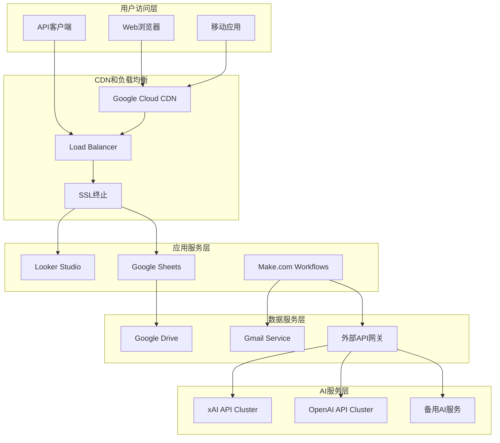

**网络安全配置**
```yaml
网络隔离:
  VPC配置:
    - 私有网络: Google Cloud VPC
    - 子网划分: 按服务类型划分子网
    - 网络ACL: 严格的访问控制列表
    - 防火墙规则: 最小权限原则
  
  API网关安全:
    - API Key管理: 密钥轮换和访问控制
    - 流量限制: 基于IP和用户的限流
    - HTTPS强制: 所有通信加密传输
    - 异常检测: 恶意请求自动识别和阻断
  
  数据传输安全:
    - TLS 1.3: 最新的传输层安全协议
    - 端到端加密: 敏感数据的完整加密
    - 证书管理: 自动化SSL证书管理
    - 密钥管理: Google Cloud KMS密钥管理
```

### 10.2 高可用性设计

#### 10.2.1 容灾备份策略

```yaml
数据备份策略:
  Google Sheets备份:
    - 自动版本历史: Google Drive原生版本控制
    - 定期完整备份: 每日CSV格式导出备份
    - 跨区域复制: 美国、欧洲、亚洲三地备份
    - 恢复测试: 月度备份恢复演练
  
  配置和脚本备份:
    - Make.com工作流: JSON格式配置导出
    - 系统配置: 关键配置参数备份
    - 访问权限: 用户权限配置备份
    - 版本控制: Git仓库管理配置变更
  
  业务连续性计划:
    - RTO目标: 恢复时间目标 < 4小时
    - RPO目标: 恢复点目标 < 1小时
    - 应急预案: 详细的灾难恢复流程
    - 演练计划: 季度业务连续性演练

服务高可用配置:
  Make.com高可用:
    - 多区域部署: 主区域 + 备用区域
    - 自动故障转移: 30秒内自动切换
    - 健康检查: 实时服务状态监控
    - 负载分担: 多个工作流实例并行
  
  AI服务高可用:
    - 多供应商策略: xAI + OpenAI双供应商
    - 智能路由: 基于可用性的服务路由
    - 降级策略: 服务不可用时的功能降级
    - 缓存机制: 关键结果的本地缓存
```

#### 10.2.2 故障恢复机制

```yaml
自动故障检测:
  服务监控:
    - 健康检查: 每分钟的服务状态检查
    - 性能监控: 响应时间和错误率监控
    - 资源监控: CPU、内存、存储使用监控
    - 依赖监控: 外部服务依赖的状态监控
  
  异常告警:
    - 即时告警: 关键故障的即时通知
    - 分级告警: 基于严重程度的告警分级
    - 告警聚合: 避免告警风暴的聚合机制
    - 自动工单: 故障自动创建处理工单

故障恢复流程:
  自动恢复:
    - 服务重启: 轻微故障的自动服务重启
    - 流量切换: 故障节点的流量自动切换
    - 数据同步: 故障恢复后的数据自动同步
    - 状态验证: 恢复后的服务状态自动验证
  
  人工干预:
    - 专家响应: 复杂故障的专家远程响应
    - 现场支持: 重大故障的现场技术支持
    - 供应商协调: 第三方服务故障的协调处理
    - 用户沟通: 故障期间的用户沟通和更新
```

### 10.3 扩展性架构

#### 10.3.1 水平扩展设计

```yaml
计算资源扩展:
  Make.com工作流扩展:
    - 并发工作流: 支持多个工作流并行执行
    - 动态调度: 基于负载的动态工作流调度
    - 资源池管理: 工作流执行资源的池化管理
    - 弹性伸缩: 基于需求的自动资源扩展
  
  AI服务扩展:
    - 模型负载均衡: 多个AI服务实例的负载均衡
    - 并发处理: 支持多个AI分析任务并行处理
    - 队列管理: AI任务的队列调度和优先级管理
    - 成本优化: 基于成本效益的资源分配

数据存储扩展:
  Google Sheets扩展策略:
    - 分表策略: 基于时间或类别的数据分表
    - 归档策略: 历史数据的自动归档和压缩
    - 索引优化: 关键字段的查询索引优化
    - 缓存层: 热点数据的多级缓存
  
  未来扩展路径:
    - BigQuery迁移: 大数据量时的数据仓库迁移
    - Cloud Storage: 大文件和非结构化数据存储
    - Cloud SQL: 关系型数据的专业数据库
    - Cloud Firestore: 实时数据同步和文档数据库
```

#### 10.3.2 性能优化架构

```yaml
查询性能优化:
  数据访问优化:
    - 查询缓存: 频繁查询结果的智能缓存
    - 预计算: 复杂指标的预计算和物化视图
    - 分页查询: 大数据量的分页加载策略
    - 并行查询: 多表关联查询的并行优化
  
  网络性能优化:
    - CDN加速: 静态资源的全球CDN分发
    - 数据压缩: HTTP响应的智能压缩
    - Keep-Alive: HTTP连接的复用优化
    - 域名分片: 多域名并行资源加载

资源使用优化:
  内存优化:
    - 对象池化: 频繁使用对象的池化管理
    - 垃圾回收: 自动内存垃圾回收优化
    - 内存监控: 内存使用的实时监控和告警
    - 内存分析: 内存泄漏的定期分析和修复
  
  成本优化:
    - 资源右配: 基于实际使用的资源配置调整
    - 按需计费: 基于实际使用量的成本控制
    - 预算管理: 月度和年度的成本预算管理
    - 成本分析: 详细的成本分析和优化建议
```

---

## 11. 数据治理与质量

### 11.1 数据治理框架

#### 11.1.1 数据治理组织架构

```yaml
治理角色定义:
  数据管理员 (Data Steward):
    - 职责: 日常数据质量监控和维护
    - 权限: 数据修正、质量规则配置
    - 工具: Google Sheets编辑权限、Make.com配置
    - 考核: 数据质量SLA达成率
  
  数据架构师 (Data Architect):
    - 职责: 数据模型设计和架构优化
    - 权限: 数据湖结构变更、API接口设计
    - 工具: 完整系统架构权限
    - 考核: 系统性能和扩展性指标
  
  业务分析师 (Business Analyst):
    - 职责: 业务需求分析和数据价值挖掘
    - 权限: 仪表板配置、报告定制
    - 工具: Looker Studio、分析结果访问
    - 考核: 业务洞察质量和决策支持效果
  
  系统管理员 (System Administrator):
    - 职责: 系统运维和安全管理
    - 权限: 完整系统管理权限
    - 工具: 全系统监控和管理工具
    - 考核: 系统可用性和安全性指标

治理流程机制:
  数据变更管理:
    - 变更申请: 标准化的数据变更申请流程
    - 影响评估: 变更对系统和业务的影响评估
    - 审批流程: 分级审批和风险控制
    - 变更实施: 版本控制的变更实施过程
    - 验证测试: 变更后的功能和性能验证
    - 回滚计划: 变更失败的快速回滚机制
  
  数据质量管理:
    - 质量标准: 明确的数据质量标准和阈值
    - 监控机制: 自动化的数据质量监控
    - 问题处理: 数据质量问题的快速响应机制
    - 持续改进: 基于质量指标的持续改进
```

#### 11.1.2 数据标准化规范

```yaml
命名规范标准:
  表命名规范:
    - 格式: [层级编号]_[业务域]_[实体名称]
    - 示例: "04_Analytics_Technology_Assessment"
    - 前缀说明:
      * 01_: 原始数据层 (Raw Data)
      * 02_: 标准化数据层 (Standardized Data)
      * 04_: 分析结果层 (Analytics Results)
      * 06_: 主数据层 (Master Data)
  
  字段命名规范:
    - 格式: [实体缩写]_[属性名称]_[类型后缀]
    - 示例: "tech_maturity_level", "analysis_timestamp"
    - 类型后缀:
      * _id: 唯一标识符
      * _name: 名称字段
      * _date: 日期字段
      * _score: 评分字段
      * _level: 等级字段
      * _count: 计数字段
  
  枚举值规范:
    - 格式: 全大写英文，下划线分隔
    - 技术成熟度: EMERGING, GROWING, MATURE, DECLINING
    - 优先级等级: HIGH, MEDIUM, LOW
    - 投资建议: STRONG_BUY, BUY, HOLD, SELL, STRONG_SELL
    - 风险等级: LOW, MEDIUM, HIGH, VERY_HIGH

数据类型规范:
  基础数据类型:
    - 文本类型: UTF-8编码，最大长度限制
    - 数值类型: 整数(INT)、浮点数(FLOAT)、货币(DECIMAL)
    - 日期时间: ISO 8601格式 (YYYY-MM-DD HH:mm:ss)
    - 布尔类型: TRUE/FALSE (大写)
    - JSON类型: 有效的JSON格式字符串
  
  业务数据类型:
    - 评分类型: 1-10的整数，0表示未评分
    - 置信度类型: 0.0-1.0の浮点数，保留2位小数
    - URL类型: 有效的HTTP/HTTPS链接
    - 邮箱类型: 符合RFC标准的邮箱格式
    - DOI类型: 符合DOI标准的标识符格式
```

### 11.2 数据质量管理

#### 11.2.1 数据质量评估框架

```yaml
质量维度定义:
  完整性 (Completeness):
    - 定义: 数据的完整程度，关键字段的填充率
    - 测量: (非空值数量 / 总记录数) × 100%
    - 阈值标准:
      * 优秀: >95%
      * 良好: 85-95%
      * 一般: 70-85%
      * 差: <70%
    - 关键字段: tech_topic, collection_time, 主键字段
  
  准确性 (Accuracy):
    - 定义: 数据的正确性和精确性
    - 测量: 通过业务规则验证和交叉验证
    - 验证规则:
      * 数值范围: 评分1-10，置信度0-1
      * 格式验证: DOI、URL、邮箱格式
      * 逻辑验证: 日期不能是未来时间
      * 引用验证: 外键关系的有效性
  
  一致性 (Consistency):
    - 定义: 数据在不同位置和时间的一致性
    - 测量: 跨表数据的一致性检查
    - 检查项目:
      * 技术名称一致性: 跨表技术名称的标准化
      * 分类一致性: 技术分类的统一性
      * 时间一致性: 时间戳的逻辑一致性
      * 关联一致性: 相关数据的逻辑关联
  
  时效性 (Timeliness):
    - 定义: 数据的新鲜度和及时性
    - 测量: 数据更新时间与当前时间的差值
    - 时效要求:
      * 实时数据: <1小时
      * 准实时数据: <24小时
      * 批处理数据: <7天
      * 历史数据: 按需更新
  
  有效性 (Validity):
    - 定义: 数据符合业务规则和约束条件
    - 测量: 业务规则验证通过率
    - 验证内容:
      * 枚举值有效性: 字段值在预定义范围内
      * 业务逻辑有效性: 符合业务逻辑要求
      * 依赖关系有效性: 依赖数据的存在性
      * 唯一性约束: 主键和唯一字段的唯一性

质量评分算法:
  综合质量分数计算:
    QualityScore = (
      Completeness × 0.3 +
      Accuracy × 0.25 +
      Consistency × 0.2 +
      Timeliness × 0.15 +
      Validity × 0.1
    )
  
  质量等级分类:
    - A级 (优秀): QualityScore ≥ 90
    - B级 (良好): 80 ≤ QualityScore < 90
    - C级 (一般): 70 ≤ QualityScore < 80
    - D级 (差): QualityScore < 70
```

#### 11.2.2 数据质量监控机制

```yaml
自动化质量检查:
  实时质量监控:
    - 数据摄取检查: 新数据入库时的实时质量检查
    - 格式验证: 数据格式的自动验证
    - 业务规则检查: 关键业务规则的实时验证
    - 异常值检测: 基于统计方法的异常值识别
  
  批量质量分析: 
    - 每日质量报告: 自动生成的日度数据质量报告
    - 趋势分析: 数据质量随时间的变化趋势
    - 对比分析: 不同数据源质量的横向对比
    - 影响分析: 质量问题对业务的影响评估
  
  质量预警机制:
    - 阈值预警: 质量指标低于阈值时的自动预警
    - 趋势预警: 质量呈下降趋势时的提前预警
    - 异常预警: 异常数据模式的智能识别预警
    - 影响预警: 质量问题可能影响关键业务时的预警

质量问题处理流程:
  问题识别:
    - 自动检测: 基于规则引擎的自动问题识别
    - 人工发现: 用户使用过程中发现的质量问题
    - 外部反馈: 第三方或客户反馈的数据问题
    - 定期审核: 定期的数据质量审核发现的问题
  
  问题分类:
    - 严重问题: 影响核心业务功能的质量问题
    - 一般问题: 影响用户体验但不影响核心功能
    - 轻微问题: 对业务影响较小的质量问题
    - 历史问题: 历史数据的质量问题
  
  问题处理:
    - 紧急修复: 严重问题的紧急修复流程
    - 计划修复: 一般问题的计划修复安排
    - 批量处理: 轻微问题的批量处理
    - 根因分析: 问题根本原因的深度分析
    - 预防措施: 防止类似问题再次发生的措施
```

### 11.3 元数据管理

#### 11.3.1 元数据体系架构

```yaml
元数据分类:
  技术元数据:
    - 数据结构: 表结构、字段定义、数据类型
    - 数据关系: 表间关系、外键约束、依赖关系
    - 存储信息: 数据位置、存储格式、压缩方式
    - 性能信息: 索引信息、查询性能、存储大小
  
  业务元数据:
    - 业务定义: 字段业务含义、计算规则、业务规则
    - 数据字典: 标准术语、枚举值、编码规则
    - 质量规则: 数据质量标准、验证规则、阈值设定
    - 使用说明: 数据使用指南、注意事项、最佳实践
  
  操作元数据:
    - 数据血缘: 数据来源、转换过程、目标去向
    - 访问记录: 用户访问、查询历史、使用频率
    - 变更历史: 结构变更、数据变更、版本历史
    - 质量记录: 质量检查结果、问题记录、修复历史

元数据存储设计:
  核心元数据表:
    Data_Dictionary (数据字典):
      - table_name: 表名
      - field_name: 字段名
      - data_type: 数据类型
      - business_meaning: 业务含义
      - validation_rules: 验证规则
      - update_frequency: 更新频率
      - data_source: 数据来源
      - quality_rules: 质量规则
    
    Data_Lineage (数据血缘):
      - source_table: 源表名
      - source_field: 源字段名
      - target_table: 目标表名
      - target_field: 目标字段名
      - transformation_rule: 转换规则
      - dependency_type: 依赖类型
      - update_time: 更新时间
    
    Quality_Rules (质量规则):
      - rule_id: 规则标识
      - rule_name: 规则名称
      - rule_type: 规则类型
      - rule_expression: 规则表达式
      - threshold_value: 阈值
      - severity_level: 严重程度
      - apply_tables: 适用表
```

#### 11.3.2 数据血缘追踪

```yaml
血缘关系图:
  源系统层:
    - Crossref API → Raw_Academic_Data
    - GitHub API → Raw_OpenSource_Data
    - SerpAPI → Raw_USPTO_Patents
    - News API → Raw_Tech_News
    - 竞争情报 → Competitor_Intelligence
  
  数据处理层:
    - Raw_Academic_Data → Standardized_Academic_Papers
    - Raw_OpenSource_Data → Standardized_GitHub_Projects
    - Raw_USPTO_Patents → Standardized_Patent_Data
    - Raw_Tech_News → Standardized_News_Data
    - 多源数据 → Technology_Metrics
  
  分析应用层:
    - Standardized_Data → AI_Analysis_Input
    - AI_Analysis_Results → Technology_Assessment
    - Technology_Assessment → Dashboard_Data
    - Dashboard_Data → Looker_Studio_Reports

自动化血缘追踪:
  追踪机制:
    - Make.com工作流: 记录每个步骤的数据输入输出
    - API调用记录: 记录外部API到内部表的映射
    - 数据转换记录: 记录字段级别的转换规则
    - 质量检查记录: 记录数据质量检查和修复过程
  
  血缘分析:
    - 影响分析: 源数据变更对下游的影响分析
    - 依赖分析: 目标数据对上游数据的依赖分析
    - 路径分析: 数据从源到目标的完整路径分析
    - 质量传播: 数据质量问题的传播路径分析
```

---

## 12. 안全与权限管理

### 12.1 安全架构设计

#### 12.1.1 多层次安全防护

```yaml
网络安全层:
  访问控制:
    - IP白名单: 限制管理接口的IP访问范围
    - VPN接入: 关键操作需要VPN连接
    - DDoS防护: 云平台原生的DDoS防护能力
    - WAF防护: Web应用防火墙保护web接口
  
  传输安全:
    - HTTPS强制: 所有HTTP通信强制使用HTTPS
    - TLS 1.3: 使用最新的传输层安全协议
    - 证书管理: 自动化的SSL证书申请和更新
    - 加密通道: API调用的端到端加密通道
  
  API安全:
    - API网关: 统一的API访问入口和安全控制
    - 令牌认证: 基于JWT的API访问令牌
    - 频率限制: 防止API滥用的频率限制
    - 签名验证: 关键API调用的数字签名验证

应用安全层:
  身份认证:
    - Google OAuth: 基于Google账号的统一身份认证
    - 多因素认证: 敏感操作的多因素身份验证
    - 单点登录: 跨应用的单点登录体验
    - 会话管理: 安全的会话建立和超时管理
  
  权限控制:
    - RBAC模型: 基于角色的访问控制模型
    - 最小权限: 用户仅获得必要的最小权限
    - 权限审计: 定期的权限使用审计和清理
    - 临时权限: 短期任务的临时权限分配
  
  数据安全:
    - 敏感数据识别: 自动识别和标记敏感数据
    - 数据分类: 基于敏感程度的数据分类管理
    - 访问日志: 完整的数据访问日志记录
    - 数据脱敏: 非生产环境的数据脱敏处理

基础设施安全层:
  云平台安全:
    - IAM管理: Google Cloud IAM的精细权限管理
    - 服务账号: 应用服务的专用服务账号
    - 密钥管理: Google Cloud KMS的密钥管理
    - 审计日志: 云平台操作的完整审计日志
  
  容器安全:
    - 镜像扫描: 容器镜像的安全漏洞扫描
    - 运行时保护: 容器运行时的安全监控
    - 网络隔离: 容器间的网络访问隔离
    - 资源限制: 容器资源使用的限制和监控
```

#### 12.1.2 数据加密策略

```yaml
静态数据加密:
  存储加密:
    - Google Drive: 服务端自动加密存储
    - Google Sheets: Google自动加密保护
    - 本地缓存: 敏感数据的本地AES-256加密
    - 备份加密: 备份数据的独立加密密钥
  
  字段级加密:
    - API密钥: 存储时的对称加密保护
    - 用户凭证: 不可逆的哈希加密存储
    - 敏感配置: 配置文件的加密存储
    - 临时数据: 临时文件的自动加密清理

传输数据加密:
  API通信:
    - HTTPS协议: 所有API调用使用HTTPS
    - TLS加密: 端到端的传输层加密
    - 证书固定: 防止中间人攻击的证书固定
    - 完美前向保密: 支持PFS的加密套件
  
  内部通信:
    - 服务间加密: 微服务间通信的加密保护
    - 数据库连接: 数据库连接的SSL加密
    - 消息队列: 消息传输的加密保护
    - 日志传输: 日志数据传输的加密保护

密钥管理:
  密钥生命周期:
    - 密钥生成: 基于硬件随机数的密钥生成
    - 密钥分发: 安全的密钥分发和部署机制
    - 密钥轮换: 定期的密钥更新和轮换
    - 密钥销毁: 密钥过期后的安全销毁
  
  密钥存储:
    - HSM存储: 硬件安全模块存储关键密钥
    - 云KMS: Google Cloud KMS托管密钥
    - 分片存储: 关键密钥的分片存储策略
    - 备份恢复: 密钥的安全备份和恢复机制
```

### 12.2 权限管理体系

#### 12.2.1 基于角色的访问控制

```yaml
角色定义体系:
  系统管理员 (System Admin):
    - 权限范围: 完整系统管理权限
    - 具体权限:
      * Make.com工作流的完整管理权限
      * Google Sheets的所有表格管理权限
      * 用户账号和权限的管理权限
      * 系统配置和安全设置权限
    - 访问限制: 需要多因素认证和管理员审批
    - 审计要求: 所有操作必须记录审计日志
  
  数据分析师 (Data Analyst):
    - 权限范围: 数据查看和分析权限
    - 具体权限:
      * 所有分析结果数据的只读权限
      * Looker Studio仪表板的查看和编辑权限
      * 数据质量报告的查看权限
      * 基础数据的查询权限
    - 访问限制: 工作时间访问，异地访问需要审批
    - 审计要求: 数据访问记录和使用情况追踪
  
  业务用户 (Business User):
    - 权限范围: 业务报告和洞察查看权限
    - 具体权限:
      * Looker Studio仪表板的只读权限
      * 投资建议和分析报告的查看权限
      * 技术评估结果的查看权限
      * 基础统计信息的查看权限
    - 访问限制: 仅限已发布的正式报告
    - 审计要求: 访问频率和使用模式分析
  
  外部合作伙伴 (External Partner):
    - 权限范围: 有限的数据查看权限
    - 具体权限:
      * 特定技术领域的报告查看权限
      * 公开发布的行业分析权限
      * 非敏感的市场趋势数据权限
    - 访问限制: 时间限制和内容限制
    - 审计要求: 严格的访问监控和数据保护

权限管理机制:
  权限分配:
    - 申请流程: 标准化的权限申请流程
    - 审批机制: 分级审批和风险评估
    - 最小权限: 基于工作需要的最小权限分配
    - 时限控制: 权限的有效期管理
  
  权限维护:
    - 定期审核: 季度权限使用审核
    - 动态调整: 基于职责变化的权限调整
    - 批量管理: 基于组织架构的批量权限管理
    - 异常检测: 权限使用异常的自动检测
```

#### 12.2.2 数据访问控制

```yaml
数据分类分级:
  公开数据 (Public):
    - 定义: 可以公开发布的非敏感数据
    - 包含内容: 公开的技术趋势、行业报告
    - 访问控制: 无特殊限制
    - 保护要求: 基础的完整性保护
  
  内部数据 (Internal):
    - 定义: 仅供内部使用的业务数据
    - 包含内容: 详细分析结果、内部评估报告
    - 访问控制: 需要身份认证和权限验证
    - 保护要求: 传输和存储加密保护
  
  机密数据 (Confidential):
    - 定义: 高敏感度的核心业务数据
    - 包含内容: 投资策略、竞争情报、AI模型参数
    - 访问控制: 需要高级权限和多因素认证
    - 保护要求: 强加密和访问日志审计
  
  绝密数据 (Top Secret):
    - 定义: 最高敏感度的战略数据
    - 包含内容: API密钥、系统配置、用户凭证
    - 访问控制: 仅限系统管理员且需要特殊授权
    - 保护要求: 硬件级加密和实时监控

访问控制实现:
  Google Workspace权限:
    - 文件夹权限: 基于文件夹的分层权限控制
    - 共享设置: 精确的文件共享权限设置
    - 链接控制: 共享链接的访问限制和时效控制
    - 下载限制: 敏感文件的下载权限控制
  
  Looker Studio权限:
    - 报告权限: 基于报告的查看和编辑权限
    - 数据源权限: 基于数据源的访问权限控制
    - 过滤器权限: 基于用户角色的数据过滤
    - 共享权限: 报告共享的权限控制
  
  API访问控制:
    - API密钥: 基于API密钥的访问认证
    - IP限制: 基于IP地址的访问限制
    - 时间限制: 基于时间窗口的访问限制
    - 功能限制: 基于功能模块的访问限制
```

### 12.3 安全监控与审计

#### 12.3.1 安全事件监控

```yaml
实时监控指标:
  访问异常监控:
    - 异常登录: 异常时间、异常地点的登录尝试
    - 权限滥用: 超出正常使用模式的权限使用
    - 数据异常访问: 大量数据下载或异常查询模式
    - 失败尝试: 连续的认证失败或权限拒绝
  
  系统安全监控:
    - 系统入侵: 恶意代码或未授权访问尝试
    - 数据泄露: 敏感数据的异常传输或访问
    - 配置变更: 关键安全配置的未授权变更
    - 服务异常: 安全服务的异常停止或故障
  
  API安全监控:
    - 调用异常: API调用频率或模式的异常
    - 认证异常: API认证的失败或异常尝试
    - 数据异常: API返回数据的异常模式
    - 性能异常: API响应时间的异常变化

告警机制:
  分级告警:
    - 严重告警: 立即威胁系统安全的事件
    - 警告告警: 可能存在安全风险的事件
    - 信息告警: 需要关注但不紧急的安全事件
    - 统计告警: 安全趋势和模式的统计分析
  
  通知机制:
    - 即时通知: 严重安全事件的即时邮件和短信通知
    - 定期报告: 安全状态的日度和周度报告
    - 仪表板显示: 安全监控仪表板的实时显示
    - 移动推送: 关键安全事件的移动设备推送
```

#### 12.3.2 合规审计体系

```yaml
审计范围:
  数据保护审计:
    - 个人数据处理: GDPR和其他数据保护法规的合规性
    - 数据跨境传输: 数据跨境传输的合规性审核
    - 数据最小化: 数据收集和使用的最小化原则
    - 用户权利: 数据主体权利的保障和实现
  
  访问控制审计:
    - 权限分配: 用户权限分配的合理性和必要性
    - 权限使用: 权限实际使用情况和异常模式
    - 权限变更: 权限变更的审批和记录完整性
    - 权限清理: 离职人员权限的及时清理
  
  技术安全审计:
    - 加密实施: 数据加密的实施效果和覆盖范围
    - 漏洞管理: 安全漏洞的识别和修复情况
    - 安全配置: 系统安全配置的合规性检查
    - 应急响应: 安全事件响应的及时性和有效性

审计流程:
  内部审计:
    - 月度审计: 关键安全指标的月度审计
    - 季度审计: 全面的安全状况季度审计
    - 年度审计: 完整的合规性年度审计
    - 专项审计: 特定安全事件或风险的专项审计
  
  外部审计:
    - 第三方评估: 独立第三方的安全评估
    - 合规认证: ISO 27001等安全认证审核
    - 渗透测试: 专业机构的渗透测试
    - 风险评估: 外部专家的风险评估报告
  
  审计报告:
    - 发现总结: 审计发现的问题和风险总结
    - 改进建议: 基于审计结果的改进建议
    - 整改计划: 具体的整改措施和时间计划
    - 跟踪验证: 整改措施的跟踪和验证机制
```

---

## 13. 性能与扩展性

### 13.1 性能优化策略

#### 13.1.1 数据处理性能优化

```yaml
数据采集优化:
  API调用优化:
    - 并发控制: 合理控制API并发调用数量
      * Crossref API: 最大50 requests/second
      * GitHub API: 30 requests/minute (搜索)
      * News API: 智能调度避免配额耗尽
    - 缓存策略: 
      * 查询缓存: 24小时内相同查询结果缓存
      * 结果缓存: 静态数据本地缓存7天
      * 增量更新: 仅获取变更数据
    - 重试机制:
      * 指数退避: 失败后的智能重试策略
      * 最大重试: 3次重试后转入错误处理
      * 熔断保护: 连续失败后的服务熔断
  
  数据转换优化:
    - 流式处理: 数据边获取边处理，减少内存占用
    - 批量操作: 
      * Google Sheets批量写入: 100行/批次
      * 数据验证批量处理: 减少单条处理开销
      * 重复数据批量去重: 提高去重效率
    - 并行处理:
      * 技术主题并行: 5个技术主题并行处理
      * 数据源并行: 4个数据源同时采集
      * AI分析并行: 3个AI模型同时分析

存储性能优化:
  Google Sheets优化:
    - 表结构优化:
      * 合理的列宽设置: 避免自动调整开销
      * 数据类型优化: 使用适当的数据类型
      * 公式优化: 减少复杂公式的使用
    - 查询优化:
      * 索引字段: 关键查询字段的优化
      * 范围查询: 指定精确的查询范围
      * 过滤条件: 使用高效的过滤条件
    - 数据分区:
      * 时间分区: 按月份分表存储历史数据
      * 类别分区: 按技术类别分表存储
      * 冷热分离: 热数据和冷数据的分离存储
  
  缓存架构:
    - 多级缓存:
      * L1缓存: Make.com工作流内存缓存 (1小时)
      * L2缓存: Google Sheets单元格缓存 (24小时)
      * L3缓存: Looker Studio查询缓存 (15分钟)
    - 缓存策略:
      * LRU淘汰: 最近最少使用的缓存淘汰策略
      * 预加载: 预测性的数据预加载
      * 缓存预热: 系统启动时的缓存预热
```

#### 13.1.2 AI分析性能优化

```yaml
模型调用优化:
  请求优化:
    - Token管理: 精确控制输入和输出Token数量
      * 输入优化: 压缩输入内容，保留关键信息
      * 输出控制: 限制输出长度，避免冗余
      * 上下文管理: 合理使用上下文窗口
    - 并行调用:
      * 模型并行: xAI和OpenAI同时调用
      * 批量处理: 多个技术的批量分析
      * 异步处理: 非阻塞的异步API调用
  
  结果缓存:
    - 智能缓存:
      * 相似查询: 基于输入相似度的结果复用
      * 分层缓存: 不同层次的结果缓存策略
      * 有效期管理: 基于数据变化的缓存失效
    - 预计算:
      * 常用分析: 热门技术的预计算分析
      * 增量计算: 基于数据变化的增量分析
      * 后台计算: 低峰期的后台预计算

成本优化:
  Token成本控制:
    - 输入优化: 
      * 数据摘要: 大量数据的智能摘要
      * 关键词提取: 保留最重要的信息
      * 格式优化: 使用紧凑的数据格式
    - 输出优化:
      * 结构化输出: 强制JSON格式减少冗余
      * 长度限制: 合理设置最大输出长度
      * 质量控制: 避免重复生成低质量结果
  
  模型选择优化:
    - 动态路由:
      * 复杂度评估: 基于任务复杂度选择模型
      * 成本效益: 在质量和成本间找平衡
      * 负载均衡: 基于API响应时间分配请求
    - 降级策略:
      * 服务降级: 主模型不可用时的备用方案
      * 质量降级: 在成本控制下的质量调整
      * 功能降级: 部分功能的智能降级
```

### 13.2 可扩展性架构

#### 13.2.1 水平扩展设计

```yaml
工作流扩展:
  Make.com扩展策略:
    - 工作流分片:
      * 技术维度分片: 按技术类别分割工作流
      * 时间维度分片: 按时间窗口分割处理任务
      * 地理维度分片: 按数据源地理位置分片
    - 负载均衡:
      * 权重分配: 基于处理能力的权重分配
      * 健康检查: 实时的工作流健康状态检查
      * 故障转移: 自动的故障工作流切换
  
  数据源扩展:
    - 新数据源接入:
      * 标准化接口: 定义标准的数据源接入接口
      * 适配器模式: 新数据源的快速适配机制  
      * 配置驱动: 基于配置的数据源管理
    - 数据源负载均衡:
      * API配额管理: 智能的API配额分配和管理
      * 响应时间优化: 基于响应时间的源选择
      * 可用性保障: 数据源故障的自动切换

存储扩展:
  数据分层存储:
    - 热数据层:
      * 当前数据: Google Sheets存储最近3个月数据
      * 高频访问: 经常查询的数据保持在线
      * 快速响应: 秒级的数据访问响应
    - 温数据层:
      * 历史数据: Google Drive存储3-12个月数据
      * 中频访问: 定期分析需要的历史数据
      * 分钟响应: 分钟级的数据检索响应
    - 冷数据层:
      * 归档数据: 云存储归档12个月以上数据
      * 低频访问: 合规和审计需要的数据
      * 小时响应: 小时级的数据恢复响应
  
  分布式存储:
    - 数据分片:
      * 时间分片: 按时间范围分片存储
      * 类别分片: 按技术类别分片存储
      * 哈希分片: 基于哈希算法的数据分片
    - 副本管理:
      * 多副本: 关键数据的多副本存储
      * 一致性: 副本间的数据一致性保证
      * 自动修复: 副本故障的自动检测和修复
```

#### 13.2.2 垂直扩展优化

```yaml
计算资源优化:
  Make.com资源优化:
    - 计划升级: 基于使用量的计划升级策略
      * 当前使用: ~15,000 operations/月
      * 升级阈值: 80%配额使用率触发升级
      * 弹性调整: 基于业务需求的弹性调整
    - 操作优化:
      * 操作合并: 多个小操作合并为批量操作
      * 条件执行: 基于条件的智能执行控制
      * 错误处理: 高效的错误处理减少重复操作
  
  AI服务资源优化:
    - 模型升级: 基于性能需求的模型版本升级
      * 性能监控: 持续监控模型性能指标
      * 版本比较: 新版本模型的A/B测试
      * 平滑升级: 无缝的模型版本切换
    - 并发能力: 提升AI服务的并发处理能力
      * 连接池: AI API连接的连接池管理
      * 队列管理: 请求队列的智能调度
      * 流控管理: 基于响应时间的流量控制

存储容量优化:
  Google Sheets优化:
    - 容量监控: 实时监控存储使用情况
      * 当前使用: ~1000行数据，使用率<1%
      * 预警阈值: 80%容量使用时预警
      * 扩展策略: 多表分片或迁移策略
    - 数据压缩: 数据的智能压缩和存储优化
      * JSON压缩: 复杂数据的压缩存储
      * 重复数据: 重复数据的引用存储
      * 历史归档: 历史数据的压缩归档
  
  备份存储优化:
    - 增量备份: 仅备份变更数据减少存储需求
    - 压缩备份: 备份数据的压缩存储
    - 生命周期: 备份数据的生命周期管理
```

### 13.3 性能监控体系

#### 13.3.1 关键性能指标 (KPI)

```yaml
系统性能指标:
  响应时间指标:
    - API响应时间: 
      * 目标: <2秒 (平均)
      * 阈值: >5秒触发告警
      * 监控: 实时监控和历史趋势
    - 数据更新延迟:
      * 目标: <15分钟 (Looker Studio同步)
      * 阈值: >30分钟触发告警
      * 监控: 端到端的数据流监控
    - 工作流执行时间:
      * 目标: <30分钟 (完整工作流)
      * 阈值: >60分钟触发告警
      * 监控: 每个工作流步骤的执行时间
  
  吞吐量指标:
    - 数据处理量:
      * 目标: 100条记录/分钟
      * 监控: 实时处理速率统计
      * 趋势: 处理量的增长趋势分析
    - API调用量:
      * 当前: ~500 calls/day
      * 容量: 10,000 calls/day
      * 监控: API配额使用情况
    - 并发用户数:
      * 当前: <10 concurrent users
      * 容量: 100 concurrent users
      * 监控: 实时用户会话统计

资源使用指标:
  存储使用:
    - Google Sheets使用率:
      * 当前: <1% (1000行/500万行)
      * 监控: 实时存储使用统计
      * 预警: 80%使用率预警
    - 备份存储使用:
      * 当前: <100MB
      * 增长: ~10MB/月
      * 监控: 存储使用趋势分析
  
  计算资源:
    - Make.com操作数:
      * 当前: 15,000 operations/月
      * 配额: 40,000 operations/月
      * 监控: 操作使用率和趋势
    - AI Token使用:
      * xAI: ~2M tokens/月
      * OpenAI: ~1M tokens/月
      * 成本: ~$150/月
      * 监控: Token使用效率分析
```

#### 13.3.2 性能监控工具

```yaml
监控工具栈:
  Make.com内置监控:
    - 执行历史: 所有工作流的执行历史记录
    - 成功率统计: 工作流执行成功率统计
    - 错误分析: 错误类型和频率分析
    - 性能指标: 执行时间和资源使用统计
  
  Google Cloud监控:
    - Cloud Monitoring: 云资源的全面监控
    - Performance Insights: 应用性能洞察
    - Error Reporting: 自动错误检测和报告
    - Trace: 分布式请求链路追踪
  
  第三方监控:
    - Uptime Robot: 外部服务可用性监控
    - Google Analytics: 用户行为和性能分析
    - Custom Dashboard: 自定义性能监控仪表板

告警和通知:
  告警规则:
    - 性能告警:
      * API响应时间 > 5秒: 立即告警
      * 工作流失败率 > 5%: 15分钟延迟告警
      * 数据更新延迟 > 30分钟: 立即告警
    - 资源告警:
      * 存储使用率 > 80%: 24小时提前告警
      * API配额使用 > 90%: 12小时提前告警
      * 成本超预算 > 20%: 即时告警
  
  通知机制:
    - 邮件通知: 关键告警的即时邮件通知
    - Dashboard显示: 监控仪表板的可视化显示
    - 移动推送: 紧急告警的移动设备推送
    - 升级机制: 告警未处理的自动升级机制
```

---

## 14. 运维与监控

### 14.1 运维管理体系

#### 14.1.1 日常运维流程

```yaml
日常监控任务:
  每日检查项 (Daily Check):
    - 系统健康检查:
      * Make.com工作流执行状态: 检查过去24小时的执行记录
      * API服务可用性: 验证所有外部API的响应状态
      * 数据质量指标: 检查数据完整性和准确性指标
      * 用户访问统计: 分析用户访问模式和异常行为
    
    - 性能指标检查:
      * 响应时间监控: API平均响应时间<2秒
      * 数据同步延迟: Looker Studio同步延迟<15分钟
      * 错误率统计: 系统错误率<5%
      * 资源使用情况: 存储和计算资源使用率
    
    - 安全状态检查:
      * 异常登录检测: 检查异常的登录尝试和模式
      * 权限使用审核: 验证权限使用的合理性
      * 数据访问日志: 分析敏感数据的访问记录
      * 安全告警处理: 处理过去24小时的安全告警
  
  每周维护任务 (Weekly Maintenance):
    - 数据维护:
      * 数据库清理: 清理临时数据和过期缓存
      * 备份验证: 验证备份数据的完整性和可恢复性
      * 存储优化: 分析存储使用模式并优化配置
      * 历史数据归档: 将超过3个月的数据归档处理
    
    - 系统维护:
      * 配置审核: 检查系统配置的合理性和安全性
      * 权限清理: 清理不再需要的用户权限
      * 日志清理: 清理过期的系统和访问日志
      * 监控调优: 基于一周数据调优监控阈值
  
  每月深度维护 (Monthly Maintenance):
    - 全面评估:
      * 性能评估: 全面的系统性能评估和优化建议
      * 安全评估: 安全状态的全面检查和改进建议
      * 成本分析: 运营成本的详细分析和优化方案
      * 容量规划: 基于增长趋势的容量规划调整
    
    - 系统升级:
      * 软件更新: 检查并应用必要的软件更新
      * 安全补丁: 应用最新的安全补丁和修复
      * 配置优化: 基于运行数据优化系统配置
      * 流程改进: 基于运维经验改进操作流程

应急响应流程:
  故障响应等级:
    - P1 (Critical): 系统完全不可用
      * 响应时间: 15分钟内
      * 解决时间: 2小时内
      * 通知范围: 所有相关人员
      * 处理流程: 立即启动应急响应团队
    
    - P2 (High): 核心功能受影响
      * 响应时间: 30分钟内
      * 解决时间: 4小时内
      * 通知范围: 技术团队和业务负责人
      * 处理流程: 技术团队优先处理
    
    - P3 (Medium): 部分功能受影响
      * 响应时间: 2小时内
      * 解决时间: 24小时内
      * 通知范围: 技术团队
      * 处理流程: 正常工作时间处理
    
    - P4 (Low): 轻微影响或改进建议
      * 响应时间: 24小时内
      * 解决时间: 72小时内
      * 通知范围: 相关技术人员
      * 处理流程: 计划性处理
```

#### 14.1.2 自动化运维

```yaml
自动化监控:
  Make.com工作流监控:
    - 执行监控: 自动监控所有工作流的执行状态
    - 异常检测: 自动识别执行异常和性能问题
    - 自动重试: 临时失败的自动重试机制
    - 状态通知: 重要状态变化的自动通知
  
  数据质量监控:
    - 实时检查: 数据入库时的实时质量检查
    - 异常告警: 数据质量问题的自动告警
    - 趋势分析: 数据质量趋势的自动分析
    - 修复建议: 常见问题的自动修复建议
  
  资源使用监控:
    - 配额监控: API配额使用的自动监控
    - 成本监控: 运营成本的实时监控和预警
    - 性能监控: 系统性能指标的自动监控
    - 容量预警: 存储和计算容量的预警机制

自动化操作:
  数据管理自动化:
    - 备份自动化: 定期的数据备份和验证
    - 清理自动化: 过期数据和日志的自动清理
    - 归档自动化: 历史数据的自动归档处理
    - 同步自动化: 数据源间的自动同步处理
  
  运维操作自动化:
    - 健康检查: 定期的系统健康自动检查
    - 重启恢复: 服务异常时的自动重启
    - 配置更新: 配置变更的自动部署
    - 日志轮转: 日志文件的自动轮转和压缩
  
  报告生成自动化:
    - 日报生成: 每日运维状态报告的自动生成
    - 周报生成: 每周系统状态报告的自动生成
    - 月报生成: 每月运营分析报告的自动生成
    - 异常报告: 异常事件的自动报告生成
```

### 14.2 监控体系架构

#### 14.2.1 多层次监控设计

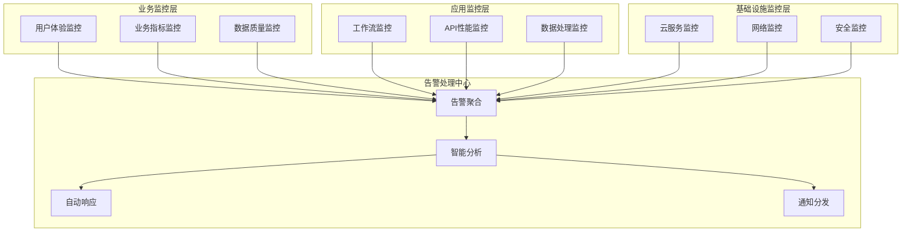

**监控指标体系**
```yaml
业务层监控指标:
  用户体验指标:
    - 页面加载时间: Looker Studio仪表板加载速度
    - 数据刷新延迟: 数据更新到用户可见的延迟
    - 功能可用性: 各功能模块的可用性统计
    - 用户满意度: 基于用户反馈的满意度评分
  
  业务指标监控:
    - 数据覆盖率: 技术主题的数据覆盖完整性
    - 分析准确率: AI分析结果的准确性评估
    - 更新及时性: 数据更新的及时性统计
    - 决策支持效果: 投资建议的有效性评估
  
  数据质量指标:
    - 数据完整性: 关键字段的完整性百分比
    - 数据准确性: 数据验证规则的通过率
    - 数据一致性: 跨表数据的一致性检查结果
    - 数据时效性: 数据新鲜度的统计分析

应用层监控指标:
  工作流性能:
    - 执行成功率: 工作流执行的成功率统计
    - 平均执行时间: 各工作流的平均执行时间
    - 错误率分布: 不同类型错误的分布统计
    - 资源使用效率: Operation使用的效率分析
  
  API服务监控:
    - 响应时间分布: API响应时间的分布统计
    - 成功率统计: API调用的成功率分析
    - 错误码分析: 不同错误码的频率分析
    - 配额使用情况: API配额的使用率监控
  
  数据处理监控:
    - 处理量统计: 每日数据处理量的统计
    - 处理速度: 数据处理的平均速度
    - 质量检查结果: 数据质量检查的结果统计
    - 异常数据统计: 异常数据的类型和数量统计

基础设施监控指标:
  云服务监控:
    - 服务可用性: Google服务的可用性监控
    - 网络延迟: 网络连接的延迟监控
    - 存储使用: Google Drive和Sheets的存储使用
    - 计算资源: 云计算资源的使用情况
  
  安全监控:
    - 异常访问: 异常访问模式的检测
    - 权限使用: 用户权限使用的监控
    - 安全事件: 安全相关事件的统计
    - 合规检查: 安全合规要求的检查结果
```

#### 14.2.2 智能告警系统

```yaml
告警规则引擎:
  基础告警规则:
    - 阈值告警: 基于固定阈值的告警规则
      * API响应时间 > 5秒
      * 工作流执行失败率 > 5%
      * 数据质量评分 < 70分
      * 存储使用率 > 80%
    
    - 趋势告警: 基于趋势变化的告警规则
      * 响应时间持续上升超过20%
      * 错误率连续3天增长
      * 数据处理量异常下降
      * 用户访问量异常波动
    
    - 异常检测告警: 基于机器学习的异常检测
      * 访问模式异常检测
      * 性能指标异常检测
      * 数据模式异常检测
      * 用户行为异常检测
  
  智能告警特性:
    - 告警聚合: 相关告警的智能聚合，避免告警风暴
    - 告警抑制: 已知问题期间的告警抑制机制
    - 告警升级: 未处理告警的自动升级机制
    - 告警关联: 告警间关联关系的智能分析

告警处理流程:
  告警分级处理:
    - 严重告警 (Critical):
      * 触发条件: 系统核心功能完全不可用
      * 响应时间: 5分钟内
      * 处理方式: 自动触发应急响应流程
      * 通知方式: 电话+短信+邮件+即时通讯
    
    - 重要告警 (High):
      * 触发条件: 重要功能受影响或性能严重下降
      * 响应时间: 15分钟内
      * 处理方式: 技术团队立即处理
      * 通知方式: 短信+邮件+即时通讯
    
    - 警告告警 (Medium):
      * 触发条件: 性能下降或潜在问题
      * 响应时间: 1小时内
      * 处理方式: 工作时间内处理
      * 通知方式: 邮件+即时通讯
    
    - 信息告警 (Low):
      * 触发条件: 状态变化或统计信息
      * 响应时间: 24小时内
      * 处理方式: 定期处理
      * 通知方式: 邮件
  
  自动化响应:
    - 自动修复: 常见问题的自动修复机制
      * 服务重启: 服务异常时的自动重启
      * 缓存清理: 缓存问题的自动清理
      * 连接重置: 连接超时的自动重置
      * 流量切换: 服务故障的自动流量切换
    
    - 自动升级: 问题未解决时的自动升级
      * 时间升级: 基于时间的自动升级机制
      * 严重度升级: 基于影响范围的升级机制
      * 人员升级: 逐级升级的人员通知机制
```

### 14.3 日志管理与分析

#### 14.3.1 日志收集体系

```yaml
日志分类收集:
  应用日志:
    - Make.com执行日志:
      * 工作流执行记录: 开始时间、结束时间、执行状态
      * 步骤执行详情: 每个步骤的输入输出和执行时间
      * 错误信息记录: 详细的错误堆栈和上下文信息
      * 数据处理统计: 处理的数据量和质量统计
    
    - API调用日志:
      * 请求记录: API请求的URL、参数、头信息
      * 响应记录: 响应状态码、响应时间、响应大小
      * 错误日志: API调用失败的详细错误信息
      * 性能日志: API调用的性能统计和趋势分析
  
  系统日志:
    - Google Cloud服务日志:
      * Cloud Logging: 云服务的系统日志
      * Error Reporting: 自动错误检测和聚合
      * Cloud Trace: 分布式请求追踪日志
      * Cloud Monitoring: 监控指标和事件日志
    
    - 第三方服务日志:
      * AI服务调用日志: xAI和OpenAI的调用记录
      * 外部API访问日志: 各种外部API的访问记录
      * 认证服务日志: OAuth认证的详细记录
      * 通知服务日志: 邮件和消息推送的记录
  
  安全日志:
    - 访问日志:
      * 用户登录记录: 登录时间、IP地址、设备信息
      * 权限使用记录: 权限使用的详细记录
      * 敏感操作记录: 敏感数据访问和操作记录
      * 异常行为记录: 异常访问模式和行为记录
    
    - 审计日志:
      * 配置变更记录: 系统配置的变更历史
      * 数据变更记录: 重要数据的变更追踪
      * 权限变更记录: 用户权限的变更历史
      * 安全事件记录: 安全相关事件的详细记录

日志格式标准化:
  日志格式规范:
    - 时间戳: ISO 8601格式的统一时间戳
    - 日志级别: DEBUG/INFO/WARN/ERROR/FATAL
    - 组件标识: 明确的组件和模块标识
    - 事件ID: 唯一的事件标识符
    - 用户ID: 相关的用户标识
    - 会话ID: 相关的会话标识
    - 消息内容: 结构化的消息内容
    - 上下文信息: 相关的上下文和元数据
  
  结构化日志:
    {
      "timestamp": "2024-01-15T10:30:00.000Z",
      "level": "INFO",
      "component": "data_collection",
      "event_id": "dc_001",
      "user_id": "system",
      "session_id": "sess_12345",
      "message": "Academic data collection completed",
      "context": {
        "tech_topic": "5G无线通信",
        "records_processed": 45,
        "processing_time": "2.3s",
        "data_quality_score": 0.92
      }
    }
```

#### 14.3.2 日志分析与洞察

```yaml
日志分析工具:
  实时分析:
    - 流式处理: 实时日志流的处理和分析
    - 关键词监控: 关键词和模式的实时监控
    - 异常检测: 基于日志的实时异常检测
    - 告警触发: 基于日志分析的智能告警
  
  批量分析:
    - 定期统计: 日志数据的定期统计分析
    - 趋势分析: 日志指标的趋势分析
    - 模式识别: 日志中的行为模式识别
    - 相关性分析: 不同指标间的相关性分析

日志洞察生成:
  性能洞察:
    - 性能瓶颈识别: 基于日志的性能瓶颈分析
    - 响应时间分析: API和服务响应时间的分析
    - 资源使用分析: 系统资源使用的分析
    - 优化建议生成: 基于日志分析的优化建议
  
  业务洞察:
    - 用户行为分析: 基于访问日志的用户行为分析
    - 功能使用统计: 各功能模块的使用情况统计
    - 数据质量分析: 基于处理日志的数据质量分析
    - 业务趋势识别: 基于业务日志的趋势识别
  
  安全洞察:
    - 安全威胁识别: 基于安全日志的威胁识别
    - 异常行为检测: 用户异常行为的检测和分析
    - 攻击模式分析: 安全攻击模式的识别和分析
    - 合规性检查: 基于审计日志的合规性检查
```

---

## 15. 未来发展规划

### 15.1 短期发展规划 (6-12个月)

#### 15.1.1 功能增强计划

```yaml
数据源扩展:
  新增数据源:
    - 中文学术数据: 
      * 中国知网 (CNKI): 中文学术论文数据源
      * 万方数据: 补充中文学术资源
      * 维普数据: 扩大中文文献覆盖
      * 实施时间: Q2 2024
      * 预期收益: 提升中文技术内容覆盖50%
    
    - 社交媒体数据:
      * Twitter API: 技术讨论和趋势数据
      * Reddit API: 技术社区讨论数据
      * LinkedIn API: 专业技术动态
      * 实施时间: Q3 2024
      * 预期收益: 增强实时技术趋势感知
    
    - 投资数据源:
      * Crunchbase API: 初创公司和投资数据
      * PitchBook: 风险投资和并购数据
      * CB Insights: 市场情报和投资趋势
      * 实施时间: Q4 2024
      * 预期收益: 增强投资决策支持能力
  
  数据质量提升:
    - 多语言支持:
      * 中英文对照: 技术术语的中英文对照
      * 自动翻译: 关键内容的自动翻译
      * 语言质量检查: 多语言内容的质量控制
    
    - 数据验证增强:
      * 交叉验证: 多数据源的交叉验证机制
      * 实时验证: 数据入库的实时质量验证
      * 历史对比: 与历史数据的一致性检查

AI能力升级:
  模型能力增强:
    - 新模型集成:
      * Claude-3: Anthropic的最新模型
      * Gemini Pro: Google的多模态模型
      * 国产大模型: 如文心一言、通义千问
      * 实施计划: 分阶段集成和测试
    
    - 专业化模型:
      * 技术分析专模: 针对ICT技术分析优化的专业模型
      * 投资分析专模: 专门用于投资分析的定制模型
      * 风险评估专模: 增强风险识别和评估能力
    
    - 模型微调:
      * Fine-tuning: 基于历史数据的模型微调
      * 领域适应: 针对ICT领域的模型适应性优化
      * 持续学习: 基于用户反馈的模型持续学习

系统性能优化:
  响应速度提升:
    - 缓存系统升级:
      * Redis缓存: 引入Redis提升查询性能
      * 智能预加载: 基于使用模式的数据预加载
      * 多级缓存: 构建多级缓存体系
    
    - 并行处理优化:
      * 工作流并行化: 提升数据处理的并行度
      * API并发优化: 优化API调用的并发处理
      * 批处理优化: 提升批量数据处理效率
  
  用户体验优化:
    - 界面优化:
      * 响应式设计: 优化移动端用户体验
      * 交互优化: 提升仪表板的交互体验
      * 个性化定制: 支持用户个性化配置
    
    - 功能增强:
      * 导出功能: 支持多格式的数据导出
      * 搜索功能: 增强的全文搜索能力
      * 订阅功能: 个性化的内容订阅服务
```

#### 15.1.2 技术债务清理

```yaml
架构优化:
  数据架构升级:
    - 数据湖演进:
      * BigQuery迁移: 评估向BigQuery的迁移方案
      * 数据仓库: 构建专业的数据仓库架构
      * 数据集市: 面向业务的专业数据集市
      * 时间计划: Q3-Q4 2024
    
    - API架构重构:
      * RESTful API: 构建标准的RESTful API
      * GraphQL: 考虑引入GraphQL提升查询灵活性
      * API网关: 构建专业的API网关服务
      * 版本管理: 实现API的版本管理机制
  
  代码质量提升:
    - 工作流优化:
      * 代码规范: 制定工作流的代码规范
      * 模块化重构: 将复杂工作流拆分为可复用模块
      * 错误处理: 增强错误处理和容错能力
      * 单元测试: 为关键逻辑增加单元测试
    
    - 配置管理:
      * 配置中心: 构建统一的配置管理中心
      * 环境隔离: 实现开发、测试、生产环境隔离
      * 版本控制: 对配置文件实施版本控制
      * 自动部署: 实现配置的自动化部署

安全加固:
  安全体系完善:
    - 身份认证升级:
      * OAuth 2.0: 实现标准的OAuth 2.0认证
      * RBAC细化: 更细粒度的权限控制
      * 审计增强: 增强审计日志和合规检查
      * 多因素认证: 对敏感操作强制多因素认证
    
    - 数据保护增强:
      * 数据分类: 实施数据分类分级管理
      * 加密升级: 升级数据加密算法和密钥管理
      * 访问控制: 实施更严格的数据访问控制
      * 隐私保护: 增强个人数据隐私保护措施
```

### 15.2 中期发展规划 (1-3年)

#### 15.2.1 平台化发展

```yaml
服务化架构转型:
  微服务架构:
    - 服务拆分设计:
      * 数据采集服务: 独立的数据采集微服务
      * 数据处理服务: 标准化的数据处理服务
      * AI分析服务: 可扩展的AI分析服务集群
      * 报告服务: 专业的报告生成和分发服务
      * 用户服务: 用户管理和权限控制服务
    
    - 服务治理:
      * 服务注册发现: 基于Kubernetes的服务治理
      * 负载均衡: 智能的服务负载均衡
      * 熔断降级: 服务间的熔断和降级机制
      * 监控追踪: 分布式服务的监控和链路追踪
    
    - 容器化部署:
      * Docker容器: 所有服务的容器化
      * Kubernetes: 基于K8s的容器编排
      * 自动扩缩容: 基于负载的自动扩缩容
      * 灰度发布: 服务更新的灰度发布机制

开放平台建设:
  API平台:
    - 开放API设计:
      * 数据API: 提供标准化的数据访问API
      * 分析API: 提供AI分析能力的API服务
      * 订阅API: 提供数据订阅和推送API
      * 定制API: 支持客户定制的专业API
    
    - 开发者生态:
      * API文档: 完善的API文档和示例
      * SDK开发: 多语言的SDK开发
      * 开发者门户: 专业的开发者服务门户
      * 社区建设: 开发者社区和技术支持
  
  生态合作:
    - 合作伙伴平台:
      * 数据合作: 与数据提供商的深度合作
      * 技术合作: 与AI公司的技术合作
      * 业务合作: 与咨询公司的业务合作
      * 渠道合作: 多渠道的市场合作
    
    - 行业解决方案:
      * 垂直行业: 针对特定行业的解决方案
      * 企业定制: 大企业的定制化解决方案
      * 中小企业: 面向中小企业的标准化产品
      * 个人用户: 面向个人用户的轻量级产品

智能化升级:
  AI能力增强:
    - 深度学习模型:
      * 自研模型: 开发专业的技术分析模型
      * 模型训练: 基于领域数据的模型训练
      * 持续优化: 模型的持续训练和优化
      * 多模态融合: 文本、图像、数据的多模态分析
    
    - 智能决策系统:
      * 决策树优化: 更复杂的决策树和规则引擎
      * 风险模型: 更精确的风险评估模型
      * 预测模型: 技术趋势的预测模型
      * 推荐系统: 个性化的技术推荐系统
  
  自动化升级:
    - 全流程自动化:
      * 智能采集: AI驱动的数据采集策略
      * 自动分析: 全自动的数据分析流程
      * 智能报告: AI生成的个性化报告
      * 自动决策: 基于规则的自动决策系统
    
    - 自适应系统:
      * 自学习: 系统的自主学习和优化
      * 自调整: 基于效果的参数自动调整
      * 自修复: 常见问题的自动识别和修复
      * 自进化: 系统能力的持续自我进化
```

#### 15.2.2 业务扩展

```yaml
行业覆盖扩展:
  新兴技术领域:
    - 人工智能: 
      * 机器学习算法和框架
      * 深度学习和神经网络
      * 自然语言处理技术
      * 计算机视觉技术
    
    - 区块链技术:
      * 公链和联盟链技术
      * 数字货币和DeFi
      * NFT和元宇宙技术
      * 区块链应用场景
    
    - 量子计算:
      * 量子算法和软件
      * 量子硬件和系统
      * 量子通信技术
      * 量子应用前景
    
    - 生物技术:
      * 生物信息学
      * 基因编辑技术
      * 生物计算
      * 医疗技术创新
  
  地理覆盖扩展:
    - 亚太地区:
      * 中国市场: 深入中国技术市场分析
      * 日韩市场: 扩展日韩技术监控
      * 东南亚: 新兴市场的技术机会
      * 印度: 印度技术生态的分析
    
    - 欧洲市场:
      * 欧盟技术政策: 欧盟技术政策和标准
      * 德国工业4.0: 德国制造业技术趋势
      * 英国创新: 英国技术创新生态
      * 北欧科技: 北欧国家的技术优势

商业模式创新:
  服务模式:
    - 订阅服务:
      * 基础版: 基础的技术洞察服务
      * 专业版: 深度的分析和建议服务
      * 企业版: 定制化的企业服务
      * 旗舰版: 全方位的智能决策服务
    
    - 咨询服务:
      * 技术咨询: 专业的技术评估和咨询
      * 投资咨询: 技术投资的专业建议
      * 战略咨询: 技术战略规划咨询
      * 实施咨询: 技术落地的实施指导
  
  盈利模式:
    - 多元化收入:
      * 订阅收入: 稳定的订阅服务收入
      * 咨询收入: 高价值的咨询服务收入
      * 数据服务: 数据产品和API服务收入
      * 广告收入: 精准的技术广告收入
    
    - 合作收入:
      * 渠道合作: 合作伙伴的渠道分成
      * 数据合作: 数据资源的合作收入
      * 技术授权: 技术和算法的授权收入
      * 投资收益: 技术投资的收益分享
```

### 15.3 长期愿景规划 (3-10年)

#### 15.3.1 技术愿景

```yaml
下一代技术架构:
  量子计算集成:
    - 量子AI模型:
      * 量子机器学习: 利用量子计算提升AI分析能力
      * 量子优化: 量子算法优化复杂决策问题
      * 量子模拟: 技术发展的量子模拟和预测
      * 量子安全: 量子加密保障数据安全
    
    - 边缘计算网络:
      * 全球边缘节点: 构建全球化的边缘计算网络
      * 实时分析: 边缘节点的实时数据分析
      * 智能路由: AI驱动的数据路由和处理
      * 自适应网络: 自适应的网络拓扑和优化
  
  脑机接口技术:
    - 认知增强:
      * 专家知识集成: 集成人类专家的认知模式
      * 直觉决策: 模拟人类直觉的决策机制
      * 创新思维: AI模拟人类的创新思维过程
      * 情感分析: 集成情感因素的技术分析
    
    - 人机协作:
      * 增强智能: 人类智能和AI的深度融合
      * 协作决策: 人机协作的决策制定过程
      * 知识传承: 专家知识的数字化传承
      * 能力扩展: 人类认知能力的技术扩展

革命性数据技术:
  全维数据感知:
    - 多维数据融合:
      * 物理世界: IoT设备的实时数据感知
      * 数字世界: 全网数据的智能爬取和分析
      * 社会网络: 社会关系和影响力的分析
      * 经济系统: 经济数据和市场信号的整合
    
    - 时空数据分析:
      * 时间序列: 长期历史数据的深度分析
      * 空间地理: 地理位置相关的技术分析
      * 时空融合: 时间和空间维度的融合分析
      * 因果推理: 技术发展的因果关系推理
  
  预测性分析系统:
    - 未来情景模拟:
      * 多情景分析: 多种可能未来的情景分析
      * 概率预测: 技术发展的概率分布预测
      * 风险仿真: 各种风险情景的仿真分析
      * 决策树优化: 动态的决策树优化算法
    
    - 自主学习系统:
      * 持续学习: 系统的持续自主学习能力
      * 迁移学习: 跨领域知识的迁移学习
      * 强化学习: 基于结果反馈的强化学习
      * 元学习: 学会如何学习的元学习能力
```

#### 15.3.2 生态愿景

```yaml
全球技术情报网络:
  智能协作网络:
    - 全球节点:
      * 研究机构: 与全球顶级研究机构合作
      * 科技企业: 与领先科技企业深度合作
      * 政府机构: 与各国政府科技部门合作
      * 投资机构: 与全球投资机构建立网络
    
    - 知识共享:
      * 开放数据: 推动技术数据的开放共享
      * 标准制定: 参与技术情报的标准制定
      * 协议制定: 制定数据共享和隐私保护协议
      * 生态治理: 建立健康的生态治理机制
  
  智慧城市集成:
    - 城市大脑:
      * 技术感知: 城市技术发展的全面感知
      * 创新监控: 城市创新活动的实时监控
      * 产业分析: 城市产业技术的深度分析  
      * 政策建议: 基于数据的技术政策建议
    
    - 数字孪生:
      * 技术生态: 技术生态系统的数字孪生
      * 创新网络: 创新网络的数字化映射
      * 知识图谱: 技术知识的大规模图谱
      * 虚拟实验: 技术发展的虚拟实验环境

人类增强智能:
  认知增强平台:
    - 专家系统:
      * 虚拟专家: AI驱动的虚拟技术专家
      * 知识助手: 个人知识管理和决策助手
      * 学习伙伴: AI驱动的个性化学习伙伴
      * 创新导师: 技术创新的AI导师系统
    
    - 集体智慧:
      * 群体决策: 大规模群体的智能决策
      * 知识众包: 全球专家的知识众包
      * 协作创新: 跨界协作的创新平台
      * 智慧涌现: 集体智慧的涌现机制
  
  社会影响:
    - 技术民主化:
      * 普惠AI: AI技术分析能力的普惠化
      * 知识平等: 技术知识获取的平等化
      * 创新包容: 包容性的技术创新生态
      * 数字鸿沟: 缩小技术认知的数字鸿沟
    
    - 可持续发展:
      * 绿色技术: 促进绿色技术的发展和应用
      * 可持续创新: 推动可持续的技术创新
      * 社会责任: 技术发展的社会责任考量
      * 伦理框架: 技术伦理的框架建设
```

#### 15.3.3 发展路径图

```yaml
分阶段发展计划:
  第一阶段 (2024-2025): 能力建设期
    - 核心目标: 构建完整的技术洞察平台
    - 关键任务:
      * 数据源扩展到15个以上
      * AI模型能力提升50%
      * 用户规模达到1000+
      * 年收入突破100万美元
    
    - 技术里程碑:
      * 多语言支持完善
      * 实时分析能力建设
      * 开放API平台上线
      * 移动端应用发布
  
  第二阶段 (2025-2027): 平台化发展期  
    - 核心目标: 成为全球领先的技术情报平台
    - 关键任务:
      * 覆盖技术领域扩展到50+
      * 服务全球用户10万+
      * 建立生态合作网络
      * 年收入达到1000万美元
    
    - 技术里程碑:
      * 微服务架构完全部署
      * AI能力达到专家级别
      * 全球化服务网络建成
      * 行业标准参与制定
  
  第三阶段 (2027-2030): 生态引领期
    - 核心目标: 构建全球技术情报生态系统
    - 关键任务:
      * 技术预测准确率达到90%+
      * 影响全球技术决策
      * 推动技术创新加速
      * 年收入达到1亿美元
    
    - 技术里程碑:
      * 量子计算技术集成
      * AGI能力初步实现
      * 全球智能网络建成
      * 技术奇点预测能力
  
  第四阶段 (2030+): 智慧演进期
    - 核心目标: 推动人类技术文明进步
    - 关键任务:
      * 实现技术发展的精确预测
      * 优化全球技术资源配置
      * 加速科技成果转化
      * 促进人类文明跃升
    
    - 技术里程碑:
      * 超级人工智能集成
      * 技术奇点管理能力
      * 星际技术发展预测
      * 文明级智慧系统

成功衡量指标:
  技术指标:
    - 预测准确率: 技术趋势预测的准确率
    - 分析深度: 技术分析的深度和专业性
    - 响应速度: 系统响应和分析速度
    - 创新发现: 新技术发现的及时性
  
  业务指标:
    - 用户规模: 全球用户数量和活跃度
    - 收入增长: 年度收入增长率
    - 市场份额: 在技术情报市场的份额
    - 品牌影响: 在技术界的品牌影响力
  
  社会价值:
    - 决策影响: 对重大技术决策的影响力
    - 创新推动: 对技术创新的推动作用
    - 知识普及: 技术知识的普及和民主化
    - 可持续发展: 对可持续技术发展的贡献
```

---

## 总结

ICT技术洞察平台v3.0是一个集成了先进AI技术、云原生架构和智能数据分析的综合性技术情报平台。通过多源数据融合、AI驱动分析和可视化展示，为ICT领域的技术投资和战略决策提供强有力的支持。

**平台核心价值：**
- **🎯 精准洞察**：基于13个核心技术主题的深度分析
- **🤖 AI驱动**：三大AI模型协同的智能分析引擎  
- **📊 实时可视**：专业级的数据可视化和仪表板
- **🛡️ 安全可靠**：企业级的安全保障和数据治理
- **🚀 持续进化**：面向未来的技术架构和发展规划

该平台不仅解决了当前技术情报分析的痛点，更为未来十年的技术发展和商业决策奠定了坚实的基础。通过持续的技术创新和生态建设，将逐步发展成为全球领先的技术情报生态系统，推动人类技术文明的持续进步。
