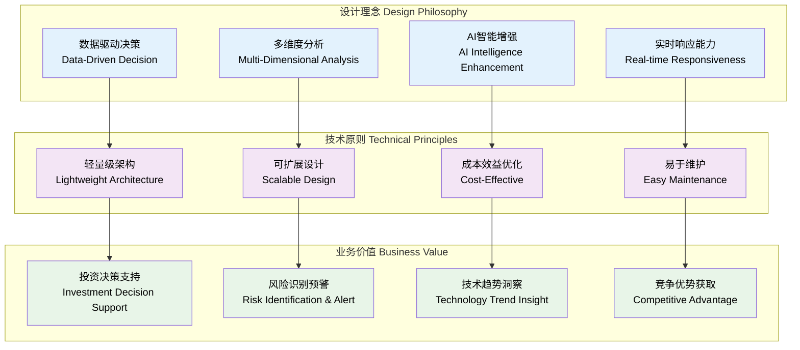
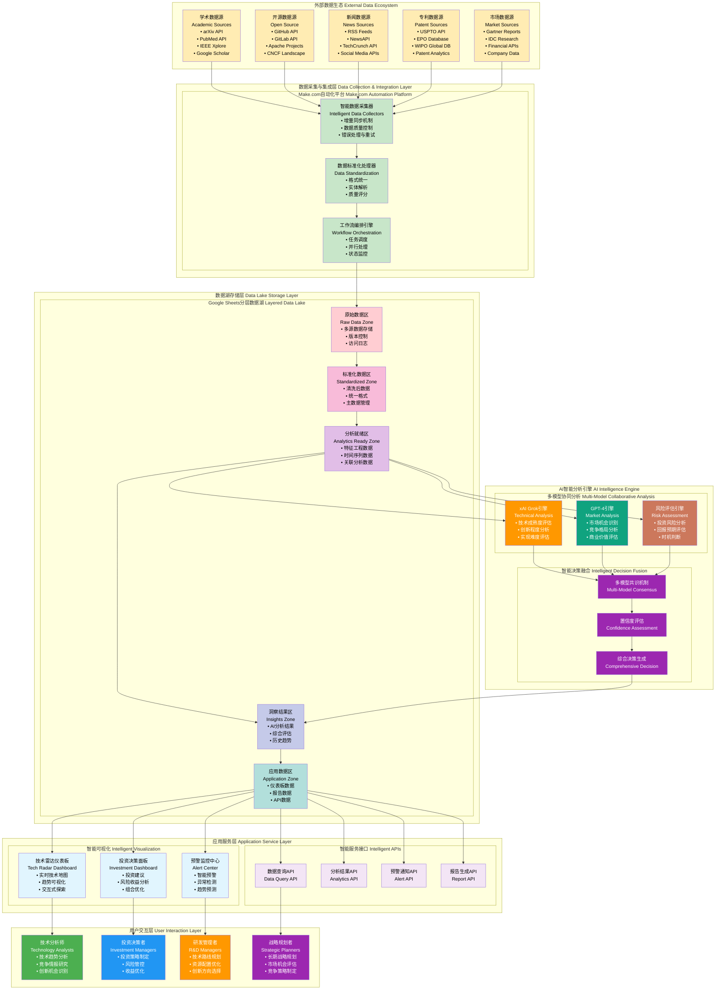
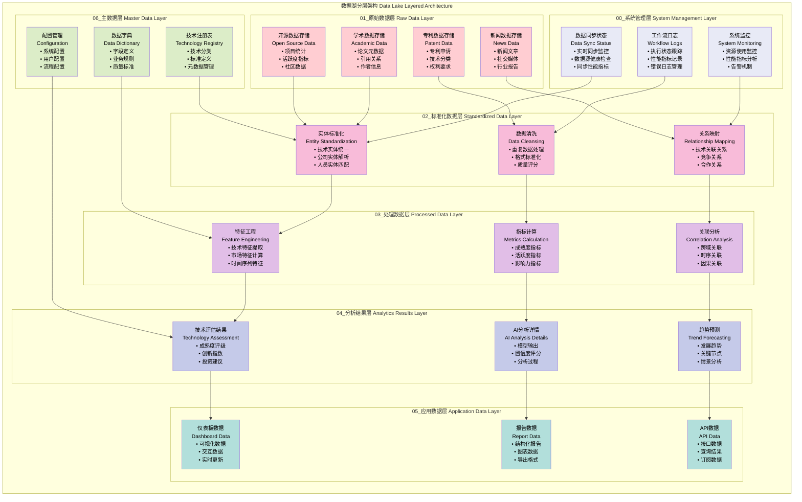
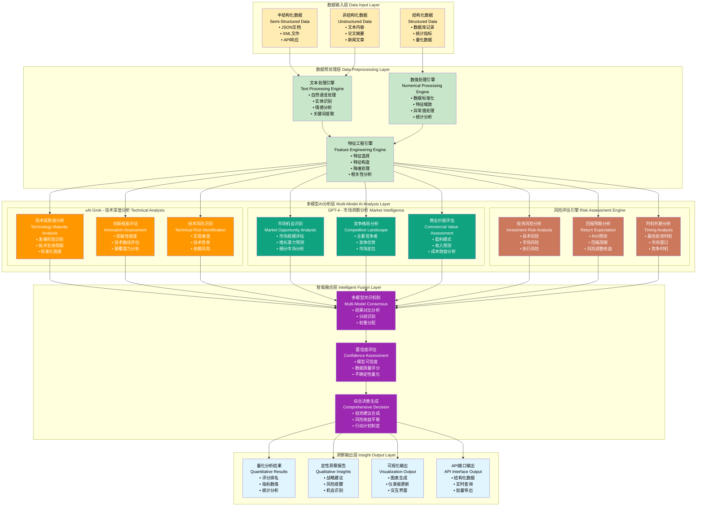
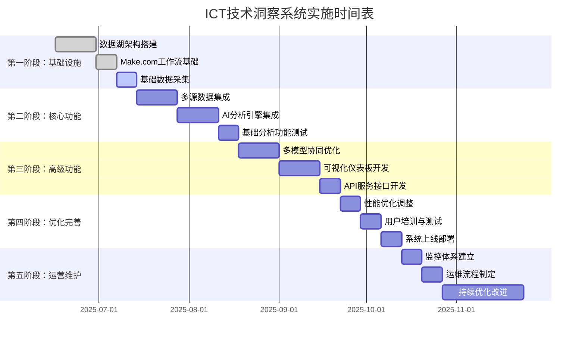
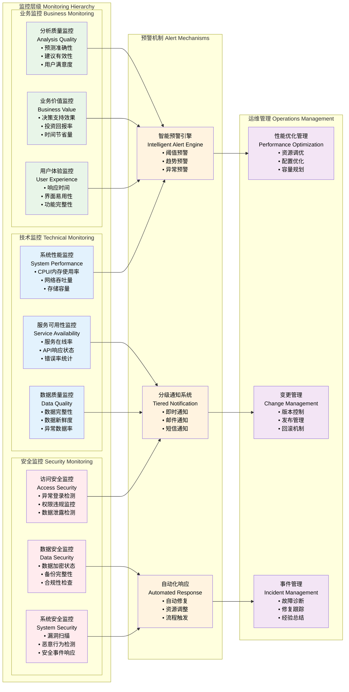

# ICT技术洞察系统完整设计文档

## **文档概述**

本文档详细描述了基于Make.com + Google Sheets + 多模型AI的ICT技术洞察系统的设计原理、技术方案和实施指南。该系统旨在为ICT技术投资决策提供数据驱动的深度洞察和智能分析。

**文档版本：** v3.0  
**编写日期：** 2025-06-16  
**作者：** Jason  
**系统名称：** ICT_TechInsight_MultiModel_AI_Analysis_v3.0

---

## **1. 系统设计原理**

### **1.1 核心设计思想**

### **1.2 系统核心价值主张**

**多模型AI协同分析：** 系统集成xAI Grok、GPT-4等多个先进AI模型，每个模型专注于特定分析维度，通过协同工作提供更全面、准确的技术洞察。

**轻量级数据湖架构：** 基于Google Sheets构建的分层数据湖，既保持了企业级数据管理能力，又具备快速部署、易于维护的特点，显著降低了系统复杂度和运维成本。

**自动化端到端流程：** 利用Make.com平台实现从数据采集到洞察生成的全流程自动化，减少人工干预，提高分析效率和一致性。

**实时智能决策支持：** 通过持续监控技术发展动态，提供及时的投资建议和风险预警，帮助决策者把握最佳投资时机。

### **1.3 技术架构设计原则**

**分层解耦设计：** 采用经典的分层架构模式，数据采集层、处理层、分析层、应用层相互独立，便于维护和扩展。

**模块化组件设计：** 每个功能模块都具备独立性，可以单独开发、测试和部署，支持敏捷开发和持续集成。

**标准化接口设计：** 所有模块间通过标准化的数据接口进行交互，确保系统的可扩展性和兼容性。

**容错和恢复机制：** 内置完善的错误处理和数据恢复机制，确保系统的稳定性和可靠性。

---

## **2. 系统总体架构**

### **2.1 宏观架构图**

### **2.2 技术栈组成**

| 层级 | 技术组件 | 作用 | 优势 |
|------|----------|------|------|
| **前端展示** | Google Sheets + Web界面 | 数据可视化和用户交互 | 易用性强、协作便利 |
| **工作流引擎** | Make.com Platform | 自动化流程编排 | 无代码开发、集成能力强 |
| **AI分析** | xAI Grok + GPT-4 + Claude | 多模型智能分析 | 分析能力强、互补性好 |
| **数据存储** | Google Sheets Data Lake | 分层数据存储 | 成本低、维护简单 |
| **数据采集** | RESTful APIs + RSS + Webhooks | 多源数据接入 | 覆盖面广、实时性好 |
| **基础设施** | Google Cloud Platform | 云服务支撑 | 稳定可靠、弹性扩展 |

---

## **3. 数据湖架构设计**

### **3.1 分层数据湖架构**

### **3.2 数据湖治理框架**

**数据质量管理：** 建立多层次的数据质量控制机制，包括数据采集时的格式验证、处理过程中的一致性检查、分析结果的逻辑验证等，确保数据质量满足分析需求。

**元数据管理：** 维护完整的数据血缘关系，记录数据的来源、转换过程、使用情况等信息，支持数据治理和合规要求。

**访问控制：** 基于角色的访问控制机制，不同用户角色具有不同的数据访问权限，确保数据安全和隐私保护。

**版本管理：** 对数据模式变更、处理逻辑修改等进行版本控制，支持回滚和兼容性管理。

### **3.3 数据模型设计**

| 数据实体 | 主要属性 | 关系 | 用途 |
|----------|----------|------|------|
| **Technology** | tech_id, name, category, maturity_level | 1:N Papers, Projects | 技术主体管理 |
| **Academic_Paper** | paper_id, title, authors, journal, citations | N:1 Technology | 学术研究跟踪 |
| **OpenSource_Project** | project_id, repo_name, stars, language | N:1 Technology | 开源生态监控 |
| **Patent** | patent_id, title, inventors, assignee | N:1 Technology | 知识产权分析 |
| **News_Article** | news_id, title, source, sentiment | N:1 Technology | 市场情绪监控 |
| **Assessment_Result** | assessment_id, overall_score, recommendation | 1:1 Technology | 综合评估结果 |

---

## **4. Make.com工作流设计**

### **4.1 端到端工作流架构**

```mermaid
graph LR
    subgraph "触发机制 Trigger Mechanisms"
        TRIG1[定时触发<br/>Scheduled Trigger<br/>• 每日自动执行<br/>• 自定义时间间隔<br/>• 业务时间窗口]
        TRIG2[事件触发<br/>Event Trigger<br/>• 数据更新事件<br/>• 阈值突破事件<br/>• 外部API事件]
        TRIG3[手动触发<br/>Manual Trigger<br/>• 即时分析需求<br/>• 特定技术分析<br/>• 紧急情况处理]
    end
    
    subgraph "数据采集编排 Data Collection Orchestration"
        COLLECT1[技术主题识别<br/>Technology Topic Detection<br/>• 高优先级筛选<br/>• 动态主题发现<br/>• 关注度评估]
        COLLECT2[多源数据并行采集<br/>Parallel Multi-Source Collection<br/>• 学术数据获取<br/>• 开源数据获取<br/>• 新闻数据获取<br/>• 专利数据获取]
        COLLECT3[数据质量控制<br/>Data Quality Control<br/>• 完整性验证<br/>• 格式标准化<br/>• 重复数据处理]
    end
    
    subgraph "智能分析编排 Intelligent Analysis Orchestration"
        subgraph "多模型并行分析 Parallel Multi-Model Analysis"
            AI_TECH[xAI Grok技术分析<br/>Technical Analysis<br/>• 技术成熟度评估<br/>• 创新程度分析<br/>• 实现难度评估<br/>• 技术风险识别]
            AI_MARKET[GPT-4市场分析<br/>Market Analysis<br/>• 市场机会评估<br/>• 竞争格局分析<br/>• 商业价值评估<br/>• 增长潜力预测]
            AI_RISK[风险评估分析<br/>Risk Assessment<br/>• 投资风险评估<br/>• 回报预期分析<br/>• 时机判断<br/>• 风险缓解建议]
        end
        
        FUSION[智能决策融合<br/>Intelligent Decision Fusion<br/>• 多模型结果整合<br/>• 置信度评估<br/>• 一致性检查<br/>• 综合建议生成]
    end
    
    subgraph "结果处理与分发 Result Processing & Distribution"
        PROCESS1[结果标准化<br/>Result Standardization<br/>• JSON格式解析<br/>• 数据验证<br/>• 评分标准化]
        PROCESS2[多目标存储<br/>Multi-Target Storage<br/>• 详细结果存储<br/>• 汇总数据更新<br/>• 历史数据归档]
        PROCESS3[智能通知分发<br/>Intelligent Notification<br/>• 个性化报告<br/>• 实时预警<br/>• 邮件推送]
    end
    
    subgraph "监控与反馈 Monitoring & Feedback"
        MONITOR1[执行监控<br/>Execution Monitoring<br/>• 实时状态跟踪<br/>• 性能指标监控<br/>• 异常检测预警]
        MONITOR2[质量反馈<br/>Quality Feedback<br/>• 结果验证<br/>• 用户反馈收集<br/>• 模型优化建议]
        MONITOR3[系统学习<br/>System Learning<br/>• 模式识别<br/>• 参数优化<br/>• 预测改进]
    end
    
    TRIG1 --> COLLECT1
    TRIG2 --> COLLECT1
    TRIG3 --> COLLECT1
    
    COLLECT1 --> COLLECT2
    COLLECT2 --> COLLECT3
    
    COLLECT3 --> AI_TECH
    COLLECT3 --> AI_MARKET
    COLLECT3 --> AI_RISK
    
    AI_TECH --> FUSION
    AI_MARKET --> FUSION
    AI_RISK --> FUSION
    
    FUSION --> PROCESS1
    PROCESS1 --> PROCESS2
    PROCESS2 --> PROCESS3
    
    PROCESS3 --> MONITOR1
    MONITOR1 --> MONITOR2
    MONITOR2 --> MONITOR3
    
    MONITOR3 -.-> COLLECT1
    
    style TRIG1 fill:#fff3e0,color:#000
    style TRIG2 fill:#fff3e0,color:#000
    style TRIG3 fill:#fff3e0,color:#000
    style COLLECT1 fill:#e8f5e8,color:#000
    style COLLECT2 fill:#e8f5e8,color:#000
    style COLLECT3 fill:#e8f5e8,color:#000
    style AI_TECH fill:#ff9800,color:#fff
    style AI_MARKET fill:#10a37f,color:#fff
    style AI_RISK fill:#cc785c,color:#fff
    style FUSION fill:#9c27b0,color:#fff
    style PROCESS1 fill:#e1f5fe,color:#000
    style PROCESS2 fill:#e1f5fe,color:#000
    style PROCESS3 fill:#e1f5fe,color:#000
    style MONITOR1 fill:#fce4ec,color:#000
    style MONITOR2 fill:#fce4ec,color:#000
    style MONITOR3 fill:#fce4ec,color:#000
```

### **4.2 关键工作流模块详解**

**模块1 - 技术主题管理：** 从Technology_Registry中筛选高优先级技术主题，支持动态优先级调整和自定义筛选条件，确保分析聚焦于最重要的技术领域。

**模块3-6 - 多源数据采集：** 并行从学术、开源、专利、新闻等多个数据源采集相关信息，采用智能去重和质量评分机制，确保数据的全面性和准确性。

**模块9-11 - 多模型AI分析：** 利用路由器实现并行分析，每个AI模型专注于特定维度，提高分析效率和专业性。

**模块13 - 智能决策融合：** 整合多个AI模型的分析结果，通过共识机制和置信度评估生成最终的投资建议。

**模块14-21 - 结果存储与通知：** 将分析结果存储到不同的数据表中，同时生成个性化报告和预警通知。

### **4.3 工作流优化策略**

**并行处理优化：** 通过路由器实现多个AI模型的并行分析，显著减少整体处理时间。

**错误处理机制：** 每个关键模块都配置错误处理和重试逻辑，确保工作流的稳定性。

**资源优化：** 合理设置API调用间隔和并发限制，避免触发服务提供商的限制。

**数据缓存：** 对重复查询的数据进行缓存，减少不必要的API调用，提高响应速度。

---

## **5. AI分析引擎架构**

### **5.1 多模型协同分析架构**

### **5.2 AI模型专业化配置**

**xAI Grok - 技术深度分析专家：** 配置为ICT技术架构分析师角色，专注于技术成熟度、创新程度和实现难度的深度评估。采用技术导向的提示策略，强调工程可行性和技术路线分析。

**GPT-4 - 市场洞察分析专家：** 配置为市场研究和商业分析专家角色，专注于市场机会识别、竞争格局分析和商业价值评估。采用商业导向的提示策略，强调市场时机和商业可行性。

**风险评估引擎：** 配置为投资分析和风险管理专家角色，专注于投资风险识别、回报预期分析和投资时机判断。采用风险导向的提示策略，强调风险控制和收益优化。

### **5.3 智能融合算法**

**加权平均融合：** 基于各模型的历史准确性和当前置信度，动态调整权重进行结果融合。

$$\text{综合评分} = \sum_{i=1}^n w_i \times \text{模型}_i \times \text{置信度}_i$$

其中 $w_i$ 为第i个模型的权重，$\sum w_i = 1$

**一致性检验：** 通过Pearson相关系数检验各模型结果的一致性，识别异常分歧。

$$r = \frac{\sum_{i=1}^n (x_i - \bar{x})(y_i - \bar{y})}{\sqrt{\sum_{i=1}^n (x_i - \bar{x})^2} \sqrt{\sum_{i=1}^n (y_i - \bar{y})^2}}$$

**置信度评估：** 基于数据质量、模型一致性和历史验证结果计算综合置信度。

$$\text{置信度} = \alpha \times \text{数据质量} + \beta \times \text{模型一致性} + \gamma \times \text{历史准确性}$$

---

## **6. 数据流设计**

### **6.1 端到端数据流图**

```mermaid
graph TD
    subgraph "数据源生态系统 Data Source Ecosystem"
        DS1[学术数据源<br/>Academic Sources<br/>• arXiv: 预印本论文<br/>• PubMed: 生物医学文献<br/>• IEEE Xplore: 工程技术论文<br/>• Google Scholar: 学术搜索]
        DS2[开源生态数据<br/>Open Source Ecosystem<br/>• GitHub: 代码仓库<br/>• GitLab: 企业开源<br/>• Apache: 开源基金会<br/>• CNCF: 云原生项目]
        DS3[新闻媒体数据<br/>News & Media Data<br/>• TechCrunch: 科技新闻<br/>• Wired: 技术趋势<br/>• RSS订阅: 实时资讯<br/>• Social Media: 社交讨论]
        DS4[专利知识产权<br/>Patent & IP Data<br/>• USPTO: 美国专利<br/>• EPO: 欧洲专利<br/>• WIPO: 国际专利<br/>• 企业专利池]
        DS5[市场与投资数据<br/>Market & Investment<br/>• Gartner: 市场研究<br/>• IDC: 行业分析<br/>• CB Insights: 投资数据<br/>• 公司财报数据]
    end
    
    subgraph "数据采集与预处理 Data Collection & Preprocessing"
        COLLECT[统一数据采集器<br/>Unified Data Collector<br/>• API标准化调用<br/>• 数据格式转换<br/>• 增量同步机制<br/>• 错误处理与重试]
        
        CLEAN[数据清洗与标准化<br/>Data Cleansing & Standardization<br/>• 重复数据删除<br/>• 格式标准化<br/>• 实体识别与匹配<br/>• 质量评分标注]
        
        ENRICH[数据增强与丰富<br/>Data Enhancement & Enrichment<br/>• 元数据补充<br/>• 关联关系构建<br/>• 上下文信息添加<br/>• 语义标签标注]
    end
    
    subgraph "智能特征工程 Intelligent Feature Engineering"
        EXTRACT[特征提取引擎<br/>Feature Extraction Engine<br/>• 文本特征提取<br/>• 时间序列特征<br/>• 网络关系特征<br/>• 统计特征计算]
        
        SELECT[特征选择优化<br/>Feature Selection & Optimization<br/>• 相关性分析<br/>• 重要性排序<br/>• 维度降维<br/>• 特征组合优化]
        
        NORMALIZE[特征标准化<br/>Feature Normalization<br/>• 数值范围标准化<br/>• 分布调整<br/>• 异常值处理<br/>• 缺失值填补]
    end
    
    subgraph "多模型AI分析引擎 Multi-Model AI Analysis Engine"
        subgraph "并行分析管道 Parallel Analysis Pipeline"
            PIPE1[技术分析管道<br/>Technical Analysis Pipeline<br/>xAI Grok Engine<br/>• 技术成熟度评估<br/>• 创新程度分析<br/>• 实现难度评估]
            PIPE2[市场分析管道<br/>Market Analysis Pipeline<br/>GPT-4 Engine<br/>• 市场机会识别<br/>• 竞争格局分析<br/>• 商业价值评估]
            PIPE3[风险分析管道<br/>Risk Analysis Pipeline<br/>Risk Assessment Engine<br/>• 投资风险评估<br/>• 回报预期分析<br/>• 时机判断分析]
        end
        
        FUSION_ENGINE[智能融合引擎<br/>Intelligent Fusion Engine<br/>• 多模型结果整合<br/>• 一致性验证<br/>• 置信度计算<br/>• 综合决策生成]
    end
    
    subgraph "结果处理与存储 Result Processing & Storage"
        VALIDATE[结果验证与质量控制<br/>Result Validation & QC<br/>• 逻辑一致性检查<br/>• 历史对比验证<br/>• 异常结果标记<br/>• 置信度评估]
        
        STORE[多层次结果存储<br/>Multi-Tier Result Storage<br/>• 原始分析结果<br/>• 汇总统计数据<br/>• 历史趋势数据<br/>• 仪表板数据]
        
        NOTIFY[智能通知与分发<br/>Intelligent Notification<br/>• 个性化报告生成<br/>• 实时预警推送<br/>• 邮件通知发送<br/>• API数据发布]
    end
    
    subgraph "应用与反馈 Application & Feedback"
        DASHBOARD[智能仪表板<br/>Intelligent Dashboard<br/>• 技术雷达图<br/>• 投资决策面板<br/>• 趋势监控中心<br/>• 风险预警系统]
        
        API_SERVICE[API服务接口<br/>API Service Interface<br/>• RESTful数据接口<br/>• GraphQL查询接口<br/>• Webhook事件推送<br/>• 批量数据导出]
        
        FEEDBACK[用户反馈与学习<br/>User Feedback & Learning<br/>• 分析结果评价<br/>• 预测准确性跟踪<br/>• 模型性能优化<br/>• 系统持续改进]
    end
    
    DS1 --> COLLECT
    DS2 --> COLLECT
    DS3 --> COLLECT
    DS4 --> COLLECT
    DS5 --> COLLECT
    
    COLLECT --> CLEAN
    CLEAN --> ENRICH
    
    ENRICH --> EXTRACT
    EXTRACT --> SELECT
    SELECT --> NORMALIZE
    
    NORMALIZE --> PIPE1
    NORMALIZE --> PIPE2
    NORMALIZE --> PIPE3
    
    PIPE1 --> FUSION_ENGINE
    PIPE2 --> FUSION_ENGINE
    PIPE3 --> FUSION_ENGINE
    
    FUSION_ENGINE --> VALIDATE
    VALIDATE --> STORE
    STORE --> NOTIFY
    
    NOTIFY --> DASHBOARD
    NOTIFY --> API_SERVICE
    
    DASHBOARD --> FEEDBACK
    API_SERVICE --> FEEDBACK
    
    FEEDBACK -.-> NORMALIZE
    FEEDBACK -.-> FUSION_ENGINE
    
    style DS1 fill:#ffecb3,color:#000
    style DS2 fill:#ffecb3,color:#000
    style DS3 fill:#ffecb3,color:#000
    style DS4 fill:#ffecb3,color:#000
    style DS5 fill:#ffecb3,color:#000
    style COLLECT fill:#c8e6c9,color:#000
    style CLEAN fill:#c8e6c9,color:#000
    style ENRICH fill:#c8e6c9,color:#000
    style EXTRACT fill:#e3f2fd,color:#000
    style SELECT fill:#e3f2fd,color:#000
    style NORMALIZE fill:#e3f2fd,color:#000
    style PIPE1 fill:#ff9800,color:#fff
    style PIPE2 fill:#10a37f,color:#fff
    style PIPE3 fill:#cc785c,color:#fff
    style FUSION_ENGINE fill:#9c27b0,color:#fff
    style VALIDATE fill:#fff3e0,color:#000
    style STORE fill:#fff3e0,color:#000
    style NOTIFY fill:#fff3e0,color:#000
    style DASHBOARD fill:#e1f5fe,color:#000
    style API_SERVICE fill:#e1f5fe,color:#000
    style FEEDBACK fill:#f3e5f5,color:#000
```

### **6.2 数据流量和性能优化**

**流量控制策略：** 实施智能流量控制，根据数据源的API限制和系统负载动态调整采集频率，避免触发限制并保持最优性能。

**缓存机制：** 多层次缓存设计，包括API响应缓存、中间结果缓存和最终结果缓存，显著减少重复计算和网络请求。

**并行处理优化：** 通过任务分片和并行处理，将大批量数据分解为小批次并行处理，提高整体处理效率。

**资源调度：** 基于工作负载和优先级的智能资源调度，确保关键任务获得优先处理资源。

### **6.3 数据质量保证**

**多层次验证：** 实施数据采集、处理、分析三层质量验证，每层都有专门的质量检查机制。

**实时监控：** 对数据流的各个环节进行实时监控，及时发现和处理数据质量问题。

**质量评分：** 为每条数据记录计算质量评分，基于完整性、准确性、时效性等维度综合评估。

**异常处理：** 建立完善的异常数据处理机制，包括自动修复、人工审核和数据隔离等策略。

---

## **7. 系统实施方案**

### **7.1 分阶段实施路线图**

### **7.2 技术实施细节**

**数据湖搭建：** 使用提供的Google Apps Script代码自动创建完整的数据湖目录结构，包括所有必需的工作表和配置文件。

**Make.com配置：** 导入提供的JSON配置文件，更新相应的连接ID和文件ID，配置AI模型API连接。

**数据源集成：** 逐步集成各个数据源，从学术和开源数据开始，然后扩展到专利和新闻数据。

**AI模型集成：** 配置xAI Grok和GPT-4连接，优化提示工程，测试分析结果质量。

### **7.3 质量保证计划**

**单元测试：** 对每个Make.com模块进行独立测试，验证数据读写和处理逻辑。

**集成测试：** 测试端到端工作流，验证数据流转和AI分析结果。

**性能测试：** 测试系统在不同负载下的性能表现，优化瓶颈环节。

**用户验收测试：** 邀请目标用户进行功能验收，收集反馈并改进。

### **7.4 风险管控**

**技术风险：** 建立技术备选方案，对关键依赖进行备份设计。

**数据风险：** 实施多重备份和恢复机制，确保数据安全。

**性能风险：** 建立性能监控和预警机制，及时发现和处理性能问题。

**合规风险：** 确保数据处理符合相关法规要求，建立隐私保护措施。

---

## **8. 运营管理方案**

### **8.1 系统监控体系**

### **8.2 关键性能指标（KPI）**

| 指标类别 | 具体指标 | 目标值 | 监控频率 |
|----------|----------|--------|----------|
| **可用性** | 系统正常运行时间 | ≥99.5% | 实时 |
| **性能** | 端到端分析完成时间 | ≤10分钟 | 每次执行 |
| **质量** | 分析结果准确率 | ≥85% | 每周 |
| **效率** | 数据处理吞吐量 | ≥100条技术/小时 | 每日 |
| **用户体验** | 仪表板响应时间 | ≤3秒 | 实时 |
| **数据质量** | 数据完整性 | ≥95% | 每日 |

### **8.3 运维流程标准化**

**日常维护流程：** 建立标准化的日常维护检查清单，包括系统状态检查、数据质量验证、性能指标监控等。

**变更管理流程：** 制定严格的变更管理流程，包括变更申请、影响评估、测试验证、发布实施和效果跟踪。

**事件响应流程：** 建立分级事件响应机制，根据事件严重程度制定不同的响应时间和处理流程。

**定期维护计划：** 制定月度、季度维护计划，包括系统优化、数据清理、模型调优等。

### **8.4 持续改进机制**

**用户反馈收集：** 建立多渠道用户反馈收集机制，包括在线反馈、定期调研、用户访谈等。

**性能数据分析：** 定期分析系统性能数据，识别优化机会和改进方向。

**技术趋势跟踪：** 持续跟踪相关技术发展趋势，适时引入新技术和新方法。

**最佳实践总结：** 总结运营过程中的最佳实践，形成标准化的操作规范。

---

## **9. 成本效益分析**

### **9.1 系统建设成本**

| 成本项目 | 初期投入 | 年度运营成本 | 说明 |
|----------|----------|--------------|------|
| **人力成本** | $15,000 | $30,000 | 系统开发和维护人员 |
| **技术平台** | $0 | $3,600 | Make.com专业版订阅 |
| **AI服务** | $0 | $12,000 | xAI、OpenAI API调用费用 |
| **云服务** | $0 | $1,200 | Google Workspace存储费用 |
| **第三方数据** | $0 | $6,000 | 专业数据源订阅费用 |
| **培训费用** | $2,000 | $1,000 | 用户培训和技能提升 |
| **总计** | $17,000 | $53,800 | - |

### **9.2 预期收益分析**

**决策效率提升：** 预计可将技术评估和投资决策时间从2-3周缩短到2-3天，效率提升80%以上。

**投资准确性改善：** 通过AI多模型分析，预计可将投资决策准确率从60%提升到85%，显著降低投资风险。

**人力成本节约：** 自动化分析流程可节约50%的人工分析时间，年节约人力成本约$40,000。

**机会成本降低：** 及时识别技术趋势和投资机会，预计可避免20%的机会成本损失。

### **9.3 ROI计算**

**年度总收益估算：** $120,000（包括时间节约、决策改善、风险降低等）  
**年度总成本：** $53,800  
**年度净收益：** $66,200  
**投资回报率：** 123%  
**投资回收期：** 约10个月

---

## **10. 结论与展望**

### **10.1 系统核心价值**

本ICT技术洞察系统通过创新的"轻量级数据湖 + 多模型AI + 自动化工作流"架构，为ICT技术投资决策提供了一个高效、智能、经济的解决方案。系统的核心价值体现在：

**技术创新性：** 首次将多个先进AI模型（xAI Grok、GPT-4）集成到ICT技术分析领域，通过专业化分工和智能融合机制，显著提升了分析的准确性和全面性。

**架构先进性：** 采用轻量级数据湖架构，在保持企业级数据管理能力的同时，大幅降低了系统复杂度和运维成本，实现了"小而美"的设计理念。

**业务实用性：** 直接面向ICT技术投资决策需求，提供从数据采集到投资建议的端到端解决方案，具有很强的业务实用价值。

### **10.2 技术优势总结**

**多维度数据整合：** 系统整合了学术、开源、专利、新闻、市场等多个维度的数据源，提供了全方位的技术洞察视角。

**AI智能增强：** 利用最新的AI技术进行深度分析，不仅提高了分析效率，更提升了洞察的深度和准确性。

**自动化流程：** 全流程自动化设计，从数据采集到结果输出，最大程度减少人工干预，提高了系统的可靠性和一致性。

**可扩展架构：** 模块化设计使系统具备良好的可扩展性，可以根据业务需求灵活添加新的数据源、分析模型和应用功能。

### **10.3 应用前景展望**

**短期应用（6-12个月）：** 系统将主要用于ICT核心技术领域的投资决策支持，帮助识别高潜力技术和最佳投资时机。

**中期发展（1-2年）：** 扩展到更多技术领域和应用场景，包括新兴技术监控、竞争情报分析、技术路线规划等。

**长期愿景（2-5年）：** 发展成为综合性的技术洞察平台，支持多行业、多场景的技术分析和决策支持需求。

### **10.4 持续发展建议**

**技术演进：** 密切跟踪AI技术发展，适时引入更先进的模型和算法，如多模态AI、强化学习等。

**数据扩展：** 持续扩展数据源覆盖范围，增加实时数据、社交数据、政策数据等新的数据维度。

**功能增强：** 基于用户反馈不断完善功能，增加预测分析、情景模拟、风险预警等高级功能。

**生态建设：** 构建开放的技术洞察生态，与行业伙伴、研究机构、投资机构等建立合作关系。

---

**文档结束**

**版本：** v3.0  
**最后更新：** 2025-06-16  
**文档状态：** 完整版  
**适用范围：** ICT技术洞察系统设计、开发、实施、运营全生命周期
