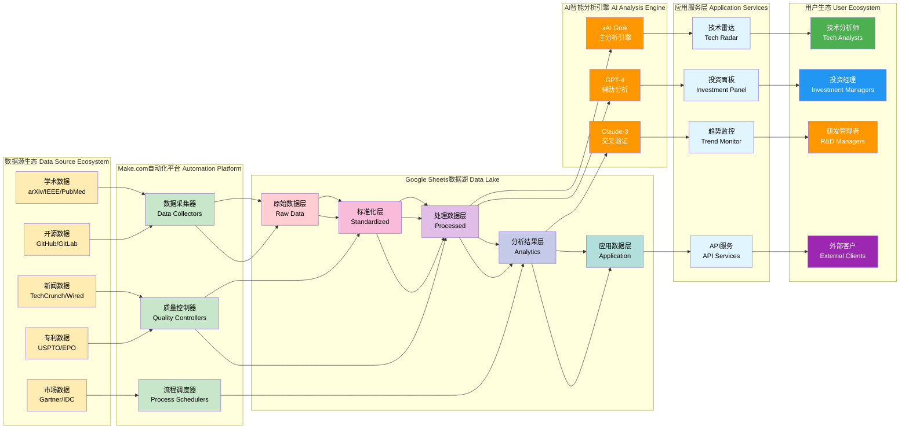
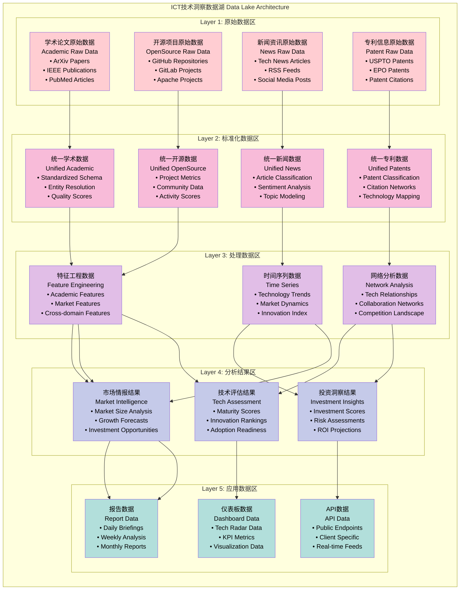
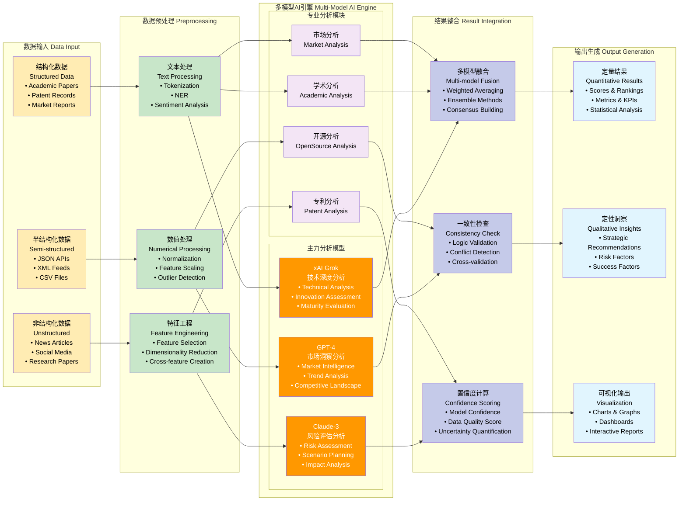
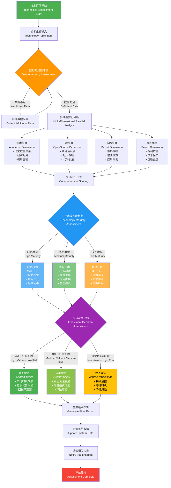
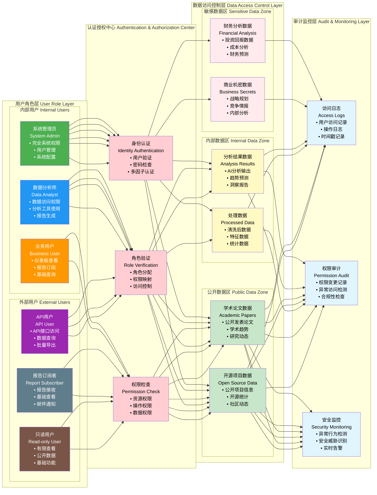
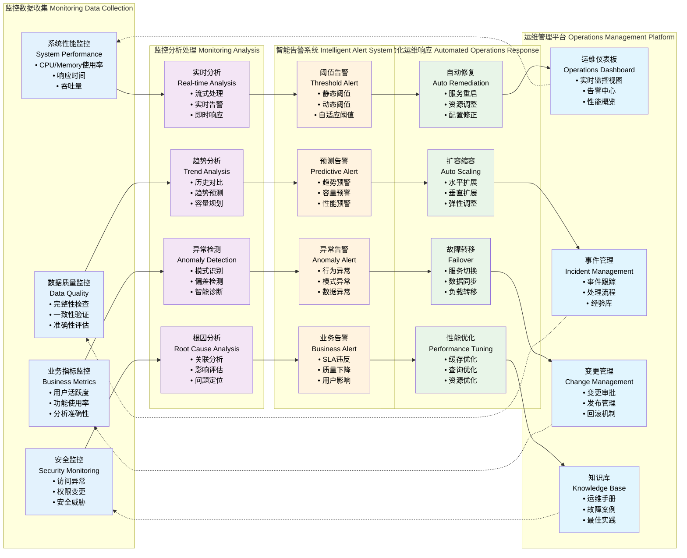
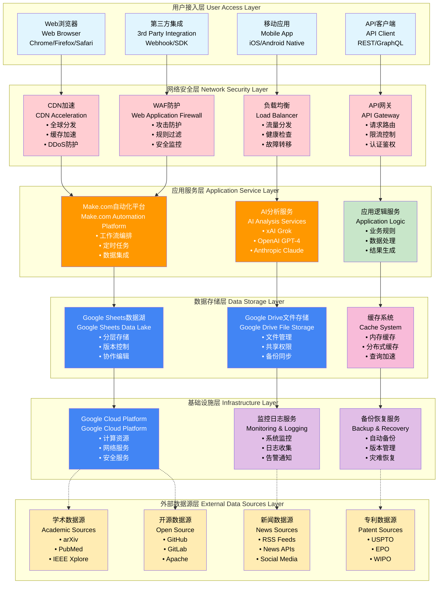
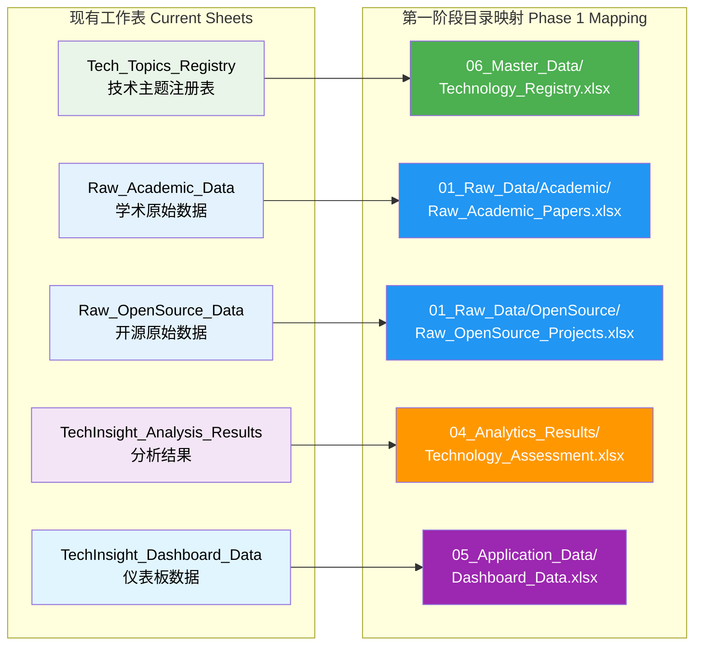
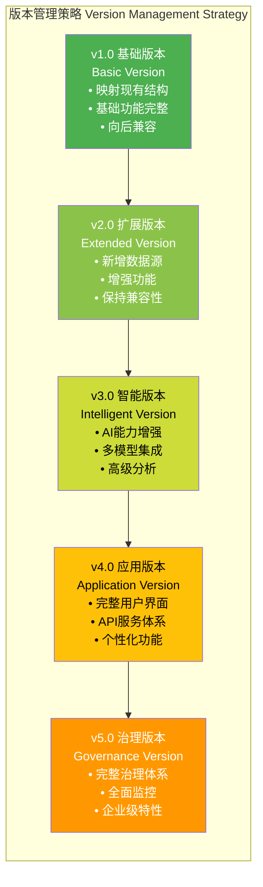

# ICT技术洞察系统完整图示方案

## **1. 总体系统架构图（横向 - 适合PPT全屏展示）**



## **2. 数据湖分层架构图（横向 - 突出数据流转）**



## **3. 端到端业务流程图（横向 - 突出流程连续性）**

```mermaid
graph LR
    subgraph "数据采集阶段 Data Collection Phase"
        DC1[数据源扫描<br/>Source Scanning] --> DC2[增量检测<br/>Incremental Detection] --> DC3[数据抽取<br/>Data Extraction] --> DC4[初步验证<br/>Initial Validation]
    end
    
    subgraph "数据处理阶段 Data Processing Phase"
        DP1[数据清洗<br/>Data Cleaning] --> DP2[格式转换<br/>Format Conversion] --> DP3[数据增强<br/>Data Enrichment] --> DP4[质量检查<br/>Quality Check]
    end
    
    subgraph "AI分析阶段 AI Analysis Phase"
        AI1[多维分析<br/>Multi-dimensional Analysis] --> AI2[模式识别<br/>Pattern Recognition] --> AI3[关联挖掘<br/>Correlation Mining] --> AI4[洞察生成<br/>Insight Generation]
    end
    
    subgraph "结果输出阶段 Output Generation Phase"
        OUT1[结果验证<br/>Result Validation] --> OUT2[格式化输出<br/>Formatted Output] --> OUT3[可视化生成<br/>Visualization] --> OUT4[分发推送<br/>Distribution]
    end
    
    subgraph "反馈优化阶段 Feedback Optimization Phase"
        FB1[用户反馈<br/>User Feedback] --> FB2[效果评估<br/>Effectiveness Assessment] --> FB3[模型调优<br/>Model Tuning] --> FB4[流程改进<br/>Process Improvement]
    end
    
    DC4 --> DP1
    DP4 --> AI1
    AI4 --> OUT1
    OUT4 --> FB1
    FB4 -.-> DC1
    
    style DC1 fill:#e8f5e8,color:#000
    style DC2 fill:#e8f5e8,color:#000
    style DC3 fill:#e8f5e8,color:#000
    style DC4 fill:#e8f5e8,color:#000
    style DP1 fill:#e3f2fd,color:#000
    style DP2 fill:#e3f2fd,color:#000
    style DP3 fill:#e3f2fd,color:#000
    style DP4 fill:#e3f2fd,color:#000
    style AI1 fill:#f3e5f5,color:#000
    style AI2 fill:#f3e5f5,color:#000
    style AI3 fill:#f3e5f5,color:#000
    style AI4 fill:#f3e5f5,color:#000
    style OUT1 fill:#fff3e0,color:#000
    style OUT2 fill:#fff3e0,color:#000
    style OUT3 fill:#fff3e0,color:#000
    style OUT4 fill:#fff3e0,color:#000
    style FB1 fill:#fce4ec,color:#000
    style FB2 fill:#fce4ec,color:#000
    style FB3 fill:#fce4ec,color:#000
    style FB4 fill:#fce4ec,color:#000
```



## **4. AI分析引擎架构图（横向 - 突出多模型协作）**



## **5. 技术评估决策树流程图（纵向 - 突出决策层次）**



## **6. 用户权限和访问控制架构图（横向 - 突出权限流转）**



## **7. 系统监控运维架构图（横向 - 突出监控流程）**



## **8. 云服务部署架构图（纵向 - 突出层次结构）**



# ICT数据湖目录设计方案（可迭代版本）

## **第一阶段：基础目录结构（当前基础优化）**

### **当前状态兼容性映射**



### **第一阶段完整目录结构**

```
ICT_TechInsight_DataLake_v1.0/
├── 00_System/                                    # 系统管理区
│   ├── Data_Sync_Status.xlsx                   # 数据同步状态表
│   ├── Workflow_Logs.xlsx                      # 工作流日志表
│   ├── Error_Tracking.xlsx                     # 错误跟踪表
│   └── Performance_Metrics.xlsx                # 性能指标表
│
├── 01_Raw_Data/                                 # 原始数据区
│   ├── Academic/
│   │   ├── Raw_Academic_Papers.xlsx            # 学术论文原始数据 (映射现有)
│   │   ├── Academic_Sync_Log.xlsx              # 学术数据同步日志
│   │   └── Academic_Quality_Check.xlsx         # 学术数据质量检查
│   │
│   └── OpenSource/
│       ├── Raw_OpenSource_Projects.xlsx        # 开源项目原始数据 (映射现有)
│       ├── OpenSource_Sync_Log.xlsx            # 开源数据同步日志
│       └── OpenSource_Quality_Check.xlsx       # 开源数据质量检查
│
├── 02_Standardized_Data/                        # 标准化数据区
│   ├── Academic_Standardized.xlsx              # 标准化学术数据
│   ├── OpenSource_Standardized.xlsx            # 标准化开源数据
│   └── Data_Mapping_Rules.xlsx                 # 数据映射规则
│
├── 03_Processed_Data/                           # 处理数据区
│   ├── Academic_Features.xlsx                  # 学术特征数据
│   ├── OpenSource_Features.xlsx                # 开源特征数据
│   ├── Cross_Domain_Features.xlsx              # 跨域特征数据
│   └── Quality_Metrics.xlsx                    # 质量评估指标
│
├── 04_Analytics_Results/                        # 分析结果区
│   ├── Technology_Assessment.xlsx              # 技术评估结果 (映射现有)
│   ├── AI_Analysis_Details.xlsx                # AI分析详细结果
│   ├── Confidence_Scores.xlsx                  # 置信度评分
│   └── Analysis_History.xlsx                   # 分析历史记录
│
├── 05_Application_Data/                         # 应用数据区
│   ├── Dashboard_Data.xlsx                     # 仪表板数据 (映射现有)
│   ├── Report_Templates.xlsx                   # 报告模板
│   ├── User_Configurations.xlsx                # 用户配置
│   └── Export_Data.xlsx                        # 导出数据
│
└── 06_Master_Data/                              # 主数据区
    ├── Technology_Registry.xlsx                # 技术注册表 (映射现有)
    ├── Data_Dictionary.xlsx                    # 数据字典
    ├── Classification_Schema.xlsx              # 分类模式
    └── Validation_Rules.xlsx                   # 验证规则
```

## **第二阶段：数据源扩展目录（2-3个月后）**

### **扩展的目录结构**

```
ICT_TechInsight_DataLake_v2.0/
├── 00_System/                                   # 系统管理区 (保持)
│   ├── Data_Sync_Status.xlsx                   
│   ├── Workflow_Logs.xlsx                      
│   ├── Error_Tracking.xlsx                     
│   ├── Performance_Metrics.xlsx                
│   ├── Data_Lineage.xlsx                       # 新增：数据血缘关系
│   └── Integration_Status.xlsx                 # 新增：集成状态监控
│
├── 01_Raw_Data/                                 # 原始数据区 (扩展)
│   ├── Academic/                                # 保持现有结构
│   │   ├── Raw_Academic_Papers.xlsx            
│   │   ├── Academic_Sync_Log.xlsx              
│   │   └── Academic_Quality_Check.xlsx         
│   │
│   ├── OpenSource/                              # 保持现有结构
│   │   ├── Raw_OpenSource_Projects.xlsx        
│   │   ├── OpenSource_Sync_Log.xlsx            
│   │   └── OpenSource_Quality_Check.xlsx       
│   │
│   ├── Patents/                                 # 新增：专利数据
│   │   ├── Raw_USPTO_Patents.xlsx              
│   │   ├── Raw_EPO_Patents.xlsx                
│   │   ├── Raw_Patent_Citations.xlsx           
│   │   └── Patent_Quality_Check.xlsx           
│   │
│   ├── News/                                    # 新增：新闻数据
│   │   ├── Raw_Tech_News.xlsx                  
│   │   ├── Raw_RSS_Feeds.xlsx                  
│   │   ├── Raw_Social_Media.xlsx               
│   │   └── News_Quality_Check.xlsx             
│   │
│   ├── Market/                                  # 新增：市场数据
│   │   ├── Raw_Market_Reports.xlsx             
│   │   ├── Raw_Funding_Data.xlsx               
│   │   ├── Raw_Company_Data.xlsx               
│   │   └── Market_Quality_Check.xlsx           
│   │
│   └── Social/                                  # 新增：社交数据
│       ├── Raw_Twitter_Data.xlsx               
│       ├── Raw_Reddit_Data.xlsx                
│       ├── Raw_LinkedIn_Data.xlsx              
│       └── Social_Quality_Check.xlsx           
│
├── 02_Standardized_Data/                        # 标准化数据区 (扩展)
│   ├── Academic_Standardized.xlsx              # 保持
│   ├── OpenSource_Standardized.xlsx            # 保持
│   ├── Patents_Standardized.xlsx               # 新增
│   ├── News_Standardized.xlsx                  # 新增
│   ├── Market_Standardized.xlsx                # 新增
│   ├── Social_Standardized.xlsx                # 新增
│   ├── Entity_Resolution.xlsx                  # 新增：实体解析
│   └── Cross_Reference_Mapping.xlsx            # 新增：交叉引用映射
│
├── 03_Processed_Data/                           # 处理数据区 (扩展)
│   ├── Features/                                # 特征工程子目录
│   │   ├── Academic_Features.xlsx              
│   │   ├── OpenSource_Features.xlsx            
│   │   ├── Patent_Features.xlsx                # 新增
│   │   ├── News_Features.xlsx                  # 新增
│   │   ├── Market_Features.xlsx                # 新增
│   │   └── Social_Features.xlsx                # 新增
│   │
│   ├── TimeSeries/                              # 时间序列子目录
│   │   ├── Technology_Trends.xlsx              
│   │   ├── Market_Dynamics.xlsx                
│   │   ├── Innovation_Index.xlsx               
│   │   └── Sentiment_Trends.xlsx               # 新增
│   │
│   ├── Networks/                                # 网络分析子目录
│   │   ├── Citation_Networks.xlsx              
│   │   ├── Collaboration_Networks.xlsx         
│   │   ├── Competition_Networks.xlsx           
│   │   └── Technology_Networks.xlsx            
│   │
│   └── Aggregations/                            # 聚合数据子目录
│       ├── Technology_Summaries.xlsx           
│       ├── Market_Summaries.xlsx               
│       ├── Company_Profiles.xlsx               
│       └── Trend_Summaries.xlsx                
│
├── 04_Analytics_Results/                        # 分析结果区 (扩展)
│   ├── Technology_Assessment/                   # 技术评估子目录
│   │   ├── Technology_Assessment.xlsx          # 保持
│   │   ├── Maturity_Analysis.xlsx              
│   │   ├── Innovation_Rankings.xlsx            
│   │   └── Adoption_Readiness.xlsx             
│   │
│   ├── Market_Intelligence/                     # 市场情报子目录
│   │   ├── Market_Opportunity_Analysis.xlsx    
│   │   ├── Competitive_Landscape.xlsx          
│   │   ├── Investment_Opportunities.xlsx       
│   │   └── Market_Forecasts.xlsx               
│   │
│   ├── Risk_Assessment/                         # 风险评估子目录
│   │   ├── Technology_Risks.xlsx               
│   │   ├── Market_Risks.xlsx                   
│   │   ├── Investment_Risks.xlsx               
│   │   └── Regulatory_Risks.xlsx               
│   │
│   └── AI_Analysis/                             # AI分析子目录
│       ├── AI_Analysis_Details.xlsx            # 保持
│       ├── Multi_Model_Consensus.xlsx          
│       ├── Confidence_Scores.xlsx              # 保持
│       └── Analysis_Validation.xlsx            
│
├── 05_Application_Data/                         # 应用数据区 (扩展)
│   ├── Dashboards/                              # 仪表板子目录
│   │   ├── Dashboard_Data.xlsx                 # 保持
│   │   ├── Tech_Radar_Data.xlsx                
│   │   ├── Investment_Panel_Data.xlsx          
│   │   └── Trend_Monitor_Data.xlsx             
│   │
│   ├── Reports/                                 # 报告子目录
│   │   ├── Daily_Reports.xlsx                  
│   │   ├── Weekly_Reports.xlsx                 
│   │   ├── Monthly_Reports.xlsx                
│   │   └── Custom_Reports.xlsx                 
│   │
│   ├── APIs/                                    # API子目录
│   │   ├── Public_API_Data.xlsx                
│   │   ├── Client_Specific_Data.xlsx           
│   │   ├── Real_Time_Feeds.xlsx                
│   │   └── API_Usage_Stats.xlsx                
│   │
│   └── Users/                                   # 用户子目录
│       ├── User_Configurations.xlsx            # 保持
│       ├── User_Preferences.xlsx               
│       ├── Custom_Watchlists.xlsx              
│       └── Usage_Analytics.xlsx                
│
└── 06_Master_Data/                              # 主数据区 (扩展)
    ├── Entities/                                # 实体主数据
    │   ├── Technology_Registry.xlsx             # 保持
    │   ├── Company_Registry.xlsx               
    │   ├── Author_Registry.xlsx                
    │   ├── Institution_Registry.xlsx           
    │   └── Journal_Registry.xlsx               
    │
    ├── Classifications/                         # 分类主数据
    │   ├── Technology_Taxonomy.xlsx             
    │   ├── Industry_Classification.xlsx         
    │   ├── Patent_Classification.xlsx           
    │   └── News_Categories.xlsx                 
    │
    ├── Rules/                                   # 规则主数据
    │   ├── Data_Dictionary.xlsx                # 保持
    │   ├── Validation_Rules.xlsx               # 保持
    │   ├── Business_Rules.xlsx                 
    │   └── Quality_Standards.xlsx              
    │
    └── Metadata/                                # 元数据
        ├── Schema_Registry.xlsx                
        ├── Data_Catalog.xlsx                   
        ├── Data_Lineage_Details.xlsx           
        └── Change_History.xlsx                  
```

## **第三阶段：AI增强后的目录结构**

### **AI分析专用目录扩展**

```
04_Analytics_Results/
├── AI_Models/                                   # 新增：AI模型管理
│   ├── Model_Configurations.xlsx               # 模型配置
│   ├── Model_Performance.xlsx                  # 模型性能评估
│   ├── Model_Versions.xlsx                     # 模型版本管理
│   └── Prompt_Templates.xlsx                   # 提示模板管理
│
├── Multi_Model_Analysis/                        # 新增：多模型分析
│   ├── Grok_Analysis_Results.xlsx              # Grok分析结果
│   ├── GPT4_Analysis_Results.xlsx              # GPT-4分析结果
│   ├── Claude_Analysis_Results.xlsx            # Claude分析结果
│   ├── Model_Consensus.xlsx                    # 模型共识结果
│   └── Conflict_Resolution.xlsx                # 冲突解决记录
│
├── Specialized_Analysis/                        # 新增：专业化分析
│   ├── Academic_Deep_Analysis.xlsx             # 学术深度分析
│   ├── Patent_Landscape_Analysis.xlsx          # 专利景观分析
│   ├── Market_Intelligence_Analysis.xlsx       # 市场情报分析
│   └── Cross_Domain_Analysis.xlsx              # 跨域关联分析
│
└── Predictive_Analytics/                        # 新增：预测分析
    ├── Trend_Predictions.xlsx                  # 趋势预测
    ├── Technology_Forecasts.xlsx               # 技术预测
    ├── Market_Projections.xlsx                 # 市场预测
    └── Scenario_Analysis.xlsx                  # 情景分析
```

## **第四阶段：应用服务完善后的目录结构**

### **应用数据区增强**

```
05_Application_Data/
├── Interactive_Dashboards/                      # 交互式仪表板
│   ├── Tech_Radar_Interactive.xlsx             
│   ├── Investment_Dashboard_Interactive.xlsx   
│   ├── Trend_Monitor_Interactive.xlsx          
│   └── Custom_Dashboard_Templates.xlsx         
│
├── Personalization/                             # 个性化服务
│   ├── User_Profiles.xlsx                      
│   ├── Recommendation_Engine_Data.xlsx         
│   ├── Personalized_Reports.xlsx               
│   └── Custom_Analysis_Requests.xlsx           
│
├── API_Services/                                # API服务增强
│   ├── RESTful_API_Endpoints.xlsx              
│   ├── GraphQL_Schema.xlsx                     
│   ├── Webhook_Configurations.xlsx             
│   ├── API_Authentication.xlsx                 
│   └── Rate_Limiting_Config.xlsx               
│
└── Advanced_Reports/                            # 高级报告
    ├── Executive_Summaries.xlsx                
    ├── Technical_Deep_Dives.xlsx               
    ├── Investment_Portfolios.xlsx              
    └── Comparative_Analysis.xlsx               
```

## **第五阶段：治理和监控完整目录结构**

### **治理和合规目录**

```
07_Governance/                                   # 新增：治理目录
├── Data_Quality/                                # 数据质量管理
│   ├── Quality_Rules_Registry.xlsx             
│   ├── Quality_Monitoring_Results.xlsx         
│   ├── Data_Profiling_Results.xlsx             
│   └── Quality_Improvement_Plans.xlsx          
│
├── Security/                                    # 安全管理
│   ├── Access_Control_Matrix.xlsx              
│   ├── Security_Audit_Logs.xlsx                
│   ├── Data_Classification.xlsx                
│   └── Privacy_Impact_Assessments.xlsx         
│
├── Compliance/                                  # 合规管理
│   ├── Regulatory_Requirements.xlsx            
│   ├── Compliance_Monitoring.xlsx              
│   ├── Data_Retention_Policies.xlsx            
│   └── Legal_Framework_Mapping.xlsx            
│
└── Metadata_Management/                         # 元数据管理
    ├── Business_Glossary.xlsx                  
    ├── Data_Stewardship.xlsx                   
    ├── Impact_Analysis.xlsx                    
    └── Change_Management_Log.xlsx              

08_Monitoring/                                   # 新增：监控目录
├── System_Performance/                          # 系统性能监控
│   ├── Performance_Metrics.xlsx                
│   ├── Resource_Utilization.xlsx               
│   ├── Response_Time_Analysis.xlsx             
│   └── Capacity_Planning.xlsx                  
│
├── Data_Operations/                             # 数据运营监控
│   ├── Data_Processing_Logs.xlsx               
│   ├── Pipeline_Status.xlsx                    
│   ├── Error_Analysis.xlsx                     
│   └── Data_Freshness_Tracking.xlsx            
│
├── Business_Metrics/                            # 业务指标监控
│   ├── User_Engagement_Metrics.xlsx            
│   ├── Analysis_Accuracy_Tracking.xlsx         
│   ├── Business_Value_Metrics.xlsx             
│   └── ROI_Analysis.xlsx                       
│
└── Alerts_Notifications/                        # 告警通知
    ├── Alert_Configurations.xlsx               
    ├── Notification_History.xlsx               
    ├── Escalation_Procedures.xlsx              
    └── Response_Tracking.xlsx                  

09_Archive/                                      # 新增：归档目录
├── Historical_Data/                             # 历史数据归档
│   ├── 2024/                                   
│   ├── 2023/                                   
│   └── Archived_Datasets_Index.xlsx            
│
├── Deprecated_Schemas/                          # 废弃模式归档
│   ├── Legacy_Data_Models.xlsx                 
│   ├── Migration_Records.xlsx                  
│   └── Backward_Compatibility.xlsx             
│
└── Audit_Archives/                              # 审计归档
    ├── Historical_Audit_Logs.xlsx              
    ├── Compliance_History.xlsx                 
    └── Investigation_Records.xlsx              
```

## **迭代策略和版本管理**

### **版本控制策略**



### **迁移和兼容性保证**

```json
{
  "migration_strategy": {
    "backward_compatibility": {
      "principle": "新版本必须兼容旧版本数据",
      "implementation": [
        "保持原有工作表名称和结构",
        "新功能通过新增目录实现",
        "提供数据映射和转换工具",
        "维护版本兼容性矩阵"
      ]
    },
    "migration_phases": {
      "phase_1": {
        "action": "原地升级",
        "method": "重命名和重组现有文件",
        "rollback": "保留原始备份"
      },
      "phase_2_5": {
        "action": "增量添加",
        "method": "添加新目录和文件",
        "rollback": "删除新增部分"
      }
    },
    "data_integrity": {
      "validation": "每次迁移后进行数据完整性检查",
      "verification": "核对关键业务指标",
      "rollback_plan": "制定详细的回滚计划"
    }
  }
}
```

### **目录管理最佳实践**

**命名规范**
- 使用英文命名，避免中文路径问题
- 采用统一的命名格式：功能_类型_日期
- 版本号采用语义化版本控制（Semantic Versioning）

**权限管理**
- 不同目录设置不同的访问权限
- 系统管理目录限制访问
- 原始数据目录只读权限
- 应用数据目录读写权限

**维护策略**
- 定期清理临时文件和日志
- 建立自动归档机制
- 监控目录大小和使用情况
- 定期备份关键目录

通过这种可迭代的目录设计，您可以从现有的基础平稳过渡到完整的企业级数据湖架构，每个阶段都有明确的升级路径和回滚保证。
